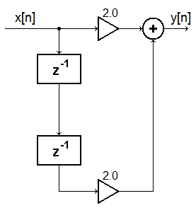

# hw01

## 1.
__Sampling:__ Consider the continuous-time signal below.
$$
x_a(t)=
\begin{cases}
-2&t<-1\\
2t&-1\leq{t}\leq1\\
2&t>1
\end{cases}
$$

**(a)** Plot (by hand) the continuous-time signal  $$x_a(t)$$.

**(b)** Find the discrete-time signal $$\{x[n]\}$$ for $$-3\leq{n}\leq6$$ for the sampling period, $$T=0.2$$ and then plot it (using stems) on top of the previous plot that you created.

## 2.
__Sampling periodic signals__: For each of the continuous time signals below, do the following:
$$
\begin{matrix}
\begin{align*}
x_a(t)&=\cos{(2\pi(10)t)}&\\
x_a(t)&=\cos{(2\pi(10)t)}&
\end{align*}&
\begin{aligned}
T=0.04,\:\text{compute $\{x[n]\}$ for $-4\leq{n}\leq4$}\\
T=0.10,\:\text{compute $\{x[n]\}$ for $-2\leq{n}\leq2$}
\end{aligned}
\end{matrix}
$$

**(a)** Sketch the continuous time signal for $$-0.2\leq{t}\leq0.2$$. (label appropriately)

**(b)** Find the discrete time signal requested (list the points and the corresponding indices)

**(c)** Draw the samples on your continuous time plot and be sure to label the indices (you can do $$a$$ and $$b$$ on the same plot, just use a different color for each)

**(d)** Determine how many samples are taken in one period of the continuous waveform?

**(e)** Determine how many periods of the continuous waveform are represented by the sample sequence. (This may not be an integer)

**(f)** Does it seem possible to reconstruct the signal from only the samples?

## 3.
__Real and Imaginary Components__: You are told that:
$$
\begin{matrix}
\begin{align*}
x_{\Re}[n]&=\{1,\:-4,\:2,\:3,\:0\}\\
x_{\Im}[n]&=\{3,\:-2,\:-4,\:1,\:-2\}
\end{align*}&
\begin{aligned}
\text{for $-2\leq{n}\leq2$}\\
\text{for $-1\leq{n}\leq3$}
\end{aligned}
\end{matrix}
$$
to create a signal $$x[n]=x_{\Re}[n]+jx_{\Im}[n]$$.  Assume any points not mentioned are $$0$$.

**(a)** List the non-zero components of  $$x^*[n]$$. Be sure to denote indices, $$n$$.

**(b)** Calculate the  $$L_2-\text{norm}$$ for the sequence found in **(a)**.

**(c)** What is the  $$L_\infty-\text{norm}$$ for the sequence found in **(a)**?

## 4.
__Operations__: Use the following input sequences to compute the requested sequences. For indices where the input sequences are not specified, assume the values are zero. Clearly specify the index range of nonzero values for each output.
$$
\begin{matrix}
\begin{align*}
a[n]&=\{2,\:4,\:-3,\:1,\:-2,\:5,\:1,\:-2\}\\
b[n]&=\{1,\:3,\:-1,\:3,\:4,\:0,\:1\}\\
c[n]&=\{1,\:5,\:-6,\:4,\:3\}
\end{align*}&
\begin{aligned}
\text{for $-4\leq{n}\leq3$}\\
\text{for $-2\leq{n}\leq4$}\\
\text{for $-3\leq{n}\leq1$}
\end{aligned}
\end{matrix}
$$

**(a)** $$y_1[n]=2a[n]+b[n+2]$$

**(b)** $$y_2[n]=a[n-2]+b[n-1]-c[n-2]$$

## 5.
__Signal Manipulation__:
**(a)** Plot the following function:
$$
\begin{matrix}
\begin{align*}
x[n]=\{2,\:4,\:0,\:-1\}
\end{align*}&
\begin{aligned}
\text{for $n=-1:2$}
\end{aligned}
\end{matrix}
$$

**(b)** Plot
$$
\begin{matrix}
\begin{align*}
y[n]=-x\left[2-\tfrac{n}{2}\right]+1
\end{align*}&
\begin{aligned}
\text{for $-6\leq{n}\leq6$}
\end{aligned}
\end{matrix}
$$

## 6.
__MATLAB__"

**(a)** Download and run the MATLAB program `hw1.m`. Understand the steps.

**(b)** Once you are comfortable moving forward with MATLAB - use MATLAB to create a short script that creates a sequence and plots it.

**(c)** Plot $$x[n]$$ vs. $$n$$ where $$x[n]=\cos{(2\pi(5)Tn)}$$ and where $$−25\leq{n}\leq25$$ and $$T=0.01$$.

**(d)** After plotting this with the “`plot`” command, type “`hold on`”, then run the stem function with the third parameter as ‘`green`’ to highlight what these samples look like. Make sure you plot these vs. $$n$$—meaning, the $$x$$-axis should range from $$-25$$ to $$25$$. The plot command connects the dots, while the stem command shows you where the samples occur.

**(e)** In a new figure (type “`figure()`” to create a new figure), repeat steps **(c)** and **(d)** with $$T=0.02$$. Has the frequency of your sampled signal changed? Describe why this looks different and what “$$n$$” represents in each case.

## 7.
__Discrete-time processing schematics__: Draw the discrete time processing schematics (block diagrams) for the following difference equations.
**(a)** $$y_1[n]=x[n]+2x[n-1]+x[n-2]$$

**(b)** $$y_1[n]=x[n]+x[n-3]$$

## 8.
__Output of a discrete time system__:

Compute the first eight output for $$y[n]$$ for the 8-sample input sequence $$x[n]=\{6,\:1,\:-4,\:1,\:6,\:1,\:-4,1\}$$ for $$n=0:7$$

## 9.
__Convolution__: Assume that $$h[n]$$ ranges from $$-M$$ to $$N$$ and $$w[n]$$ ranges from $$-L$$ to $$-R$$. $$M$$, $$N$$, $$L$$, and $$R$$ are all positive integers with $$L>R$$. What is the length and range of $$h[n]\otimes{w}[n]$$?

## 10.
__Convolution—part 2__: Find the convolution of $$\{2,\:4,\:6\}$$ with $$\{-0.5,\:1,\:-0.5\}$$.

## 11.
__Circular Shift__: Consider $$\{x[n]\}=\{2,\:-5,\:6,\:-3,\:4,\:-4,\:0,\:-7,\:8\}$$ for $$-5\leq{n}\leq3$$. Let $$y[n]$$ denote the sequence obtained by a left circular shift of $$12$$ sample periods.  Preserve the range (*i.e.* $$y[n]$$ should have the same range as $$x[n]$$). Determine the sample value of $$y[-3]$$.

## 12.
__Odd/Even Parts__:  Find the odd and even parts of $$\{2,\:-3,\:1,\:4,\:-2,\:4,\:5\}$$ for $$-2\leq{n}\leq4$$.

## 13.
__Fundamental Period__: Find the fundamental period of:
$$
4\sin{(0.12\pi{n})}-\cos{(0.15\pi{n}+0.4\pi)}
$$

## 14.
__Energy/Power__:
.$$x_2[n]=\mu[n]$$ is the unit step sequence. Calculate the energy and the power. Is this an energy signal or a power signal?

## 15.
__Unit sample and Unit Step Sequences__: Plot the following signals

**(a)** $$x[n]=2\delta[n]-3\delta[n-2]+5\delta[n-3]$$

**(b)** $$x[n]=\mu[ns]+\mu[n-2]-2\mu[n-5]$$

## 16.
For the system $$y[n]=x[n]+0.5y[n-1]$$, find the values of the output $$y[n]$$ for $$0\leq{n}\leq8$$ for each of the following inputs.  Assume that $$y[-1]=0$$

**(a)** $$x[n]=\mu[n]$$

**(b)** $$x[n]=2\delta[n]-3\delta[n-1]+\delta[n-2]$$

