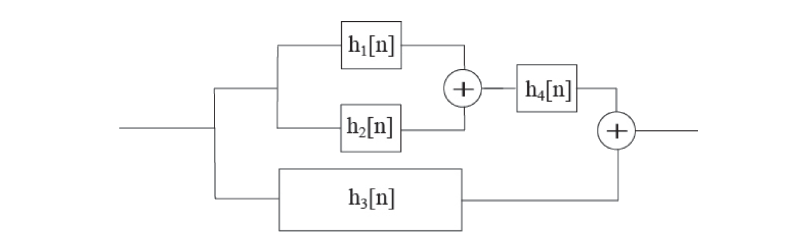

# hw02

## 1.
__Sampling/Aliasing__: For the following cases, determine the normalized frequency in cycles per sample and determine whether or not aliasing occurs. If aliasing occurs, identify the unaliased frequency in $$\tfrac{\text{cycles}}{\text{sec}}$$ that produces the same sample sequence.
- signal frequency, $$f_0\:\left[\tfrac{\text{cycle}}{\text{sec}}\right]$$
- sampling frequency, $$F_T\:\left[\tfrac{\text{sample}}{\text{sec}}\right]$$
- normalized freq. $$\nu_0\:\left[\tfrac{\text{cycle}}{\text{sample}}\right]$$
- normalized radian frequency $$\omega_0\:\left[\tfrac{\text{rad}}{\text{sample}}\right]$$

__(a)__
$$
\begin{matrix}
f_0=6,000\:\text{Hz}&F_T=20,000\:\text{Hz}
\end{matrix}
$$
- normalized frequency?
- normalized radian frequency?
- aliasing?
- if yes, unaliased frequency?

__(b)__
$$
\begin{matrix}
f_0=6,000\:\text{Hz}&F_T=8,000\:\text{Hz}
\end{matrix}
$$
- normalized frequency?
- normalized radian frequency?
- aliasing?
- if yes, unaliased frequency?

## 2.
__Sampling and Aliasing__: You are interested in sending an encrypted message to your friend via a signal that you will sample and send (without error) over a digital transmission line. The message you are trying to send is only two numbers—say, for example, they are latitude and longitude points for a hidden treasure.

The scheme you and your friend come up with is that you will weight two cosine terms by the two values you are trying to transmit. The first cosine will have a frequency of $$2\:\text{Hz}$$ and will have an amplitude of your latitude coordinate, the second cosine will have a frequency of $$3\:\text{Hz}$$ and will have an amplitude of your longitude coordinate.

Thus, your transmitted signal will look like this before sampling:
$$
x(t)=(\text{LAT})\cdot\cos{\left(2\pi(2)t\right)}+(\text{LON})\cdot\cos{\left(2\pi(3)t\right)}
$$

And, specifically, assume that you've determined the location of the buried treasure and you designed time-domain signal is $$x(t)=36.12\cos{\left(2\pi(2)t\right)}-125.17\cos{\left(2\pi(3)t\right)}$$

You opt to not implement an anti-aliasing filter and instead take your chances that there will be no spurious tones that will affect your reconstruction.

__(a)__ What should be the lower bound for your sampling frequency to allow for effective reconstruction on the other side?

Being an intelligent engineer who has paid attention in class, you decide to conservatively sample your signal at $$7\:\text{Hz}$$ and you share this detail with your friend so that an appropriate reconstruction filter can be created.

__(b)__ Plot the first 10 samples of the sampled signal. You can use MATLAB, Excel, a calculator or any other means you’d like.
 
Unbeknownst to you, another treasure seeker looks to sabotage your transmission and includes the following signal: $$10\cos{\left(2\pi(15)t\right)}$$ before your sampler.

__(c)__  Since the signal was sampled at $$7\:\text{Hz}$$, your friend will assume that all frequencies in the transmission were less than $$3.5\:\text{Hz}$$. What cosines will your friend assume were transmitted and with what weights?

__(d)__ Will your friend be able to accurately determine where the buried treasure is buried? If not, where will your friend go look for the treasure?

Another competitor instead corrupts your original signal with the signal $$10\cos{\left(2\pi(17)t\right)}$$.

__(e)__ Repeat part (c) and (d) for this situation.

## 3.
You have two signals defined:
$$
\begin{align*}
x[n]&=\{2,\:0,\:-1,\:6,\:-3,\:2,\:0\}&&\text{for }-3\leq{n}\leq3\\
y[n]&=\{8,\:2,\:-7,\:-3,\:0,\:1,\:1\}&&\text{for }-5\leq{n}\leq1
\end{align*}
$$

__(a)__ Calculate the cross correlation of $$x[n]$$ and $$y[n]$$, that is $$r_{xy}[l]$$ 

__(b)__ Calculate the autocorrelation of $$y[n]$$.

## 4.
__LTI Analysis__: Determine if $$y[n]=bx[n]+c$$ is linear and if it is shift-invariant.

## 5.
__LTI system analysis and convolution__: An LTI system is defined by the following equation:
$$
y[n]=x[n]-x[n-1]+x[n-2]
$$

__(a)__ Using the methods established earlier this quarter—find the output, $$y[n]$$, for the input, $$\begin{matrix}x[n]=\{4,\:2,\:1\}&\text{for }0\leq{n}\leq2\end{matrix}$$

__(b)__ What is the impulse response, $$h[n]$$, of this system?

__(c)__ Write the input as a sum of weighted impulses.

__(d)__ Your answer in part (c) should be the sum of three weighted impulses. Determine the output of the system for each of the weighted impulses individually.

__(e)__ Since this is an LTI system, you can add the individual outputs found in part (d) to obtain the same output as you found in part (a). Show this is the case.

__(f)__ Finally, find the convolution of the input (as given in part (a) and the impulse response (as determined in part (b)) to determine the output. Is this the same as found in part a and part (e)?

## 6.
__Cascaded systems__: Two LTI systems have impulse responses
$$
\begin{align*}
h_1[n]&=\delta[n]-\alpha\delta[n-1]\\
h_2[n]&=\delta[n]+\alpha\delta[n-1]+\alpha^2\delta[n-2]
\end{align*}
$$
__(a)__ Find the impulse response of the series combination of the two systems. 
__(b)__ Find the impulse response of the parallel combination of the two systems.

## 7.
__Summation reduction__: remember that
$$
\sum_{k=0}^{N}{a^k}=
\begin{cases}
\frac{1-a^{N+1}}{1-a}&\text{for }a\neq1\\
N+1&\text{for }a=1\\
\end{cases}
$$

__(a)__ Show the above is true for the $$a\neq1$$ case by starting with
$$
\sum_{k=0}^{N}{a^k}-a\sum_{k=0}^{N}{a^k}=???
$$

__(b)__ Use similar logic to create an expression for $$\sum_{k=M}^{N}{a^k}$$
 
__(c)__ Apply the expression learned from part (b) to create an expression for $$\sum_{k=4}^{N+4}{a^k}$$

## 8.
__Difference Equation and Response__: A system is defined by the difference equation that was seen in class, specifically from the pair and share from slide 20 of Lecture Notes 4. That is: $$y[n]=x[n]+ay[n-1]$$. (In class we used $$a=0.5$$)

__(a)__  What is the impulse response? In class we wrote this as a summation. Instead, write this as an expression using the unit step sequence, $$\mu[n]$$. Assume $$y[-1]=0$$.

__(b)__ What is the step response—that is, what is the response to the unit step sequence, $$\mu[n]$$. Again, assume, $$y[-1]=0$$. (The result from problem 1 may prove useful.)

__(c)__ Using MATLAB, plot the impulse response from (a) and the step response from (b) for $$ 0\leq{n}\leq20$$ for $$a=0.5$$. Repeat for $$a=0.9$$. Experiment with the for loop or some other loop to make your code somewhat efficient.

## 9.
Determine an expression for $$y[n]$$ in terms of $$x[n]$$ and its step response, $$s[n]$$. Use the fact that $$\delta[n-k]=\mu[n-k]-\mu[n-k-1]$$

## 10.
__Stability/Causality__: You are given the impulse response:
$$
h[n]=\delta[n]+\frac{1}{2}\left(\delta[n-1]+\delta[n+1]\right)
$$

__(a)__ Is the system causal?

__(b)__ Is the system BIBO stable?

__(c)__ What function does this describe?

## 11.
__System Combination__: What is the impulse response of the following system in terms of the given impulse responses?

## 12.
__CTFT Calculations__: Find the CTFT of the following CT functions:

__(a)__ 
$$
x(t)=\sin{\left(\Omega_0t\right)}
$$

__(b)__
$$
x(t)=
\begin{cases}
1&|t|<\frac{1}{2}\\\frac{1}{2}&|t|=\frac{1}{2}\\0&|t|>\frac{1}{2}\\
\end{cases}
$$
> this is the rect(), or $$\sqcap{()}$$ function

## 13.
__DTFT__: Find the DTFT of the following sequences. For parts (b) and (c), write the result in terms of the result of part (a).

__(a)__ 
$$
x[n]=a^n\mu[n]
$$

__(b)__
$$
x[n]=a^n\mu[n-2]
$$

__(c)__
$$
x[n]=a^{n-2}\mu[n-2]
$$

## 14.
__MORE DTFT__: A system with the impulse response $$h[n]=\delta[n]-\delta[n-1]$$ has an input $$x[n]=\mu[n]-\mu[n-5]$$

__(a)__ Find the output $$y[n]$$.

__(b)__ Find the DTFT of $$h[n]$$.

__(c)__ Find the DTFT of $$x[n]$$.

__(d)__ Find the DTFT of $$y[n]$$.

__(e)__ How are the DTFTs related?

## 15.
__DTFT Convolution__: Using the DTFT, find the convolution of $$\{4,\:2,\:1\}$$ for $$n=0:2$$ and $$\{1,\:-1,\:1\}$$ for $$n=0:2$$. “Using the DTFT” means, find the DTFT of each and use the DTFT Convolution property to multiply the two transforms in the frequency-domain, then find the inverse DTFT to determine the discrete-time convolution.

## 16.
__Sampling with a frequency domain perspective__: You are given the following signal: 
$$
x(t)=5\sin{\left(2\pi(300)t\right)}+3\sin{\left(2\pi(500)t\right)}
$$

__(a)__ Plot the spectrum of the signal.

__(b)__ Assume the signal is sampled at $$700\:\text{Hz}$$. Plot the spectrum of the sampled signal from $$-1,000\:\text{Hz}$$ to $$1,000\:\text{Hz}$$.

__(c)__ Draw the LPF that should be used with a sampling rate of $$700\:\text{Hz}$$ and determine the reconstructed signal after applying that LPF.

## 17
__Sampling a Bandpass signal__: Assume you are given a signal with frequencies from $$22\:\text{Hz}$$ to $$28\:\text{Hz}$$. What is the lowest sampling rate that you can use to sample the signal while still ensuring perfect reconstruction on the other side.

