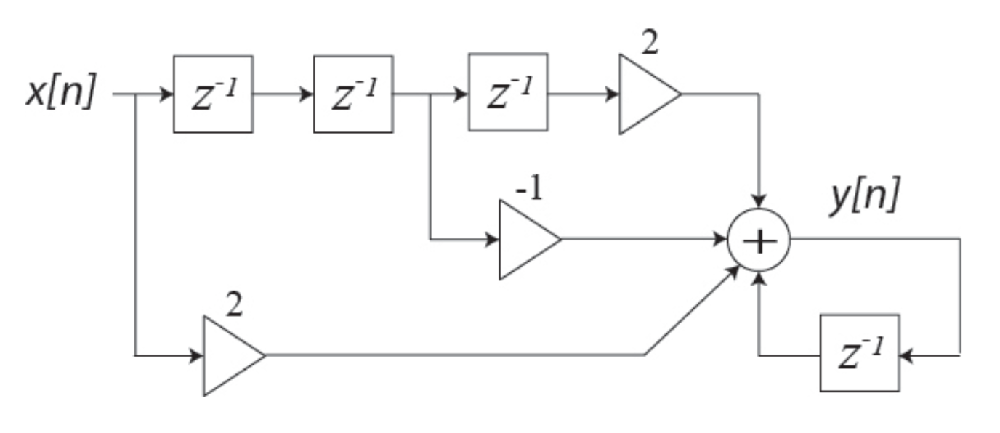
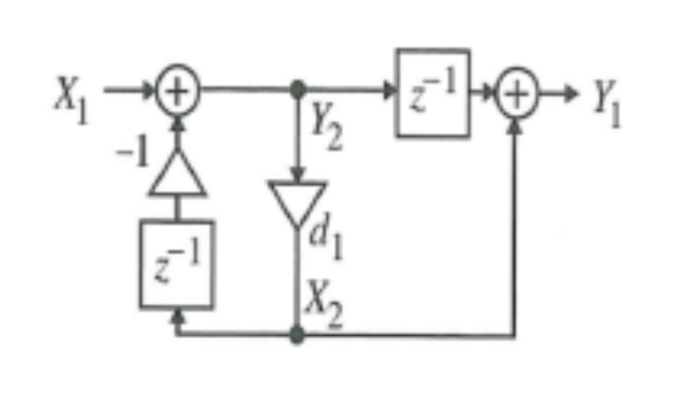

# hw05

## 1.
A system has a zero at $$z=\rho$$ ,a zero at $$z=\frac{1}{\rho}$$ and two poles at $$z=0$$.

__(a)__ Find $$H(z)$$ for this system and write its difference equation.

__(b)__ Is this filter symmetric? If so, state why and determine if it has even or odd symmetry? If not, why not?

## 2.
A system has a zero at $$z=e^{j\omega_0}$$, a zero at $$z=e^{-j\omega_0}$$, and a zero at $$z=1$$. It has three poles at $$z=0$$.

__(a)__ Find $$H(z)$$ for this system and write its difference equation.

__(b)__ Is this filter symmetric? If so, state why and determine if it has even or odd symmetry? If not, why not?

## 3.
For the two transfer function
$$
H_1(z)=\frac{1}{1-0.5z^{-1}}
$$
and
$$
H_2(z)=\frac{0.5(1+z^{-1})}{1-0.5z^{-1}}
$$
with a ROC $$|z|>0.5$$:

__(a)__ Find the poles and zeroes of each and sketch the pole-zero diagrams.

__(b)__ Write an expression for the frequency responses and sketch the magnitudes of the frequency responses.

__(c)__ What is the magnitude of each filter at $$\omega=0,\:\frac{\pi}{2},\:\pi$$? From this, which filter would make a better low pass filter?

__(d)__ Write the difference equation for each.

__(e)__ If you already had $$H_1(z)$$, what could you do to it in the time domain to creat $$H_2(z)$$?
(f) Find the impulse response for each filter.

## 4.
For the three transfer functions:
$$
\begin{align*}
H_1(z)&=z^{-10},\\
H_2(z)&=0.27-0.46z^{-1}+0.27z^{-2},\\
H_3(z)&=\frac{a-z^{-1}}{1-az^{-1}},\\
a&=0.8
\end{align*}
$$
__(a)__ Write a mathematical expression for the frequency responses for each filter. Find the magnitude of the frequency response and simplify as much as possible.

__(b)__  Use MATLAB’s freqz to compute each frequency response over 512 points.

__(c)__ Which filters have linear phase?

__(d)__ Using the MATLAB functions, filter, apply the three filters to the input siganl:
$$
\begin{matrix}
x[n]=\sin{\left(w_0n\right)}+\frac{\sin{\left(3w_0n\right)}}{3}+\frac{\sin{\left(5w_0n\right)}}{5},&\text{for }-20\leq{n}\leq60
\end{matrix}
$$
The filter command in MATLAB uses the same `a` and `b` vector inputs as `freqz`. If you need assistance, type `help filter` at the MATLAB prompt. Assume $$w_0=\tfrac{\pi}{20}$$. Plot the input signal and the output signal for each filter Briefly describe the impact of each filter on the signal.
__(e)__ Repeat part __(d)__ with $$w_0=\frac{\pi}{8}$$.

## 5.
A first order causal FIR system has a transfer function
$$
H(z)=1-z^{-1}
$$

__(a)__ Find the poles and zeros of this system.

__(b)__ Find the frequency response. Reduce as much as possible.

__(c)__ Find the impulse response.

__(d)__ Is it most like a low-pass, band-pass, or high-pass filter?

__(e)__ Repeat __(a)__-__(d)__ for a new filter
$$
H_1(z)=H(-z)
$$
__(f)__ Repeat __(a)__-__(d)__ for a new filter
$$
H_2(z)=\left(H(z)\right)^4
$$

__(g)__ Repeat __(a)__-__(d)__ for a new filter
$$
H_3(z)=H(z^4)
$$

__(h)__ What is the type # FIR filter of each of the four filters – that is, the original $$H(z)$$, $$H_1(z)$$, $$H_2(z)$$, and $$H_3(z)$$

## 6.
__In Midterm problem 3(c)__, we were given the following block diagram:

And, in __3(c)__, we found the difference equation:
$$
y[n]=2x[n]−x[n-2]+2x[n-3]+y[n-1]
$$
In 3__(d)__, we were asked to find the impulse response. Plugging in an impulse and noting the output, we observe the output is $$2,\:2,\:1,\:3,\:3,\:3,\:3,\:3$$ and so on. There are many different ways to express this answer in a closed form. One way is:
$$
h[n]=2\mu[n]-\mu[n-2]+2\mu[n-3]
$$
There are different ways to represent this answer.

__(a)__ Find the transfer function H(z) from the difference equation.

__(b)__ Use Long Division of the Polynomials and find the first 5 terms of the impulse response.

__(c)__ Finally, use Partial Fraction Expansion to find the inverse Z-transform of $$H(z)$$, *i.e.* $$h[n]$$.

## 7.
Consider a system with an input $$x[n]$$ and output $$y[n]$$ that has the following three stages:
$$
\begin{align*}
w[n]&=(-1)^{n}x[n]\\
v[n]&=w[n]\otimes{h}[n]\\
y[n]&=(-1)^{n}v[n]\\
\end{align*}
$$
__(a)__ Find the DTFT $$W(e^{j\omega})$$ in terms of $$X(e^{j\omega})$$.

__(b)__ If the filter $$h[n]$$ is a LPF which passes discrete frequencies up to $$|\omega|=\tfrac{\pi}{5}$$ without change and totally suppresses higher frequencies, what is $$V(e^{j\omega})$$ in terms of $$W(e^{j\omega})$$? WHat about in terms of $$X(e^{j\omega})$$, These should be __piecewise functions__.

__(c)__ Find the DTFT of the output $$Y(e^{j\omega})$$ in terms of $$X(e^{j\omega})$$. This should be a __piecewise function__.

__(d)__ What does this system do?

## 8.
An ideal low pass filter with cutoff frequency, $$\omega_c$$, has an impulse response,
$$
h[n]=\frac{\sin{\left(\omega_cn\right)}}{\pi{n}}
$$
Remember,
$$
\operatorname{sinc}(x)=\frac{\sin{\left(x\right)}}{x}
$$
and
$$
\operatorname{sinc}(0)=1
$$
A causal FIR approximation is implemented with a Type 1 symmetric filter of order $$N=2M$$ by
$$
h_{LP}[n]=\begin{cases}
h[n-M],&0\leq{n}\leq{N}\\
0,&\text{otherwise}
\end{cases}
$$

__(a)__ For $$N=2$$ (*i.e.* a filter of length 3) explicitly find the filter coefficients for three different low pass filters with cutoff frequencies
$$
\omega_c=\frac{\pi}{2},\:\frac{\pi}{4},\text{and}\:\frac{\pi}{8},
$$

__(b)__ Find the poles and zeros for each of the three filters. Why are they so similar when the cutoff frequencies are so different?

## 9.
Use MATLAB to compute the coefficients for the approximate low pass filters for the three cutoff frequencies from the previous problem for $$N=2$$, $$N=6$$, $$N=14$$, and $$N=30$$. Using subplot to put 8 plots in the same figure, make a figure for each cutoff frequency showing the pole-zero diagram and the magnitude of the frequency response for the four values of $$N$$. Use the MATLAB functions `freqz` and `zplane`.

__(a)__ For each of the 12 filters, find the number of zeros that are in complex conjugate pairs on the unit circle, the number that are in real pairs of $$\rho$$ and $$\tfrac{1}{\rho}$$, and the number in groups of 4 complex values that are noton the unit circle.
1. For each cutoff frequency, how does this change as the filter length increases?
2. How does the location of the zeros affect the shape of the frequency response?

__(b)__ How does decreasing the value of the cutoff frequency affect the location of the zeros?

__(c)__ For  only the $$N=30$$ and cutoff $$\omega_c=\frac{\pi}{2}$$ case, use the first method described in the lecture notes for converting an LPF to an HPF — *i.e.* subtract the center coefficient from 1 and change the sign of all other coefficients.

## 10.
Consider that you have an order N filter with even symmetry that is increased to order $$N+1$$ by adding a zero at $$z=+1$$.

__(a)__ What symmetry will the new filter have? Prove it — meaning, follow the logic of the discussion question from class to provide a proof – do not just simply answer by using an example.

__(b)__ If the original filter has coefficients $$[a,\:b,\:c,\:b,\:a]$$, what will be the coefficients of the new filter?

## 11.
A moving average filter is used on input $$x[n]$$ to compute the local average value, $$v[n]$$. Assume, this moving average filter looks at the last three values and takes the direct average of them — meaning:
$$
v[n]=\frac{1}{3}\left(x[n]+x[n-1]+x[n-2]\right)
$$

__(a)__ Write the difference equation for the output,
$$
y[n]=x[n]-v[n]
$$
in terms of only $$y[n]$$ and $$x[n]$$

__(b)__ What is the impulse response, $$h[n]$$?

__(c)__ What is the transfer function, $$H(z)$$?

__(d)__ Find the poles and zeros of $$H(z)$$

__(e)__ Compute the output for an input $$x[n]=Bn$$

__(f)__ Repeat (a)__-(e)__ if $$y[n]$$ is defined as
$$
y[n]=x[n-1]-v[n]
$$
Explain any differences in the results.  Functionally, how are these two situations different?

## 12.
Assume
$$
H(z)=\frac{1}{2}(1+z^{-1})
$$
and that you wish to creat a comb filter using:
$$
\begin{align*}
G(z)&=H(z^{L})\\
&=\frac{1}{2}(1+z^{-L})\\\\
&\left<\text{for }L=5\right>
\end{align*}
$$
Plot the zeros on a pole-zero plot and determine the magnitude of the frequency response.

## 13.
For
$$
y[n]=ax[n]+bx[n-1]+bx[n-2]+ax[n-3]
$$

__(a)__ Draw the direct form implementation of the above difference equation.

__(b)__ Modify the implementation to use only two multipliers.

## 14.
For
$$
H(z)=\frac{a+z^{-1}}{1+az^{-1}}
$$

__(a)__ Write the difference equation for the function described above.

__(b)__ For the structure below, write a difference equation for the output of every adder. Using these equations, find the output $$y[n]$$ when $$d_1=a$$.

