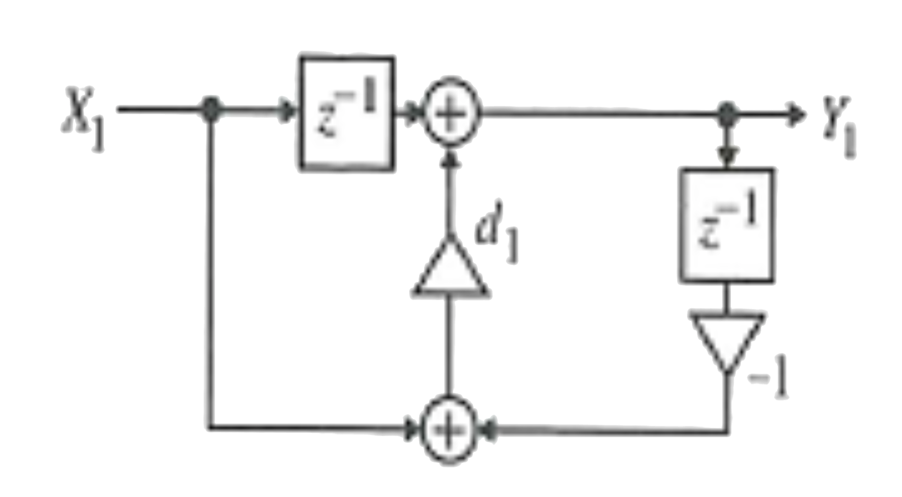
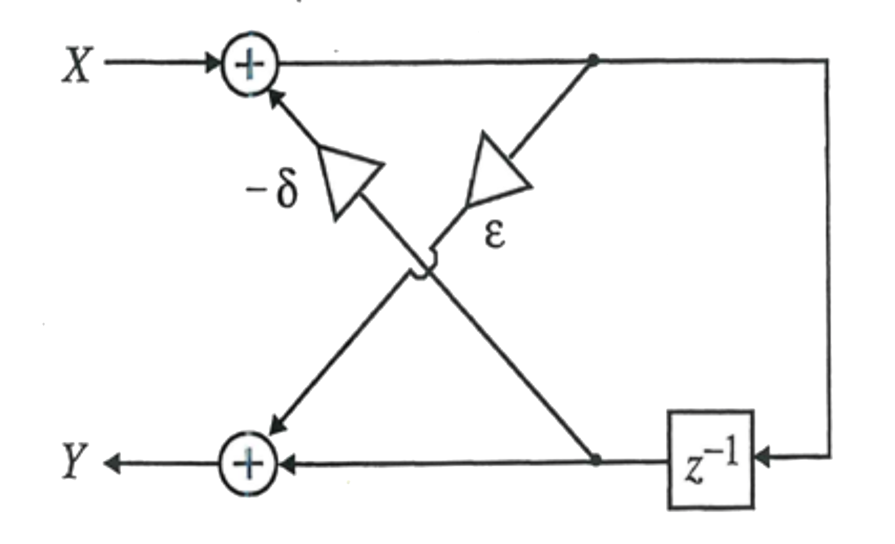
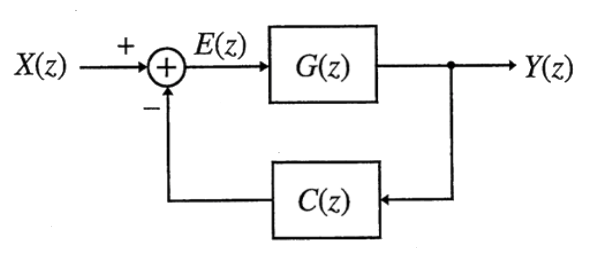

# hw06

## 1.
For $$y[n]=ax[n]+bx[n-1]+bx[n-2]+ax[n-3]$$:

__(a)__ Draw the direct form implementation of the above difference equation.

__(b)__ Modify the implementation to use only two multipliers.

## 2.
For $$H(z)=\tfrac{a+z^{-1}}{1+az^{-1}}$$

__(a)__ Write the difference equation for the function described above.

__(b)__ Draw the Direct Form II transpose implementation. How many multipliers
does it have? How many delays does it have? Label the output of every adder and write a difference equation for the output of every adder. Using these equations, verify that the output $$y[n]$$ is the output specified in part __(a)__.

__(c)__ For the figure below, label the output of every adder and write a difference equation for the output of every adder. Using these equations, verify that the output $$y[n]$$ is the output specified in part __(a)__ when $$d_1=a$$.

## 3.
A system has been designed to filter out both an interfering frequency and its third harmonic.
$$
\begin{align*}
H(z)&=\frac{P_1(z)P_2(z)}{D_1(z)D_2(z)}\\\\
P_1(z)&=1-\sqrt{3}z^{-1}+z^{-2}\\
P_2(z)&=1+z^{-2}\\
D_1(z)&=1-0.9\sqrt{3}z^{-1}+0.81z^{-2}\\
D_2(z)&=1+0.81z^{-2}\\
\end{align*}
$$

__(a)__ Find the numerator and denominator polynomials for $$H(z)$$.

__(b)__ Find the poles and zeros of $$H(z)$$.

__(c)__ Using MATLAB’s `freqz`, find the system frequency response and plot the magnitude. Verify that the frequency response has notches at two distinct frequencies. What is the maximum gain of the system? (Just take the maximum of the plotted magnitude.)

__(d)__ The system is implemented as the cascade of two second order systems:
$$
\begin{align*}
H_1(z)&=\frac{P_1(z)}{D_1(z)}\\
H_2(z)&=\frac{P_2(z)}{D_2(z)}
\end{align*}
$$
Plot the magnitude of the frequency response of each of these systems. What is the maximum gain for each?

__(e)__ The system is implemented as the cascade of two second order systems:
$$
\begin{align*}
H_3(z)&=\frac{P_1(z)}{D_2(z)}\\
H_4(z)&=\frac{P_2(z)}{D_1(z)}
\end{align*}
$$
Plot the magnitude of the frequency response of each of these systems. What is the maximum gain for each?

__(f)__ If the sampling frequency is $$12,000\:\text{Hz}$$, what frequencies are notched out?

## 4.
A lattice structure can be used for filter implementation. For the figure below, write the difference equation for $$y[n]$$ for input $$x[n]$$. Find the values for the multiplier coefficients for a filter with a zero at $$z=-1$$ and a pole at $$z=0.5$$.

## 5.
Use the algebraic stability test to determine if systems with the following denominator polynomials are stable. Justify your answers.

__(a)__ $$D(z)=1-0.5z^{-1}-0.75z^{-2}$$

__(b)__ $$D(z)=1+0.5z^{-1}+0.75z^{-2}$$

__(c)__ $$D(z)=1-1.5z^{-1}-1.2z^{-2}$$

## 6.
Let $$G(z)$$ be the plant model for a system with input $$X(z)$$ and output $$Y(z)$$. A feedback controller $$C(z)$$ is designed for the system as shown below.

__(a)__ Write the general expression for the transfer function of the system with the controller added.

__(b)__ For
$$
\begin{align*}
G(z)&=\frac{z^{-2}}{1+1.5z^{-1}+0.5z^{-2}};\\
C(z)&=K;
\end{align*}
$$
find the range of values of $$K$$ for which the controlled system is stable.

## 7.
Specify the cutoff frequencies of low pass filters needed to create the following desired filters by adding and subtracting multiple low pass filters. Using MATLAB, find the coefficients for the desired filter and plot both the magnitude and the log magnitude (that is `20*log10`) — __Note__: you can protect against the problem of taking the log of $$0$$ by making sure the minimum magnitude cannot be lower than a very small value. Use $$M=15$$ (length = 31). Note, you can use the filter designs from the last homework.

__(a)__ A band pass filter which passes frequencies between $$0.25\pi$$ and $$0.75\pi$$

__(b)__ A band pass filter which passes frequencies between $$0.5\pi$$ and $$0.55\pi$$

## 8.
Four window functions often used to truncate an infinite length ideal impulse response are defined below. In all cases, the width of the window is $$2M+1$$.

### Rectangular
$$
\begin{matrix}
w[n]=1,&-M\leq{n}\leq{M}
\end{matrix}
$$
### HANN
$$
\begin{matrix}
w[n]=\frac{1}{2}\left[1+\cos{\left(\frac{\pi{n}}{M}\right)}\right],&-M\leq{n}\leq{M}
\end{matrix}
$$
### HAMMING
$$
\begin{matrix}
w[n]=0.54+0.46\cos{\left(\frac{\pi{n}}{M}\right)},&-M\leq{n}\leq{M}
\end{matrix}
$$
### BLACKMAN
$$
\begin{matrix}
w[n]=0.42+0.5\cos{\left(\frac{\pi{n}}{M}\right)}+0.08\cos{\left(\frac{2\pi{n}}{M}\right)},&-M\leq{n}\leq{M}
\end{matrix}
$$

__(a)__ For $$2M+1=15$$, create each window and plot each on the same page using stem. (Use a 4x3 subplot array.) Then use `freqz` with `N=256` to compute the frequency response and plot the magnitude of each on the same page using plot. Plot `20*log10` of the magnitude also. On these plots find the width of the main lobe and the maximum gain of the side lobes.

__(b)__ Repeat for $$2M+1=63$$.

## 9.
This problem will analyze the rectangular or boxcar window function,
$$
\begin{matrix}
w_1[n]=1,&0\leq{n}\leq{N}
\end{matrix}
$$

__(a)__ Find an expression for $$W_1(z)$$, its $$z$$-transform. It may be useful to write this as a summation and find a simplification for the summation.

__(b)__ Determine the poles and zeros of $$W_1(z)$$.

__(c)__ For an even value of $$N$$, find the values of a tapered window obtained from the convolution of
$$
\begin{matrix}
w_2[n]=1,&0\leq{n}\leq\tfrac{N}{2}
\end{matrix}
$$
with itself. Find its $$z$$-transform. Find the values of $$z$$ for which the numerator, the denominator, and the transform are zero.

## 10.
Use the results of the previous problem to help with this. For the following specific windows, find the values of the window function and the zeros of the $$z$$-transform. Also find the frequency difference between the zeros on each side of $$\omega=0$$. (This would correspond to a main lobe width.)

__(a)__ A rectangular window with $$N=8$$ (length 9)

__(b)__ A convolution of a rectangular window with $$N=4$$ with a rectangular window with $$N=4$$.

## 11.
The same windows used for filter design are used to create finite length data records for block processing of real-time data.

__(a)__ If you were processing a discrete time signal sampled at a rate of $$8000\:\text{Hz}$$ and you wanted to detect the presence of and distinguish one or more tones (cosines) at frequencies of $$600\:\text{Hz}$$, $$800\:\text{Hz}$$ and $$1000\:\text{Hz}$$, what is the narrowest width rectangular window you would use? (*i.e.* What is the smallest number of data samples you would analyze?) Why?

__(b)__ What is the smallest Hann window you would use? Why?

__(c)__ If you wanted to reliably detect and distinguish tones in the same data that could have any amplitude between $$1$$ and $$100$$, how would that affect your choice of window type and window width?

## 12.
For an $$N$$th order Butterworth filter,
$$
\begin{align*}
H(s)&=\frac{(\Omega_c)^N}{\prod_{k=1}^{N}{(s-p_k)}}\\
p_k&=\Omega_ce^{j\pi}\left(\tfrac{N+2k-1}{2N}\right),&&\text{for }1\leq{k}\leq{N}
\end{align*}
$$

__(a)__ Find $$\Omega_c$$ — this should be in terms of $$T$$.

__(b)__ Find the three $$s$$-plane poles for the filter, and using these poles, write $$H(s)$$ using the value for $$\Omega_c$$ from part __(a)__.

__(c)__ Evaluate $$G(z)$$ and find its pole and zero locations.

## 13.
 Use the MATLAB function `butter` with $$\omega_c=0.3\pi$$  to get the filter coefficients for Butterworth filters with order $$N=1,\:7,\:\text{and},\:15$$

__(a)__ For each filter plot the poles and zeros using `zplane`. Describe the pattern of the poles in the $$z$$-plane.

__(b)__ Again, for each filter, compute the frequency response with `freqz`. Plot the magnitude and also plot the magnitude in dB (*i.e.* `20*log10` of the magnitude).

__(c)__ How does the filter order affect the steepness of the attenuation?

## 14.
Repeat #11 for only `N=7` using `cheby1` (use passband ripple of $$0.5\:\text{dB}$$ and a `Wp` of 0.3), `cheby2` (use stopband attenuation of $$40\:\text{dB}$$ and a `Wst` of 0.3) and `ellip` (use passband ripple of $$0.5\:\text{dB}$$, a stopband attenuation of $$20\:\text{dB}$$ and a `Wp` of 0.3). Plot the pole-zero plot using `zplane` and the magnitude of the frequency response using `freqz` and plot.

