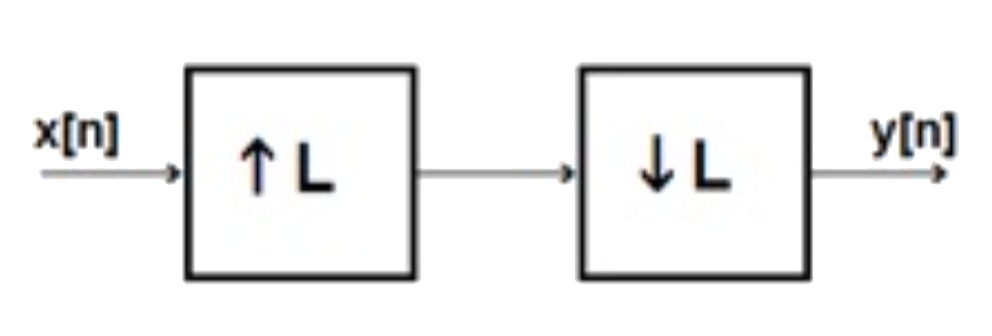
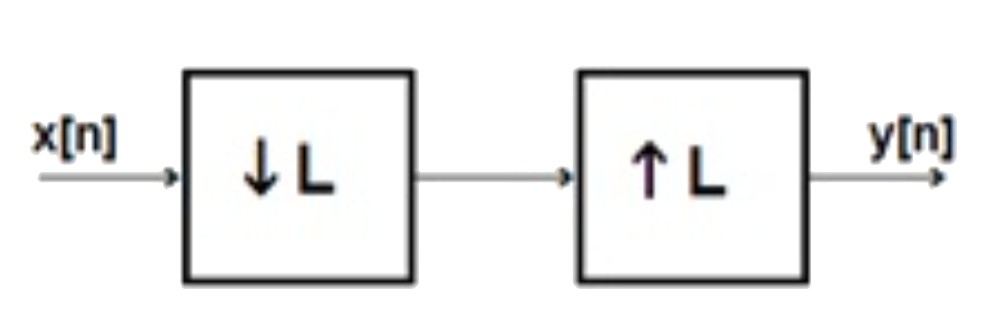
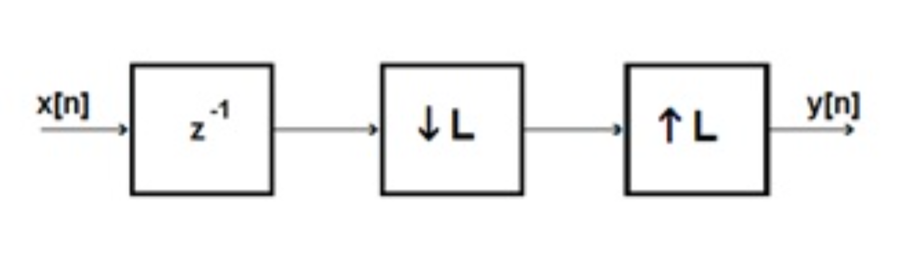

# hw07


## 1 
Use the MATLAB function `buttord` to find the estimated order and $$3\:\text{dB}$$ frequency required for the following filter specifications. Use these results to get the discrete time Butterworth filter coefficients and verify that the pass-band and stop-band specifications have been met.

**(a)** `wp = 0.2`, `ws = 0.4`, `rp = 1.0` dB, `rp = 40` dB

**(b)** `wp = 0.2`, `ws = 0.4`, `rp = 0.5` dB, `rp = 60` dB

**(c)** `wp = 0.2`, `ws = 0.3`, `rp = 0.5` dB, `rp = 60` dB

**(d)** Explain how the estimated filter order is related to the filter specifications.


## 2
You have sampled a signal at $$200\:\text{Hz}$$ and desire to create a LPF with a pass-band frequency of $$30\:\text{Hz}$$ and a stop-band frequency of $$50\:\text{Hz}$$. When appropriate, you desire a passband ripple of less than 1dB and a stopband attenuation of $$40\:\text{dB}$$. Using the appropriate MATLAB order functions (`buttord`, `cheb1ord`, `cheb2ord`, `ellipord`), find the recommended order and parameters for the following filter specifications for Butterworth, Chebyshev I, Chebyshev II, and Elliptic filters. For each use the appropriate MATLAB function to compute the discrete time filter coefficients, and then use freqz to compute the frequency response. Verify that the specifications are met and find the width of the transition band for each filter. Are the recommended order and transition band as expected based on what was discussed in class?


## 3
Again, assume you have sampled a signal at $$200\:\text{Hz}$$. Create the following filters with order, $$N=6$$:

**(a)** A Chebyshev Type I bandstop filter that blocks frequencies from $$35\:\text{Hz}$$ to $$60\:\text{Hz}$$ with a passband ripple of no more than $$2\:\text{dB}$$.

**(b)** An Elliptic high pass filter that passes frequencies greater than $$40\:\text{Hz}$$ with a passband ripple of no more than $$2\:\text{dB}$$ and a stopband attenuation of $$40\:\text{dB}$$.

**(c)** A Chebyshev Type II bandpass filter that allows frequencies between $$40\:\text{Hz}$$ and $$55\:\text{Hz}$$ to pass with a stopband attenuation of $$40\:\text{dB}$$.


## 4
Convert the single-pole lowpass Butterworth filter with system function:  
$$
H(z)=\frac{0.245\left(1+z^{-1}\right)}{1-0.509z^{-1}}
$$
into a bandpass filter with upper and lower cutoff frequencies $$\omega_u$$ and $$\omega_l$$, respectively. The low pass filter has a $$3\:\text{dB}$$ bandwidth, $$\omega_p=0.2\pi$$. Leave your answer in terms of $$a_1$$  and $$a_2$$ as provided in the lecture notes.
 

## 5
The MATLAB function `firpm` uses the Parks-McClellan method. Use `firpm` to design the following filters, each at two different orders, `n=10` and `30`. For each filter observe the frequency response generated by `freqz` with 1024 points and the pole zero diagrams generated by `zplane`. Answer the specific questions. You do not need to submit plots of the frequency response and the pole zero diagrams.

**(a)** Design a low pass filter with a pass band at normalized frequencies $$0.0$$ to $$0.2$$ and a stop band at normalized frequencies $$0.3$$ to $$1.0$$. (A normalized frequency of $$1.0$$ corresponds to one half the sampling frequency in $$\text{Hz}$$ and to a discrete time frequency of $$\omega=\pi$$ radians per sample.)
1. How does the frequency response at the band edges change as the filter order is increased?
2. How do the sidelobe peaks in the stop band change as the filter order increases?
3. Where are the zeroes of the filters?

**(b)** Design a band pass filter with a stop band at normalized frequencies $$0.0$$ to $$0.2$$, a pass band at normalized frequencies $$0.3$$ to $$0.6$$ and a stop band at normalized frequencies of $$0.7$$ to $$1.0$$.
1. How does the frequency response at the band edges change as the filter order is increased?
2. How do the sidelobe peaks in the stop band change as the filter order increases?
3. How do the results of (1) and (2) compare to the results in part **(a)** where there are only two bands?
4. Where are the zeroes of the filters?

**(c)** Design a high pass filter with a stop band at normalized frequencies $$0.0$$ to $$0.65$$ and a pass band at normalized frequencies of $$0.7$$ to $$1.0$$.
1. How does the frequency response at the band edges change as the filter order is increased?
2. How do the sidelobe peaks in the stop band change as the filter order increases?
3. How do the results of (1) and (2) compare to the results in part **(a)** where the transition band is twice as wide?
4. Where are the zeroes of the filters?


## 6
Use `firpm` to design full-band differentiators with orders of $$5$$ and $$21$$.

**(a)**  How does the frequency response change as the order is increased?

**(b)**  Create an input function $$x[n]$$ of 1024 points and compute the filter output $$y[n]$$ for each filter. Use `fft` to compute the frequency content of $$x[n]$$ and $$y[n]$$ for each filter. Compare the results based on the magnitude of the `fft` results.
$$
x[n]=\cos{\left(0.2\pi{n}\right)}+\cos{\left(0.4\pi{n}\right)}+\cos{\left(0.6\pi{n}\right)}+\cos{\left(0.8\pi{n}\right)}
$$
 
**(c)**  Repeat part **(b)**, with input 
$$
x_2[n]=x[n]+a\times\operatorname{randn}(N)
$$
where $$N=\operatorname{length}(x)$$. How does the value of $$a$$, which controls the noise level, affect your results?


## 7
__Downsampling__

**(a)** If $$x[n]$$ is obtained by sampling the analog signal $$x(t)=\cos{\left(2\pi2000t\right)}$$ at a sampling frequency of $$10\:\text{kHz}$$, find the discrete time frequency of $$x[n]$$ in radians per sample. Find the discrete time frequency of the downsampled signal if $$M=2$$ and if $$M=6$$.

**(b)** If $$x[n]$$ is obtained by sampling the analog signal $$x(t)=\cos{\left(2\pi100t\right)}$$ at a sampling frequency of $$600\:\text{Hz}$$, find the values for $$\begin{matrix}x[n],&\text{for }0\leq{n}\leq10\end{matrix}$$. Find the values of 
$$
\begin{matrix}y[n],&\text{for }0\leq{n}\leq10\end{matrix}
$$
if $$M=2$$. Find the values of 
$$
\begin{matrix}y[n],&\text{for }0\leq{n}\leq10\end{matrix}
$$ 
if $$M=4$$.

**(c)** From **(a)** and **(b)**, identify any cases in which the downsampling operation caused aliasing.


## 8
The signal $$x_1[n]$$ has $$z$$-transform  $$X_1(z)$$.

**(a)**  How is the signal  $$x_2[n]=0.25 \left(x_1[n]+(j)^nx_1[n]+(-1)^nx_1[n]+(-j)^nx_1[n]\right)$$ related to  $$x_1[n]$$?

**(b)**  Write an expression for the $$z$$-transform of $$x_2[n]$$ in terms of $$X_1(z)$$.


## 9
__Upsampling__
**(a)** If $$x[n]$$ is obtained by sampling the analog signal $$x(t)=\cos{\left(2\pi100t\right)}$$ at a sampling frequency of $$300\:\text{Hz}$$, find the values for 
$$
\begin{matrix}
x[n],&\text{for }0\leq{n}\leq10
\end{matrix}. 
$$
Find the values of 
$$
\begin{matrix}
x_u[n],&\text{for }0\leq{n}\leq10
\end{matrix}. 
$$
if $$L=2$$.
 
**(b)** Can $$x[n]$$ be obtained from  $$x_u[n]$$? If so, how? If not, why not?


## 10
Write expressions for the outputs of the following systems in terms of the inputs.






## 11
A signal $$x_a(t)$$ is sampled with a sampling frequency of 10KHz to produce the sample sequence $$x[n]$$ with values (starting with $$n=0$$) of
$$
\left\{2,\:-1,\:-1,\:2,\:-1,\:-1,\:2,\:-1,\:-1,\:2,\:-1,\:-1,\:2,\:-1,\:-1\right\}.
$$

**(a)** What is the time duration represented by the sample sequence?

**(b)** Write the sample sequence for $$x_u[n]$$ created using an up-sampling factor of 2. What is the effective sampling frequency and sampling interval of the new sequence?

**(c)** Convolve $$x_u[n]$$ with 
$$
h[n]=\begin{cases}
\left\{0.5,\:1,\:0.5\right\},&\text{for }0\leq{n}\leq2\\
0,&\text{otherwise}
\end{cases} 
$$
Plot your result. Show that this results in a linear interpolation of the original signal.

**(d)** Convolve Convolve $$x_u[n]$$ with 
$$
h[n]=\begin{cases}
\frac{\sin{\left(\tfrac{\pi{n}}{2}\right)}}{\left(\tfrac{\pi{n}}{2}\right)},&\text{for }-7\leq{n}\leq7\\
0,&\text{otherwise}
\end{cases}
$$
Plot your result. Show that samples from the original $$x[n]$$ sequence are preserved. How does this periodic waveform compare to the result of **(c)**?


## 12
A signal $$x[n]$$ has been sampled with a sampling time interval of $$T$$. The signal will be resampled with a sampling interval of $$0.8T$$.

**(a)** If the original sampling frequency was $$8000\:\text{Hz}$$, what is the sampling rate of the resampled signal?

**(b)** Draw a block diagram to do this rate conversion using up-sampling, down-sampling, and low-pass filter blocks. Specifically identify the rates for the up and down sampling and the cutoff frequency for the low pass filter. Identify the sampling rate in Hz. at the output of each block in the block diagram.

**(c)** If $$x[n]=\cos{\left(2\pi\left(\tfrac{1}{8}\right)n\right)}$$, sketch the DTFT of the output of each block.

**(d)** If the original analog signal included a tone at $$4500\:\text{Hz}$$, what frequency would it appear as in the original sampled signal, $$x[n]$$? What frequency would it appear as in the resampled signal?


## 13
A signal $$x[n]$$ is to be up-sampled by a factor of 4 and then linearly interpolated. 

**(a)** Show that this can be done by convolving the up-sampled $$x[n]$$ with a filter
$$
h[n]=\{0.25,\:0.5,\:0.75,\:1,\:0.75,\:0.5,\:0.25\}
$$
How many multiplies are need to produce each convolution output? On average, how many of these multiplications are multiplying a filter coefficient by a zero data point inserted by the up-sampling operation?

**(b)** For the input sequence 
$$
x[n]=\{0,\:4,\:8,\:-12,\:0,\:-4,\:4,\:0\}
$$
determine the output sample sequence.

**(c)** Show how the desired up-sampling and interpolation can be achieved by creating four new signals, each obtained by convolving the original $$x[n]$$ by a filter of length $$1$$ or $$2$$, and then up-sampling each of the new signals by a factor of $$4$$, delaying them, and then adding them all together. The four filters are: 
$$
\begin{matrix}
\{0.25,\:0.75\},&\{0.75,\:0.25\},&\{0.5,\:0.5\},&\text{and }\{1.0\}
\end{matrix}
$$
.
1. Draw a block diagram for this system. Specifically show the delay for each of the four up-sampled outputs before they are all added together.
2. Using $$x[n]$$ from part **(b)**, compute the four filtered output signals. Compute the four up-sampled and delayed signals.
3. Compare the computation required for this method compared to the method of part **(a)**


## 14
Consider the upsampling and interpolation described in the Lecture Notes. This problem is meant to illustrate this process at work.

**(a)**  Upsample the signal 
$$
x[n]=[1,\:2,\:3] 
$$
by 3, *i.e.* $$L=3$$.

**(b)**  Now, convolve the filter 
$$
h=\left[\tfrac{1}{3},\:\tfrac{2}{3},\:1,\:\tfrac{2}{3},\:\tfrac{1}{3}\right]
$$ 
by the upsampled vector and verify that it implements linear interpolation. How many multiplies total did you have to do to complete this?

**(c)**  Now, implement the Polyphase Filter Decomposition by taking the unsampled signal $$x[n]$$ and each of the three downsampled versions of the filter $$h$$ (that is, create three new filters by downsampling $$h$$ by a factor of 3 starting at the first, second and third samples). Your first downsampled filter should be $$h_0=\left[\tfrac{1}{3},\:\tfrac{2}{3}\right]$$.
1. What are the other two downsampled filters?
2. Show the result of each of the downsampled filters convolved with the original input $$x$$.
3. Implement the Polyphase Filter Decomposition by taking each of the results of **(c)**2 and shifting appropriately and adding. Do you get the same response as in part **(b)**?
4. How many multiplies were calculated in part **(c)**?

## 15
__Quantization Error__: The following code was written to explore the errors that would occur in the pole positions of a denominator polynomial if the number of bits in the
coefficients was limited. Explain this result.
```matlab
% bit test
r = 0.98;
wv = pi*[0.25:0.005:0.35];
figure (1)
th = pi*[0:512]/256;
plot(cos(th), sin(th), 'g')
hold on
for m = 1:length(wv)
    w = wv(m);
    cv = [ 1, -2*r*cos(w), r*r];
    cv2 = ( round( 16*cv))/16;  % limit to 5 bits
    p = roots(cv);
    plot( p, 'bs')
    p2 = roots(cv2);
end plot( p2, 'rd')
hold off
```