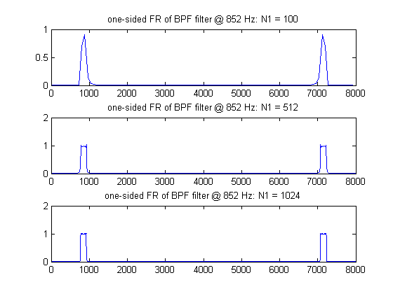
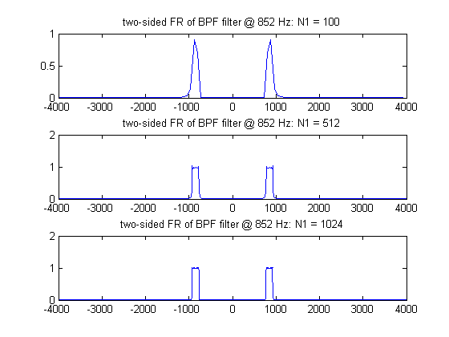
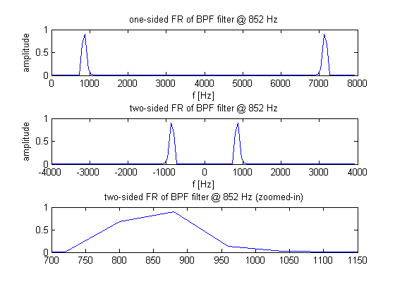
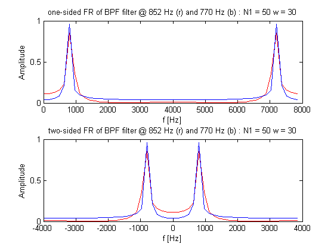
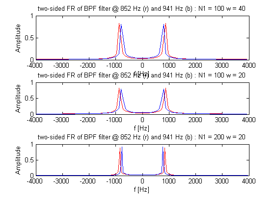
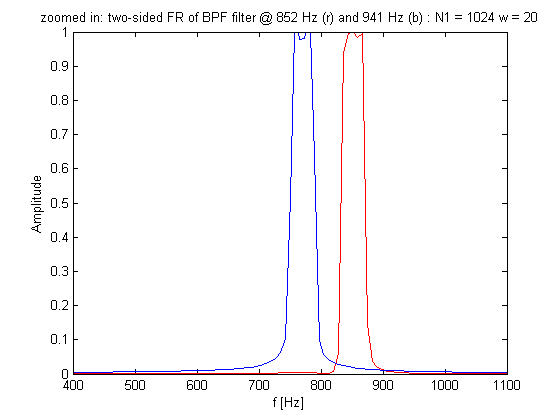

# lab04sub
Detecting DTMF Tones with FIR Filters

## OBJECTIVES:
In this laboratory we will:
- Use MATLAB to help us specify the most appropriate filter length and filter parameters to distinguish the button frequencies.
- Test the selected filter using test signals similar to those generated in Laboratory 3.

## PRELAB:
In this PreLab we will explore filters that can distinguish the third row tone at $$852\:\text{Hz}$$ from the second row tone at $$770\:\text{Hz}$$.

### 1.
In MATLAB type “`help fir1`” to read about the function that will generate low pass and bandpass filter coefficients. Part of that information is shown below.
`B = FIR1(N, Wn, WIN)` designs an N-th order FIR filter using the N+1 length vector WIN to window the impulse response.
- An `N`th order FIR filter will have $$(N+1)$$ coefficients. Its Z-transforms will have $$N$$ zeros, which we will not compute (we will cover z-transforms more fully in about two weeks).
- The cut-off frequency `Wn` must be between $$0<Wn<1.0$$, with $$1.0$$ corresponding to half the sample rate. Here, `Wn` is a normalized frequency that is $$\omega$$  that we have been dealing with so far (with a range of $$-\pi$$ to $$\pi$$) divided by $$\pi$$ . Since the magnitude will be even, simply dealing with the positive normalized frequency is sufficient.
- If `Wn` is a two-element vector, `Wn = [W1 W2]`, `FIR1` returns an order `N` bandpass filter with passband $$W1<W<W2$$.
- `WIN = rectwin(N+1)` will use a rectangular window.

We want to detect the row 3 frequency of $$852\:\text{Hz}$$, so we will specify a passband with $$852$$ in the center. The width of the passband should be chosen to be small enough so that the $$770\:\text{Hz}$$ signal cannot get through. For a passband of width `2*w` we would use the instructions below. Note that we have divided the two frequencies specifying the band edges by $$\tfrac{f_s}{2}$$ so that the frequency range for the function would be normalized to the range of 0 and 1 as required by the function definition.

-----

### 2.
The function `fir1` produces the filter coefficients based on our specifications, but it is hard to tell by looking at the coefficients how good a job the filter will do. We need to look at the filter frequency response. To put this in terms that we have already seen in class, the frequency response is simply the DTFT of the filter — *i.e.*, it shows the response as a function of frequency. Type “`help freqz`” to read about the function that will compute the frequency response.
`[H,W] = FREQZ(B,A,N)` returns the N-point complex frequency response vector `H` and the `N`-point frequency vector `W` in $$\tfrac{\text{radians}}{\text{sample}}$$ of the filter defined by a difference equation in which the `A` vector has the a coefficients and the `B` vector has the `b` coefficients. For our use, `B` will be the output of `fir1` and we will set `A` equal to the scalar value 1. Since we are dealing with a FINITE impulse response, the fact that `A=1` should make sense as it means that there are no coefficients for delayed output (`y`) terms. If there was feedback, the impulse response would be infinite.
- The frequency response is evaluated at `N` points equally spaced around the upper half of the unit circle of a `real` vs. `imag` plot. Generally, we consider the unit circle with an angle equal to that described by $$\omega$$ in radians. If `N` isn't specified, it defaults to $$512$$. (Note that this `N` has nothing to do with the filter length.)
- `[H,F] = FREQZ(B,A,N,Fs)` returns frequency vector `F` (in Hz), where `Fs` is the sampling frequency (in Hz).

We are specifying our frequency bands in Hz, so if we want to be able to easily interpret the frequency response, we will use the frequency vector in Hz for plotting. To see the frequency response we would use the following:
```matlab
N2=512;
[H852, fv] = freqz(b852,1,N2,fs); %N2 is the number of frequency response points
plot(fv, abs(H852))
```

This shows just the one-sided spectrum. To see the two-sided spectrum from $$-\tfrac{F_s}{2}$$ to $$\tfrac{F_s}{2}$$ do the following instead.
```matlab
N2=1024;
[H852, fv] = freqz(b852,1,N2,fs,'whole');
plot(fv-4000, fftshift(abs(H852)));
```

Note that in the plot command, `plot(fv, abs(H852))` would yield a plot from $$0$$ to just shy of $$8000$$ ($$8000$$ would start the next period — look at `fv(end)` to see.)

So, to see the two-sided plot, one must subtract $$\tfrac{F_s}{2}$$  (in this case, $$4000$$) and “`fftshift`” the values being plotted — in essence, this is picking up the irght hand side of the plot and putting it onto the left.
```matlab
% ----- EXERCISE 1: -----
% changes in resolution (N2) of FR 

fs = 8000;
fc = 852;
w = 82;
Wn = [fc-w, fc+w]/(fs/2);

N1 = 100;
b852 = fir1(  N1, Wn, rectwin(N1+1)  );

N2a = 512;
[H852a, fv1] = freqz(  b852, 1, N2a, fs,'whole'  );

N2b = 1024;
[H852b, fv2] = freqz(  b852, 1, N2b, fs,'whole'  );

title1 = 'one-sided FR of BPF filter @ 852 Hz w/ resolution, N2 = ';
title2 = 'two-sided FR of BPF filter @ 852 Hz w/ resolution, N2 = ';

% ----- one-sided plot ----- 
figure();
subplot(2,1,1);
plot(  fv1, abs(H852a)  );
title(  horzcat(title1, num2str(N2a))  );

subplot(2,1,2);
plot(  fv2, abs(H852b)  );
title(  horzcat(title1, num2str(N2b))  );

% ----- two-sided plot ----- 
figure();
subplot(2,1,1);
plot(  fv1-(fs/2), fftshift(abs(H852a))  );
title(  horzcat(title2, num2str(N2a)));

subplot(2,1,2);
plot(  fv2-(fs/2), fftshift(abs(H852b))  );
title(  horzcat(title2, num2str(N2b))  );
```





-----

### 3.
Use `N1 = 100` and `w = 80` to compute `b852` and then plot the frequency response as described above. It is your choice to plot the one-sided or the two-sided plot — but, you should understand and be comfortable with both. This should produce a filter with $$101$$ coefficients that tries to make a filter that will pass frequencies between $$772\:\text{Hz}$$ and $$932\:\text{Hz}$$. Observe the plot of the frequency response and see how well this filter works.
```matlab
% ----- EXERCISE 2: -----
% Change in filter based on the limited amount of sample points.

fs = 8000;
fc = 852;
w = 80;
Wn = [fc-w, fc+w]/(fs/2);

N1 = 100;
N2 = 1024;      % resolution of FR
b852 = fir1(  N1, Wn, rectwin(N1+1)  );
[H852, fv] = freqz(  b852, 1, N2, fs, 'whole'  );

title3 = 'one-sided FR of BPF filter @ 852 Hz';
title4 = 'two-sided FR of BPF filter @ 852 Hz';
title5 = 'two-sided FR of BPF filter @ 852 Hz (zoomed-in)';

% ----- plot frequency response -----
figure();
subplot(3,1,1);
plot(fv, abs(H852));
title(title3);
xlabel('f [Hz]'); ylabel('amplitude');

subplot(3,1,2);
plot(fv-(fs/2), fftshift(abs(H852)));
title(title4);
xlabel('f [Hz]'); ylabel('amplitude');

subplot(3,1,3);
plot(fv-(fs/2), fftshift(abs(H852)));
title(title5);
axis([670 1100 0 1]);

% linear interpolation: apprximate magnitude for 
% (1) 852 Hz, 
% (2) 772 Hz, and 
% (3) 932 Hz

a765 = fftshift(abs(H852(99)));  % 765 Hz
a773 = fftshift(abs(H852(100)));  % 773 Hz
a851 = fftshift(abs(H852(110)));  % 851 Hz
a859 = fftshift(abs(H852(111)));  % 859 Hz
a929 = fftshift(abs(H852(120)));  % 929 Hz
a937 = fftshift(abs(H852(121)));  % 937 Hz

a852 = a851 + (a859 - a851) * (852-851)/(859-851)
a772 = a765 + (a773 - a765) * (772-765)/(773-765)
a932 = a929 + (a937 - a929) * (932-929)/(937-929)

% Approximately 985 and 720 hits close to 0
```

__output__:
```
a852 
	= 0.9991
a772 
	= 0.3877
a932 
	= 0.3766
```




#### 3(a).
You should see a narrow band centered at $$852\:\text{Hz}$$ on frequency axis that either goes from  $$0\:\text{Hz}$$ to $$8000\:\text{Hz}$$ or from $$-4000\:\text{Hz}$$ to $$4000\:\text{Hz}$$. If you do not see this (note example below), check your parameters and instructions and then replot.

#### Q3(b)
Use the magnify feature in the figure window and display the small region with a nonzero frequency response in detail. What is the value of the frequency response at approximately $$852\:\text{Hz}$$? At approximately $$772\:\text{Hz}$$?, at approximately $$932\:\text{Hz}$$? At what frequency below $$852\:\text{Hz}$$ does the frequency response first go to zero? At what frequency above $$852\:\text{Hz}$$ does the frequency response first go to zero?

#### A3(b)
- @ $$852\:\text{Hz}$$, the amplitude is approximately 0.9991
- @ $$772\:\text{Hz}$$, the amplitude is approximately 0.3877
- @ $$932\:\text{Hz}$$, the amplitude is approximately 0.3766
- Examining the plot, @ $$985\:\text{Hz}$$ and $$720\:\text{Hz}$$ is the location where it will first go to zero.

------

In the example below, filters with `N1 = 50` and `w = 30` are used for row 3 and row 4 tone frequencies. On the right, the frequency response between $$600\:\text{Hz}$$ and $$1200\:\text{Hz}$$ is shown. Clearly these filters have a lot of overlap in frequency, and they are not narrow enough to separate the two frequencies.


For the following steps, use a script `m`-file for your MATLAB instructions. (Note that `figure(n)` creates a new figure window and plotting after that command will appear in the new window without disturbing existing figure windows.)


### 4.
Compute `b770` and `H770` in the same way and plot both `H770` and `H852` on the same axes with __`plot(fv, abs(H770),’-r’, fv, abs(H852),’-b’)`__ to plot the one-sided spectra in different colors as in the figure above. You can modify this to view the two-sided spectra as desired.

```matlab
% ----- EXERCISE 3: -----
% Examiniation of overlapping filter @ different frequencies.

fs = 8000;
fc1 = 852;
fc2 = 770;


N1 = 50;
w = 30;
Wn1 = [fc1-w, fc1+w]/(fs/2);
b852 = fir1(  N1, Wn1, rectwin(N1+1)  );

Wn2 = [fc2-w, fc2+w]/(fs/2);
b770 = fir1(  N1, Wn2, rectwin(N1+1)  );

N2 = 1024;
[H852, fv] = freqz(  b852, 1, N2, fs,  'whole'  ) ;
[H770, fv] = freqz(  b770, 1, N2, fs,  'whole'  ) ;

title1 = 'one-sided FR of BPF filter @ 852 Hz (r) and 770 Hz (b) : N1 = ';
title2 = 'two-sided FR of BPF filter @ 852 Hz (r) and 770 Hz (b) : N1 = ';
width = ' w = '; 

% ----- plot the frequency response ----- 
figure();
subplot(2,1,1)
plot(  fv, abs(H852), '-r', fv, abs(H770), '-b'  );
title(horzcat(title1, num2str(N1), width, num2str(w)));
xlabel('f [Hz]'); ylabel('Amplitude');

subplot(2,1,2)
plot(  fv-(fs/2), fftshift(abs(H852)), '-r',...
    fv-(fs/2), fftshift(abs(H770)), '-b' );
title(horzcat(title2, num2str(N1), width, num2str(w)));
xlabel('f [Hz]'); ylabel('Amplitude');
```



#### Q4
How much overlap is there between the two frequency bands? Print this plot and submit it with your PreLab. Note the values of `N1` and `w` on it.

#### A4
There's almost a complete overlap between these two bands. 

-----

### 5.
Try to reduce the overlap by repeating Step 4 with the following three sets of values of `w` and `N1`.
- `N1 = 100` and `w = 40`;
- `N1 = 100` and `w = 20`;
- `N1 = 200` and `w = 20`;

__NOTE__: Just reducing w will not necessarily narrow the width of your filter. As `w` is decreased, `N1` may have to be increased to attain the sharper frequency definition.

```matlab
% ----- EXERCISE 4: -----
% Remove the overlap
fs = 8000;
fc1 = 852;
fc2 = 770;

% ----- test1: ----- 
N1 = 100;
w1 = 40;

Wn1 = [fc1-w1, fc1+w1]/(fs/2);
Wn2 = [fc2-w1, fc2+w1]/(fs/2);
b852 = fir1(  N1, Wn1, rectwin(N1+1)  );
b770 = fir1(  N1, Wn2, rectwin(N1+1)  );

N2 = 1024;
[H852, fv] = freqz(  b852, 1, N2, fs,  'whole'  ) ;
[H770, fv] = freqz(  b770, 1, N2, fs,  'whole'  ) ;

title2 = 'zoomed in: two-sided FR of BPF filter @ 852 Hz (r) and 941 Hz (b) : N1 = ';
width = ' w = '; 

% ----- test1: plot the frequency response ----- 
subplot(3,1,1)
plot(  fv-(fs/2), fftshift(abs(H852)), '-r',...
    fv-(fs/2), fftshift(abs(H770)), '-b' );
title(horzcat(title2, num2str(N1), width, num2str(w1)));
xlabel('f [Hz]'); ylabel('Amplitude');
axis([ 600 1100 0 1]);

% ----- test2: reducing w by half -----
N1 = 100;
w1 = 20;

Wn1 = [fc1-w1, fc1+w1]/(fs/2);
Wn2 = [fc2-w1, fc2+w1]/(fs/2);
b852 = fir1(  N1, Wn1, rectwin(N1+1)  );
b770 = fir1(  N1, Wn2, rectwin(N1+1)  );

[H852, fv] = freqz(  b852, 1, N2, fs,  'whole'  ) ;
[H770, fv] = freqz(  b770, 1, N2, fs,  'whole'  ) ;

% ----- test2: plot the frequency response ----- 
subplot(3,1,2)
plot(  fv-(fs/2), fftshift(abs(H852)), '-r',...
    fv-(fs/2), fftshift(abs(H770)), '-b' );
title(horzcat(title2, num2str(N1), width, num2str(w1)));
xlabel('f [Hz]'); ylabel('Amplitude');
axis([ 600 1100 0 1]);

% ----- test3: double N1 -----
N1 = 200;
w1 = 20;

Wn1 = [fc1-w1, fc1+w1]/(fs/2);
Wn2 = [fc2-w1, fc2+w1]/(fs/2);
b852 = fir1(  N1, Wn1, rectwin(N1+1)  );
b770 = fir1(  N1, Wn2, rectwin(N1+1)  );
[H852, fv] = freqz(  b852, 1, N2, fs,  'whole'  ) ;
[H770, fv] = freqz(  b770, 1, N2, fs,  'whole'  ) ;

% ----- test3: plot the frequency response ----- 
subplot(3,1,3)
plot(  fv-(fs/2), fftshift(abs(H852)), '-r',...
    fv-(fs/2), fftshift(abs(H770)), '-b' );
title(horzcat(title2, num2str(N1), width, num2str(w1)));
xlabel('f [Hz]'); ylabel('Amplitude');
axis([ 600 1100 0 1]);
```



### 6.
Compare the results of Steps 4 and 5 with respect to the filter’s ability to suppress one of the tones. 

#### Q6
What is the effect of reducing `w`? What is the effect of increasing `N1`?

#### A6
- `w` adjusts the bandwidth. Reducing `w`, entails __narrower__ band on the frequency domain.
- `N1` adjusts the degree of the filter.  Increasing `N1` brings __more sample points__ for the filter and the shapes of the filter will look more __well-defined__ due to a large sample size. 


### 7.
Chose a set of values for `N1` and `w` that you think would be the best to use in filters that would reliably distinguish the row 3 tone from the row 2 tone and justify your choice. How long is your filter as a fraction of the minimum time between digits of $$45\:\text{ms}$$? Your choice does not have to be one of the four suggested in this Prelab.

```matlab
% ----- EXERCISE 5: -----
% Find the best N1 and w for the least overlapping.
fs = 8000;
fc1 = 852;
fc2 = 770;

% ----- test1: ----- 
N1 = 200;
w1 = 10;

Wn1 = [fc1-w1, fc1+w1]/(fs/2);
Wn2 = [fc2-w1, fc2+w1]/(fs/2);
b852 = fir1(  N1, Wn1, rectwin(N1+1)  );
b770 = fir1(  N1, Wn2, rectwin(N1+1)  );

N2 = 1024;
[H852, fv] = freqz(  b852, 1, N2, fs,  'whole'  ) ;
[H770, fv] = freqz(  b770, 1, N2, fs,  'whole'  ) ;

title2 = 'zoomed in: two-sided FR of BPF filter @ 852 Hz (r) and 941 Hz (b) : N1 = ';
width = ' w = '; 

% ----- test1: plot the frequency response ----- 
figure();
plot(  fv-(fs/2), fftshift(abs(H852)), '-r',...
    fv-(fs/2), fftshift(abs(H770)), '-b' );
axis([600 1100 0 1]);
title(horzcat(title2, num2str(N1), width, num2str(w1)));
xlabel('f [Hz]'); ylabel('Amplitude');
```



Given
$$
f_s=8000\:\left[\tfrac{\text{sample}}{\text{sec}}\right]
$$
We can find the tone signal's time by doing the following
$$
\begin{align*}
t_\text{tone}&=\frac{N1}{f_s}\\
&=\frac{200}{8000}\\
&=0.025
\end{align*}
$$
Doing so, the ratio between tone time to quiet time must be less than one. So,
$$
\frac{t_\text{tone}}{t_\text{quiet}}=\frac{0.025}{0.045}=0.55
$$

__For the Prelab, submit the answers to the questions, the plots and any Matlab scripts that you wrote.__


