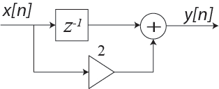

# ex02

## 1
__EXAMPLE: SAMPLING__

### (a)
You are given
$$
\begin{matrix}
x[n]=\{1,\:2,\:3,\:4,\:5\}&\text{for }n=0:4
\end{matrix}
$$
Plot the samples vs. $$n$$,

### (b)
You are given
$$
\begin{matrix}
x[n]=\{1,\:2,\:3,\:4,\:5\}&\text{for }n=0:4
\end{matrix}
$$
Plot the samples vs. $$n$$, assuming that the sampling interval, $$T=1\:\text{sec}$$.

### (c)
You are given
$$
\begin{matrix}
x[n]=\{1,\:2,\:3,\:4,\:5\}&\text{for }n=0:4
\end{matrix}
$$
Plot the samples vs. $$n$$, assuming that the sampling interval, $$T=0.5\:\text{sec}$$.

----

## 2
__EXAMPLE: SIGNAL MANIPULATION(1)__

Take the following continuous-time signal, $$x(t)$$ and plot: $$y(t)=2x(0.5t-1)$$

----

## 3
__EXAMPLE: SIGNAL MANIPULATION(2)__

Recall the standard:
$$
y[n]=cx[a(n+b)]+d
$$
Plot $$y[n]=2x[1-0.5n]$$

----

## 4
__EXAMPLE: BRANCHING__
### (a)
What is the ouput to the system below?

### (b)
What is the ouput $$y[n]$$ o the system below?

----

## 5
__EXAMPLE: CONVOLUTION__

What is the convolution of the following two signals:

----

## 6
__EXAMPLE: UPSAMPLING__

$$
\begin{matrix}
x[n]=\{1,\:2,\:3,\:4\}&
\begin{cases}
\text{for }n=0:3\\
L=2
\end{cases}
\end{matrix}
$$
What is $$x_u[n]$$

----

## 7
__EXAMPLE: DOWNSAMPLING__

$$
\begin{matrix}
x[n]=\{1,\:2,\:3,\:4,\:5,\:6,\:7,\:8\}&
\begin{cases}
\text{for }n=0:7\\
L=2
\end{cases}
\end{matrix}
$$
What is $$x_d[n]$$

