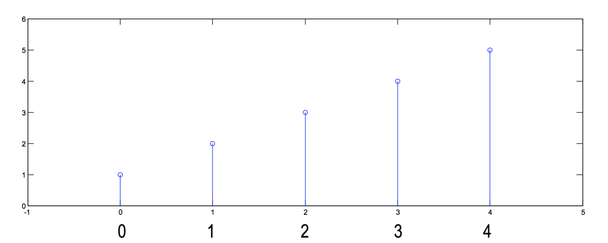

# ex02a

## 1
__EXAMPLE: SAMPLING__

### (a)
You are given
$$
\begin{matrix}
x[n]=\{1,\:2,\:3,\:4,\:5\}&\text{for }n=0:4
\end{matrix}
$$
Plot the samples vs. $$n$$,

### (b)
You are given
$$
\begin{matrix}
x[n]=\{1,\:2,\:3,\:4,\:5\}&\text{for }n=0:4
\end{matrix}
$$
Plot the samples vs. $$n$$, assuming that the sampling interval, $$T=1\:\text{sec}$$.

### (c)
You are given
$$
\begin{matrix}
x[n]=\{1,\:2,\:3,\:4,\:5\}&\text{for }n=0:4
\end{matrix}
$$
Plot the samples vs. $$n$$, assuming that the sampling interval, $$T=0.5\:\text{sec}$$.

