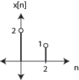
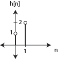
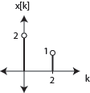
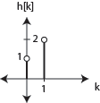
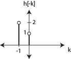
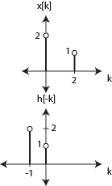
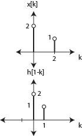
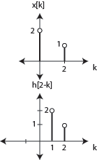
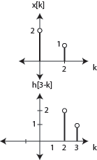

# ex02e

## 5
__EXAMPLE: CONVOLUTION__

What is the convolution of the following two signals:

__(1)__: Put these on the $$k$$-axis

__(2)__: next flip $$h[k]$$ around $$k=0$$ to create $$h[-k]$$.

__(3)__:  Now, line up $$x[k]$$ with $$h[-k]$$

__(4)__: What points overlap?
- multiply them
- add all of the products up
__(5)__: In this case
- we have overlap at 0, so
$$
2\times1=2
$$
There is nothing else to add to it. since no more overlap.
__(6)__: This value $$2$$ appears at $$y[0]$$, *i.e.* $$y[n]=2$$ at $$n=0$$. $$n=0$$ represents no shift.

### $$n=1$$
__(1)__: Next, shift $$h[-k]$$ to the right $$1$$ *i.e.* $$h[1-k]$$. Thus, this situation is looking at $$n=1$$

__(2)__: Note that the convolution equation asks you to look at $$h[n-k]$$ and this can be re-written as $$h[-1(k-n)]$$ which should help understand why a positive $$n$$ shifts $$h[-k]$$ to the right.

__(3)__: Anyway, for this example,
- the overlap at $$k=0$$, so
$$
2\times2=4
$$
This is the only overlap and thus is the only contribution to $$y[1]$$.

----
### $$n=2$$
__(1)__: Shifting by $$2$$ yields the plots to the right.

__(2)__: In this one,
- The only overlap appears at $$k=2$$
$$
1\times1=1;
$$
__(3)__: We shifted $$2$$ to the right, thus $$y[2]=1$$

----
### $$n=3$$
__(1)__: Shifting to the right $$3$$ yields our last shift to the right that will yield overlap. *i.e* again at position $$k=2$$.

__(2)__: In this one,
- we have
$$
1\times2=2;
$$
__(3)__: Thus, $$y[3]=2$$
$$
\begin{matrix}
\therefore\:y[n]=\{2,\:4,\:1,\:2\}&\text{for }n=0,\:1,\:2,\:3
\end{matrix}
$$
