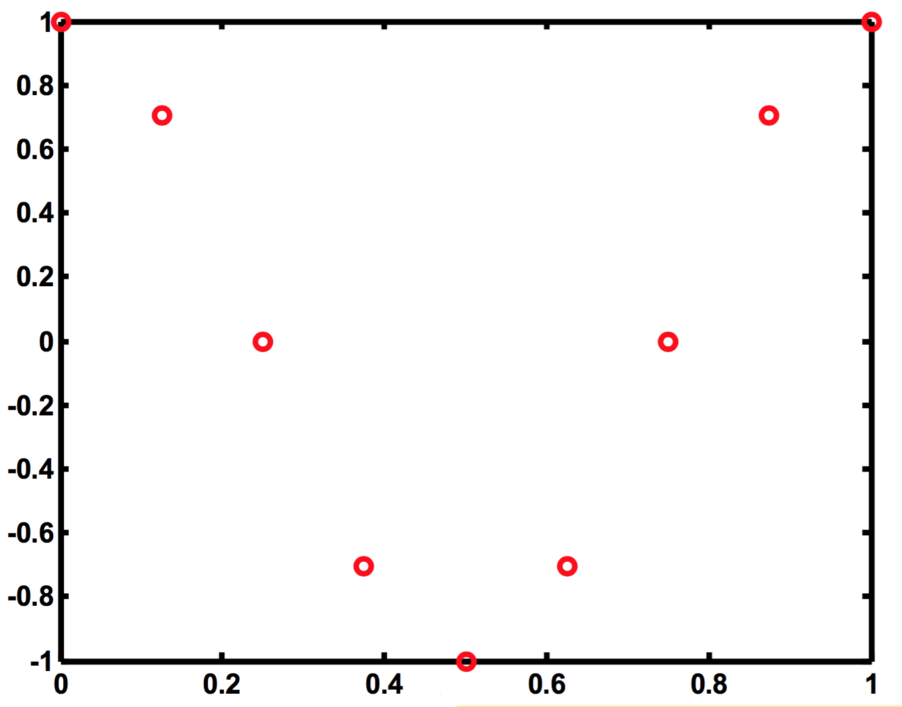

# ex04

## 1
__EXAMPLE: SAMPLING-ALIASING__

What CT function created these samples?

### [SEE ANSWER HERE](ex04/ex04a.md)

## 2
__EXAMPLE: SAPPLE VOCABULARY__

### (a)
- Start with a continuous-time signal $$x(t)=\cos{\left(2\pi(5)t\right)}$$ and sample it at $$f_T=20\:\text{Hz}$$.
- This has a continuous-time frequency of $$5\:\text{Hz}$$ and is being sampled at a sampling rate of $$20\:\text{Hz}$$.

### (b)
- Start with a continuous-time signal $$x(t)=\cos{\left(2\pi(10)t\right)}$$ and sample it at $$f_T=40\:\text{Hz}$$.
- This has a continuous-time frequency of $$10\:\text{Hz}$$ and is being sampled at a sampling ate of $$40\:\text{Hz}$$.

### (c)
- Start with a continuous-time signal $$x(t)=\cos{\left(2\pi(25)t\right)}$$ and sample it at $$f_T=20\:\text{Hz}$$.
- This has a continuous-time frequency of $$25\:\text{Hz}$$ and is being sampled at a sampling ate of $$20\:\text{Hz}$$.

### [SEE ANSWER HERE](ex04/ex04b.md)

## 3
__EXAMPLE: RECONSTRUCTION__

All three signals above ended with $$\cos{\left(\left(\tfrac{\pi}{2}\right)n\right)}$$
- We originally replaced $$t$$ with $$nT$$
- so, to go back, we can replace $$n$$ with $$\tfrac{t}{T}=tf_T$$.
- For the three cases, the reconstructor is only told of the sampling frequency:

### [SEE ANSWER HERE](ex04/ex04c.md)

## 4
__EXAMPLE: RECONSTRUCTED FREQUENCIES__

What are reconstructed frequencies for following cases?

### (a)
$$
\begin{matrix}
f_0=5\:\text{Hz},&f_T=20\:\text{Hz}\\
\end{matrix}
$$

### (b)
$$
\begin{matrix}
f_0=10\:\text{Hz},&f_T=40\:\text{Hz}\\
\end{matrix}
$$

### (c)
$$
\begin{matrix}
f_0=25\:\text{Hz},&f_T=20\:\text{Hz}\\
\end{matrix}
$$

### [SEE ANSWER HERE](ex04/ex04d.md)

## 5
__EXAMPLE: SAMPLING AT RECONSTRUCTED FREQUENCIES__

$$
\begin{align*}
g_1(t)&=\cos{(2\pi{t})}\\
g_2(t)&=\cos{(6\pi{t})}\\
\end{align*}
$$
Plot these and sample each at $$4\:\text{Hz}$$

### [SEE ANSWER HERE](ex04/ex04e.md)

## 6
__EXAMPLE: LINEARITY TEST__

Is the accumulator linear?

### [SEE ANSWER HERE](ex04/ex04f.md)

## 7
__EXAMPLE: SHIFT-INVARIANCE TEST__

Is an up-sampler shift-invariant?

### [SEE ANSWER HERE](ex04/ex04g.md)

