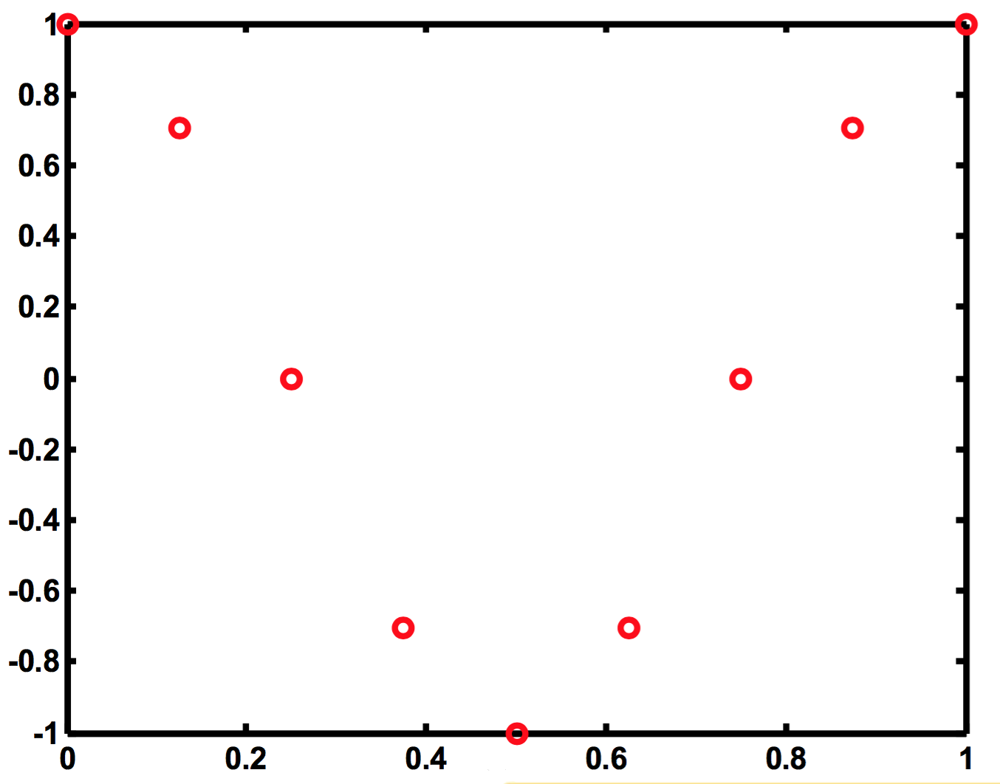

# ex04a

## 1
What CT function created these samples?

.$$\cos{\left(2\pi(1)t\right)}$$ sampled at $$8\:\text{Hz}$$

.$$\cos{\left(2\pi(1)t\right)}$$ and $$\cos{\left(2\pi(9)t\right)}$$ sampled at $$8\:\text{Hz}$$

### ANALOGY
What is this word or phrase?

| w[0] | w[1] | w[2] | w[3] | w[4] | w[5] |
| :--: | :--: | :--: | :--: | :--: | :--: |
| O | _ | A | _ | G | _ |

- More obvious now that it is the word __ORANGE__
- But, really, it depends on the sampling rate...

How about this?

| w[0] | w[1] | w[2] | w[3] | w[4] | w[5] | w[6] | w[7] | w[8] | w[9] | w[10] | w[11] |
| :--: | :--: | :--: | :--: | :--: | :--: | :--: | :--: | :--: | :--: | :---: | :---: |
| O | _ | _ | _ | A | _ | _ | _ | G | _ | _ | _ |

- could be something completely different... same samples.
- __OPERASINGERS__.

