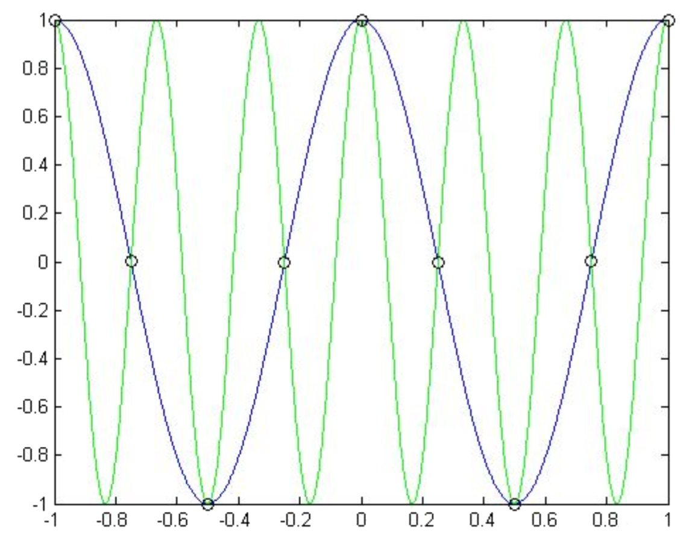

# ex04e

## 5
__EXAMPLE: SAMPLING AT RECONSTRUCTED FREQUENCIES__

$$
\begin{align*}
g_1(t)&=\cos{(2\pi{t})}\\
g_2(t)&=\cos{(6\pi{t})}\\
\end{align*}
$$
Plot these and sample each at $$4\:\text{Hz}$$

> __NOTE__: The point of this exercise is to
see that the samples at $$4\:\text{Hz}$$ are identical for these two signals. There are an infinite number of signals that would result in the same sample

$$
\begin{cases}
\nu_0=\frac{{f}_0}{{f}_T}&
\text{normalized digital frequency }\left[\tfrac{\text{cycles}}{\text{sec}}\right]\\
\omega_0=\frac{2\pi\Omega_0}{\Omega_T}&
\text{normalized digital angular frequency }\left[\tfrac{\text{radians}}{sec}\right]
\end{cases}
$$