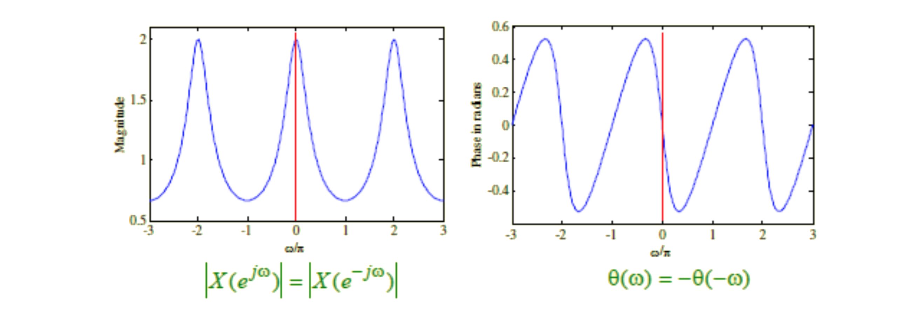

# ex06a

## 1
Find the DTFT of the followings:

__(a)__ the unit sample sequence, $$\delta[n]$$.
$$
\begin{align*}
\Delta{\left(e^{j\omega}\right)}&=\sum_{n=-\infty}^{\infty}{\delta[n]e^{-j\omega{n}}}\\
&=\delta[0]=1;
\end{align*}
$$
__(b)__ the causal sequence, $$ \begin{matrix}x[n]=\alpha^n\mu[n],&|\alpha|<1\end{matrix}$$.
$$
\begin{align*}
X\left(e^{j\omega}\right)&=\sum_{n=-\infty}^{\infty}{\alpha^{n}\mu[n]e^{-j\omega{n}}}\\
&=\sum_{n=(0)}^{\infty}{\alpha^{n}e^{-j\omega{n}}}\\
&=\sum_{n=(0)}^{\infty}{\left(\alpha{e}^{-j\omega}\right)^n}\\
&\left<\sum_{n=0}^{N}{a^n}=\frac{\left(1-a^{N+1}\right)}{(1-a)}\right>\\
&=\frac{\left(1-\left(\alpha{e}^{-j\omega}\right)^{\infty+1}\right)}{\left(1-\alpha{e}^{-j\omega}\right)}\\
&=\frac{1}{1-\alpha{e}^{-j\omega}}
\end{align*}
$$

## MAGNITUDE AND PHASE OF THE SOLUTION
$$
X(e^{j\omega})=\frac{1}{1-\alpha{e}^{-j\omega}}
$$

