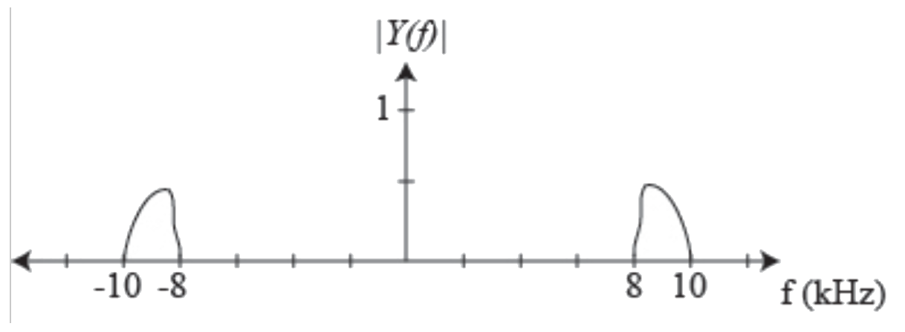
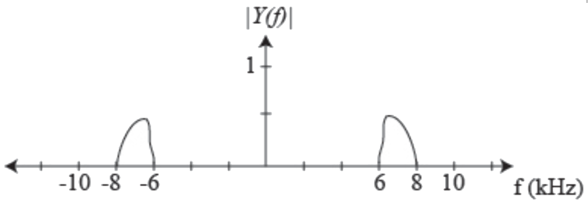

# ex07

## 1.
__EXAMPLE: SAMPLING AND RECONSTRUCTION__

At what rate can we sample the following signals (whose spectra are shown) and still get perfect reconstruction? State any assumptions.

## 2.
__EXAMPLE: FREQUENCY RESPONSE__
- Consider an altered moving average filter:
$$
y[n]=\frac{1}{M}\sum_{k=0}{M-1}{x[n-k]}
$$
Find the frequency response.