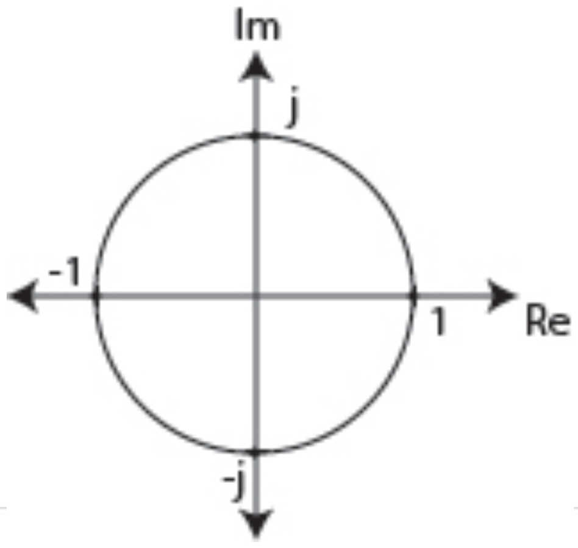

# ex09

## 1.
__EXAMPLE: DFT AROUND UNIT CIRCLE__

What are $$W_4^4$$, $$W_4^6$$, and $$W_4^9$$?
Calculate it or use the unit circle.

## 2.
__EXAMPLE: CIRCULAR CONVOLUTION__

Given
$$
\begin{align*}
h[n]&=[1,\:2,\:1]\\
x[n]&=[-1,\:5,\:6,\:2,\:7]
\end{align*}
$$
Find the convlution using DFT.

## 3.
__EXAMPLE: OVERLAP-ADD__
$$
\begin{align*}
x[n]&=[1,\:1,\:2,\:2]\\
h[n]&=[1,\:1,\:1]\\
y[n]&=x[n]\otimes{h}[n]
\end{align*}
$$
