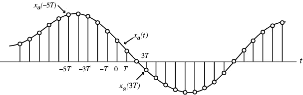

# lect01

## STARTING POINT
- What are digital signals?
- Why do we process them?
- How do we process them to achieve our goals?

## What does DSP look like?
- It’s changed over the years
	- 50’s and before—analog signal processing only—electronic circuits or mechanical devices
	- 60’s: largely theoretical—memory and multiplication were expensive and slow
	- 1965: Fast Fourier Transforms (FFTs) make real-time DSP possible
	- 70’s: 4x4 multiplier chips, TI processors, Processing speeds increased
	- 80’s: IC technology
	- Since ASIC, FPGA, GPUs—all have different constraints and these drive the methods and algorithm design
- What are the applications?
	- Communication, Entertainment, Healthcare, Sensor nets, Robotics and Control, Imaging

## EXAMPLE(FILTERING): Dow Jones Index

## MOVING AVERAGES ARE LPFs
- “High frequency” randomness goes away with a moving average
- Averaging results in a delay—especially if they “look ahead”
- More samples results in a smoother signal, and usually more delay

## IMAGES:

- Images are two-dimensional signals
- Samples are pixels that when viewed from far away look like the intended image
- Images can undergo filtering, processing, etc.

### WHAT ARE IMAGES? pixels

### IMAGES... at an even closer look

## ADVANTAGES TO DSP
### Pros:
- Easy to duplicate
- Stability. Robust—not varying with temperature, storage without deterioration
- Flexibility and upgrade—use a general computer or microprocessor

### Cons:
- Limitations of ADC and DAC
- High power consumption and complexity of a DSP implementation: unsuitable for simply, low-power applications

## COURSE OVERVIEW: PART 1
- Discrete-Time Signals in the Time Domain
	- Operations, Classifications, Sampling
- Discrete-Time Systems
	- Impulse/Step Responses, LTI Classification, Stability, Response to sinusoidal input
- Discrete-Time Signals in the Frequency Domain
	- Transforms, Applications, Sampling and reconstruction
- Finite-Length Discrete Transforms
	- DFT, FFT, Zero-padding, Fourier Domain filtering, Linear and Circular convolution
- Z-transform
- Basic filter structures: All pass, LPF, band pass, HPF, comb filter, prototype LPF
- Digital filter structures and representations; 2nd order building blocks
- FIR Design, Windowing
- IIR Design, Bilinear transformation
- IIR filter design with MATLAB
- Review of signal acquisition and reconstruction from frequency domain perspective, interpolating filters, zero-padding, A/D and D/A converters, anti-aliasing filter, sample-and-hold, anti-imaging filter
- Multirate DSP, up-sampling and down-sampling
- Implementation considerations—quantization and dynamic range
- Specific Applications (if time)

## REPRESENTATION OF DISCRETE-TIME SIGNALS
- Discrete-Time (DT) Signals are represented as sequences of numbers, called samples, usually written within braces.
- Example of DT signal definitions:
- arrow points at value @ $$n=0$$
$$
\{x[n]\}=\{-0.4,\:3,\:2.1,\:\underset{\uparrow}{-0.25},\:1.3,\:-1.5\:,8\}
$$
- Braces around $$x[n]$$ are not needed if there is context that indicates we are not talking about an individual sample
$$
x[n]=\{-0.4,\:3,\:2.1,\:\underset{\uparrow}{-0.25},\:1.3,\:-1.5\:,8\}
$$
- Range MUST be defined in one way or another.
$$
\begin{matrix}
x[n]=\{-0.4,\:3,\:2.1,\:-0.25,\:1.3,\:-1.5\:,8\}&\text{for }n=-3:3
\end{matrix}
$$
- Sample value: $$x[n]$$, with $$n$$ being an integer in the range $$-\infty\leq{n}\leq\infty$$
- $$x[n]$$ defined only for integer values of $$n$$ and __undefined for noninteger values of__ $$n$$.

### [EXAMPLE: DT SIGNAL SAMPLES][1]

## DT SIGNAL: GRAPHICAL REPRESENTATION
- Graphical representation of a discrete-time signal with real-valued samples

## SAMPLING: CONTINUOUS TO DISCRETE TIME
- Discrete-time (DT) sequence $$\{x[n]\}$$ may be generated by sampling a continuous-time (CT) signal $$x_a(t)$$ at uniform intervals of time.

- n-th sample is given by:
$$
x[n]=x_a(t)|_{t=nT}=x_a(nT),\:\:\:\:n\text{ is an integer}
$$
- Sampling interval or sampling period: $$T$$ (unit time)
- Sampling frequency: $$F_T=\tfrac{1}{T}$$ (unit: $$\text{Hertz}$$, $$\text{Hz}$$ if $$T$$ is in seconds)

## REAL VS. COMPLEX SEQUENCES
- Real sequence:  $$x[n]$$ is real $$\forall{n}$$
- Complex sequence: $$x[n]$$ is complex for any $$n$$

### [EXAMPLE: REAL OR COMPLEX SEQUENCE?][2]

### [EXAMPLE: COMPLEX CONJUGATE][3]

## CONTINUOUS-VALUED vs. DISCRETE-VALUED SIGNALS
### CONTINUOUS-VALUED: 
- generally sampled data signals
– Signals can be any value

### DISCRETE-VALUED: 
- sample values are quantized

## FINITE-LENGTH vs. INFINITE-LENGTH
- Finite-length sequence is defined for a finite period of time: $$N_1\leq{n}\leq{N}_2$$
	- Where:
	$$
	\begin{matrix}
	-\infty<N_1;&N_2<\infty;&N_1\leq{N}_2
	\end{matrix}
	$$
	– Duration (or length) of sequence is
	$$
	N=N_2-N_1+1
	$$
	– Length-N sequence or N-point sequence
	– Length can be increased by zero-padding, *i.e.* appending zeros to the end of the sequence
- Infinite-length sequence has an infinite number of samples
	– Can be *right-sided*: (a __casual__ signal)
	$$
	\begin{matrix}
	x[n]=0&\text{for }n<N_1
	\end{matrix}
	$$
	– Can be *left-sided*:  (a __anti-casual__ siganl)
	$$
	\begin{matrix}
	x[n]=0&\text{for }n>N_2
	\end{matrix}
	$$

### [EXAMPLE: DIGITAL SIGNALS][4]

[1]: http://chanhi2000.gitbooks.io/elen133/content/lect/ex01.html#1
[2]: http://chanhi2000.gitbooks.io/elen133/content/lect/ex01.html#2
[3]: http://chanhi2000.gitbooks.io/elen133/content/lect/ex01.html#3
[4]: http://chanhi2000.gitbooks.io/elen133/content/lect/ex01.html#4
