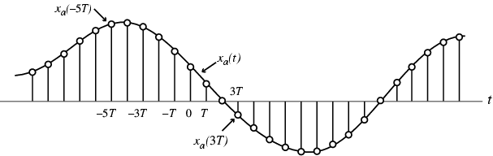
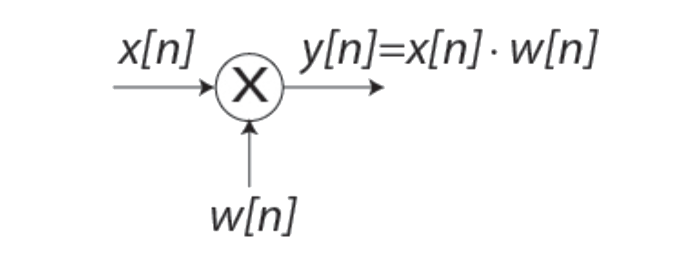
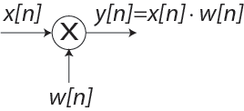
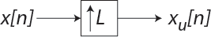
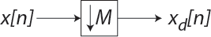

# lect02

## COURSE OVERVIEW: PART 1
- ~~Discrete-Time Signals in the Time Domain~~
	- __Operations, Classifications, Sampling__
- Discrete-Time Systems
	- Impulse/Step Responses, LTI Classification, Stability, Response to sinusoidal input
- Discrete-Time Signals in the Frequency Domain
	- Transforms, Applications, Sampling and reconstruction
- Finite-Length Discrete Transforms
	- DFT, FFT, Zero-padding, Fourier Domain filtering, Linear and Circular convolution
- Z-transform
- Basic filter structures: All pass, LPF, band pass, HPF, comb filter, prototype LPF
- Digital filter structures and representations; 2nd order building blocks
- FIR Design, Windowing
- IIR Design, Bilinear transformation
- IIR filter design with MATLAB
- Review of signal acquisition and reconstruction from frequency domain perspective, interpolating filters, zero-padding, A/D and D/A converters, anti-aliasing filter, sample-and-hold, anti-imaging filter
- Multirate DSP, up-sampling and down-sampling
- Implementation considerations—quantization and dynamic range
- Specific Applications (if time)

## OVERVIEW
- Signals and Systems Review
- Definitions and Basic operations
- Convolution
- Sampling, Up-sampling, Down-sampling
- Classification of sequences

## REPRESENTATION OF DISCRETE-TIME SIGNALS
- Discrete-Time (DT) Signals are represented as sequences of numbers, called samples, usually written within braces.
- Example of DT signal definitions:
- arrow points at value @ $$n=0$$
$$
\{x[n]\}=\{-0.4,\:3,\:2.1,\:\underset{\uparrow}{-0.25},\:1.3,\:-1.5\:,8\}
$$
- Braces around $$x[n]$$ are not needed if there is context that indicates we are not talking about an individual sample
$$
x[n]=\{-0.4,\:3,\:2.1,\:\underset{\uparrow}{-0.25},\:1.3,\:-1.5\:,8\}
$$
- Range MUST be defined in one way or another.
$$
\begin{matrix}
x[n]=\{-0.4,\:3,\:2.1,\:-0.25,\:1.3,\:-1.5\:,8\}&\text{for }n=-3:3
\end{matrix}
$$
- Sample value: $$x[n]$$, with $$n$$ being an integer in the range $$-\infty\leq{n}\leq\infty$$
- $$x[n]$$ defined only for integer values of $$n$$ and __undefined for non-integer values of__ $$n$$.

## SAMPLING: CONTINUOUS TO DISCRETE TIME
- Discrete-time (DT) sequence $$\{x[n]\}$$ may be generated by sampling a continuous-time (CT) signal $$x_a(t)$$ at uniform intervals of time.

- n-th sample is given by:
$$
x[n]=x_a(t)|_{t=nT}=x_a(nT),\:\:\:\:n\text{ is an integer}
$$
- Sampling interval or sampling period: $$T$$ (unit time)
- Sampling frequency: $$F_T=\tfrac{1}{T}$$ (unit: $$\text{Hertz}$$, $$\text{Hz}$$ if $$T$$ is in seconds)

## FINITE-LENGTH vs. INFINITE-LENGTH
- Finite-length sequence is defined for a finite period of time: $$N_1\leq{n}\leq{N}_2$$
	- Where:
	$$
	\begin{matrix}
	-\infty<N_1;&N_2<\infty;&N_1\leq{N}_2
	\end{matrix}
	$$
	– Duration (or length) of sequence is
	$$
	N=N_2-N_1+1
	$$
	– Length-N sequence or N-point sequence
	– Length can be increased by zero-padding, *i.e.* appending zeros to the end of the sequence
- Infinite-length sequence has an infinite number of samples
	– Can be *right-sided*: (a __casual__ signal)
	$$
	\begin{matrix}
	x[n]=0&\text{for }n<N_1
	\end{matrix}
	$$
	– Can be *left-sided*:  (a __anti-casual__ siganl)
	$$
	\begin{matrix}
	x[n]=0&\text{for }n>N_2
	\end{matrix}
	$$

### [EXAMPLE: SAMPLING](ex02.md/#1)

## $$L_p$$-norm: SIZE OF THE SIGNAL
- The size of the signal is given by the norm of the signal
- .$$L_p$$-norm is defined as
$$
||x||_p=\left(\sum_{n=-\infty}^{\infty}{|x[n]|^p}\right)^{\tfrac{1}{p}}
$$
where $$p$$ is a *positive integer*
- .$$p$$ is typically $$1$$, $$2$$, or $$\infty$$
- mean absolute value of $$\{x[n]\}$$
$$
\frac{L_1-\text{norm}}{N}=\frac{||x||_1}{N}
$$
- root-mean-square (rms) value
$$
\frac{L_2-\text{norm}}{\sqrt{N}}=\frac{||x||_2}{\sqrt{N}}
$$
- peak absolute value of $$\{x[n]\}$$ (a.k.a. $$L_{(\infty)}$$-norm)
$$
|x[n]_\text{max}|=||x||_\infty
$$

## DISCRETE-TIME SYSTEMS
A discrete-time system operates on an input sequence according to some prescribed rules and develops an output sequence.

## ELEMENTARY OPERATIONS ON SEQUENCES
- Product (modulation)
- Multiplication and Addition
- Time-shifting
	- Delaying
	- Advancing
- Time-reversal
- Branching
- Combination of above operations

## PRODUCT (MODULATION) OPERATION

One application is forming a finite-length sequence from an infinite-length sequence by multiplying the latter with a window sequence – this process is called *windowing*.

## MULTIPLICATION AND ADDITION

Inverting all samples of $$w[n]$$ creates a subtraction operation

## TIME-SHIFTING OPERATION

### TIME-SHIFTING
$$
y[n]=x[n-N]
$$
,where $$N$$ is an integer
- If $$N>0$$, it is a __delaying__ operation
    - Unit delay:

    

- If $$N<0$$, it is a __advance__ operation
    - Unit advance:

    

### TIME REVERSAL
$$
y[n]=x[-n]
$$

### [EXAMPLE: SIGNAL MANIPULATION(1)](ex02.md/#2) 

## SIGNAL OPERATIONS REVIEW
### TIME-SCALING:
$$
\begin{matrix}
y[n]=x[an],&a=\text{constant}
\end{matrix}
$$
- If $$a>1$$, expand or compress?
- If $$a<1$$, expand or compress?
- If $$a$$ is negative, what happens?

### TIME-SHIFTING:
$$
\begin{matrix}
y[n]=x[n+b],&b=\text{constant}
\end{matrix}
$$
- If $$b>0$$, shift which direction?
- If $$b<0$$, shift which direction?

### AMPLITUDE SCALING:
$$
\begin{matrix}
y[n]=cx[n],&c=\text{constant}
\end{matrix}
$$

### AMPLITUDE SHIFTING:
$$
\begin{matrix}
y[n]=x[n]+d,&d=\text{constant}
\end{matrix}
$$

All at once:
$$
y[n]=cx[a(n+b)]+d
$$
- Put them in this form and apply in $$a$$, $$b$$, $$c$$, $$d$$ order!

### [EXAMPLE: SIGNAL MANIPULATION(2)](ex02.md/#3)

### [EXAMPLE: BRANCHING](ex02.md/#4)

## LAST SYSTEM AS A MOVING AVERAGE
- If $$\propto_1=\propto_2=\propto_3=\propto_4=\tfrac{1}{4}$$, we end up with a moving average
- Each entry in $$y[n]$$ is equal to the average of the previous four points
- What have we created?
- __LOW PASS FILTER!__

## AVERAGING TO REMOVE HIGH-FREQUENCY NOISE
- Assume we have a signal, $$s$$, with a noise component $$w$$, where $$s$$ is constant and $$x[n]=s+w[n]$$
- An ensemble average can be used to extract $$s$$. After $$K$$ measurements, the average $$x$$ looks like:
$$
\begin{align*}
x_\text{ave}&=\frac{1}{K}\sum_{i=1}^{K}{x[i]}\\\\
&=\frac{1}{K}\sum_{i=1}^{K}{(s+w[i])}\\
&=s+\frac{1}{K}\sum_{i=1}^{K}{w[i]}\\
&\approx{s}
\end{align*}
$$

## CONVOLUTION
Convolution sum:
$$
\begin{align*}
y[n]&=x[n]\otimes{h}[n]\\
&=\sum_{k=-\infty}^{\infty}{x[k]h[n-k]}\\
&=\sum_{k=-\infty}^{\infty}{x[n-k]h[k]}\\
\end{align*}
$$
- Performing this manually:
	- First, move $$x[n]$$ to the $$k$$-axis and $$h[n]$$ to the $$k$$-axis. The $$n$$-axis will now represent “shift”
	- Flip $$h[k]$$ about $$k=0$$
	- Multiply and sum the overlapping points
	- Slide and repeat multiplication and summing (be sure to slide both directions)
	- Keep track of the amount you slide as that is the index of $$y$$
- Length of convolution sum, $$y[n]=\text{length of }\{x[n]\}+\text{length of }\{h[n]\}-1$$.

### [EXAMPLE: CONVOLUTION](ex02.md/#5)

- Convolution is commutative. You can prove this through a substitution of variables.
$$
x[n]\otimes{h}[n]=\sum_{k=-\infty}^{\infty}{x[k]h[n-k]}
$$
- .$$\left<u=n-k\right>$$
$$
x[n]\otimes{h}[n]=\sum_{k=-\infty}^{\infty}{x[n-u]h[u]}
$$
> __NOTE__: $$k=-\infty$$ now is $$u=+\infty$$ and vice verse, so the summation can remain unchanged. This expression is the same as $$h[n]\otimes{x}[n]$$
- In continuous time, the length of a signal is the right edge minus the left edge. So, if a signal is defined from $$0$$ to $$N-1$$, the length is $$N-1$$. HOWEVER, for a discrete signal, a signal described the same way (defined from $$0$$ to $$N-1$$) has a length of $$N$$ because we count all distinct samples and there are $$N$$ of them.
- so, the $$\text{length}-N$$ __continuous time__ signals convolved with result in a convolution with length $$2N$$
- However, in __discrete time__, two signals—also defiend from $$0$$ to $$N-1$$—is two $$\text{length}-N$$ signals and, when convolved, will result in a $$2N-1$$ signal.

## SAMPLING RATE ALTERATION
- Used to generate a new sequence, $$y[n]$$, with a sampling rate $$F_T^{\prime}$$ higher or lower than that of the original sampling rate $$F_T$$ of a given sequence $$x[n]$$.
$$
R=\frac{F_T^{\prime}}{F_T}
$$
- If $$R>1$$, the process is called __interpolation__, *i.e.*, we are interpolating between samples to determine the new samples
- If $$R<1$$, the process is called __decimation__, *i.e.* we are decimating samples that previously existed

## UNSAMPLING

- An integer $$L>1$$ describes unsampling as $$L-1$$ equidistant zero-valued samples are inserted by an up-sampler between each set of two consecutive samples of the input sequence.
- Thus,
$$
x_u[n]=
\begin{cases}
x\left[\tfrac{n}{L}\right],&n=0,\:\pm{L},\:\pm2L,\cdots\\
0,&\text{otherwise}
\end{cases}
$$

### [EXAMPLE: UPSAMPLING](ex02.md/#6)

## DOWNSAMPLING

- An integer $$M>1$$ describes downsampling as every $$M$$-th sample of the input sequence being kept and $$M-1$$ samples between them being removed.
- Thus,
$$
x_x[n]=x[nM]
$$

### [EXAMPLE: DOWNSAMPLING](ex02.md/#7)