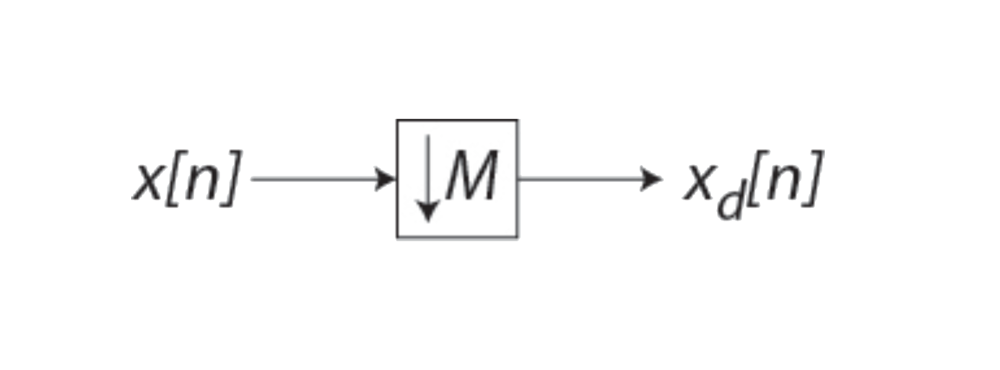

# lect02

## COURSE OVERVIEW: PART 1
- ~~Discrete-Time Signals in the Time Domain~~
	- __Operations, Classifications, Sampling__
- Discrete-Time Systems
	- Impulse/Step Responses, LTI Classification, Stability, Response to sinusoidal input
- Discrete-Time Signals in the Frequency Domain
	- Transforms, Applications, Sampling and reconstruction
- Finite-Length Discrete Transforms
	- DFT, FFT, Zero-padding, Fourier Domain filtering, Linear and Circular convolution
- Z-transform
- Basic filter structures: All pass, LPF, band pass, HPF, comb filter, prototype LPF
-Digital filter structures and representations; 2nd order building blocks
- FIR Design, Windowing
- IIR Design, Bilinear transformation
- IIR filter design with MATLAB
- Review of signal acquisition and reconstruction from frequency domain perspective, interpolating filters, zero-padding, A/D and D/A converters, anti-aliasing filter, sample-and-hold, anti-imaging filter
- Multirate DSP, up-sampling and down-sampling
- Implementation considerations—quantization and dynamic range
- Specific Applications (if time)

## OVERVIEW
- Signals and Systems Review
- Definitions and Basic operations
- Convolution
- Sampling, Up-sampling, Down-sampling
- Classification of sequences

## REPRESENTATION OF DISCRETE-TIME SIGNALS
- Discrete-Time (DT) Signals are represented as sequences of numbers, called samples, usually written within braces.
- Example of DT signal definitions:
- arrow points at value @ $$n=0$$
$$
\{x[n]\}=\{-0.4,\:3,\:2.1,\:\underset{\uparrow}{-0.25},\:1.3,\:-1.5\:,8\}
$$
- Braces around $$x[n]$$ are not needed if there is context that indicates we are not talking about an individual sample
$$
x[n]=\{-0.4,\:3,\:2.1,\:\underset{\uparrow}{-0.25},\:1.3,\:-1.5\:,8\}
$$
- Range MUST be defined in one way or another.
$$
\begin{matrix}
x[n]=\{-0.4,\:3,\:2.1,\:-0.25,\:1.3,\:-1.5\:,8\}&\text{for }n=-3:3
\end{matrix}
$$
- Sample value: $$x[n]$$, with $$n$$ being an integer in the range $$-\infty\leq{n}\leq\infty$$
- $$x[n]$$ defined only for integer values of $$n$$ and __undefined for noninteger values of__ $$n$$.

## SAMPLING: CONTINUOUS TO DISCRETE TIME
- Discrete-time (DT) sequence $$\{x[n]\}$$ may be generated by sampling a continuous-time (CT) signal $$x_a(t)$$ at uniform intervals of time.

- n-th sample is given by:
$$
x[n]=x_a(t)|_{t=nT}=x_a(nT),\:\:\:\:n\text{ is an integer}
$$
- Sampling interval or sampling period: $$T$$ (unit time)
- Sampling frequency: $$F_T=\tfrac{1}{T}$$ (unit: $$\text{Hertz}$$, $$\text{Hz}$$ if $$T$$ is in seconds)

## EXAMPLE(COMPLEX CONJUGATE): PAIR AND SHARE
$$
\{x[n]\}=\{e^{j\omega{n}}\}
$$
- Write an expression for the sequence $$\{x[n]\}$$ in terms of $$\sin$$ and $$\cos$$
$$
\{x[n]\}=\cos{(\omega{n})}+j\sin{(\omega{n})}
$$
- Write an expression for the sequence $$\{x^*[n]\}$$ in terms of $$\sin$$ and $$\cos$$
$$
\{x^*[n]\}=\cos{(\omega{n})}-j\sin{(\omega{n})}
$$

> __NOTE__:
$$
\begin{align*}
e^{j\omega{n}}&=\cos{(\omega{n})}+j\sin{(\omega{n})}\\
\cos{\omega{n}}&=\frac{1}{2}\left(e^{j\omega{n}}+e^{-j\omega{n}}\right)\\
\sin{\omega{n}}&=\frac{1}{2j}\left(e^{j\omega{n}}-e^{-j\omega{n}}\right)
\end{align*}
$$

## FINITE-LENGTH vs. INFINITE-LENGTH
- Finite-length sequence is defined for a finite period of time: $$N_1\leq{n}\leq{N}_2$$
	- Where:
	$$
	\begin{matrix}
	-\infty<N_1;&N_2<\infty;&N_1\leq{N}_2
	\end{matrix}
	$$
	– Duration (or length) of sequence is
	$$
	N=N_2-N_1+1
	$$
	– Length-N sequence or N-point sequence
	– Length can be increased by zero-padding, *i.e.* appending zeros to the end of the sequence
- Infinite-length sequence has an infinite number of samples
	– Can be *right-sided*: (a __casual__ signal)
	$$
	\begin{matrix}
	x[n]=0&\text{for }n<N_1
	\end{matrix}
	$$
	– Can be *left-sided*:  (a __anti-casual__ siganl)
	$$
	\begin{matrix}
	x[n]=0&\text{for }n>N_2
	\end{matrix}
	$$

## PAIR AND SHARE: DIGITAL SIGNALS
- __Q__: Which of the following describe a digitial signal?
	- Discrete-valued OR ~~Continuous-valued~~
	- Discrete-time OR ~~Continous-time~~
	- Real OR Complex
	- Finite-length OR ~~__Infinite-length__~~
> __CAVEAT__: Theoretical digital signals can have *infinite* lenght. Practical digital signals cannot.

## PAIR AND SHARE: SAMPLING EXAMPLE
### 1.
You are given
$$
\begin{matrix}
x[n]=\{1,\:2,\:3,\:4,\:5\}&\text{for }n=0:4
\end{matrix}
$$
Plot the samples vs. $$n$$,

### 2.
You are given
$$
\begin{matrix}
x[n]=\{1,\:2,\:3,\:4,\:5\}&\text{for }n=0:4
\end{matrix}
$$
Plot the samples vs. $$n$$, assuming that the sampling interval, $$T=1\:\text{sec}$$.

### 3.
You are given
$$
\begin{matrix}
x[n]=\{1,\:2,\:3,\:4,\:5\}&\text{for }n=0:4
\end{matrix}
$$
Plot the samples vs. $$n$$, assuming that the sampling interval, $$T=0.5\:\text{sec}$$.

## $$L_p$$-norm: SIZE OF THE SIGNAL
- The size of the signal is given by the norm of the signal
- .$$L_p$$-norm is defined as
$$
||x||_p=\left(\sum_{n=-\infty}^{\infty}{|x[n]|^p}\right)^{\tfrac{1}{p}}
$$
where $$p$$ is a *positive integer*
- .$$p$$ is typically $$1$$, $$2$$, or $$\infty$$
- mean absolute value of $$\{x[n]\}$$
$$
\frac{L_1-\text{norm}}{N}=\frac{||x||_1}{N}
$$
- root-mean-square (rms) value
$$
\frac{L_2-\text{norm}}{\sqrt{N}}=\frac{||x||_2}{\sqrt{N}}
$$
- peak absolute value of $$\{x[n]\}$$ (a.k.a. $$L_{(\infty)}$$-norm)
$$
|x[n]_\text{max}|=||x||_\infty
$$

## DISCRETE-TIME SYSTEMS
A discrete-time system operates on an input sequence according to some prescribed rules and develops an output sequence.

## ELEMENTARY OPERATIONS ON SEQUENCES
- Product (modulation)
- Multiplication and Addition
- Time-shifting
	- Delaying
	- Advancing
- Time-reversal
- Branching
- Combination of above operations

## PRODUCT (MODULATION) OPERATION

One application is forming a finite-length sequence from an infinite-length sequence by multiplying the latter with a window sequence – this process is called *windowing*.

## MULTIPLICATION AND ADDITION

Inverting all samples of $$w[n]$$ creates a subtraction operation

## TIME-SHIFTING OPERATION

### TIME-SHIFTING
$$
y[n]=x[n-N]
$$
,where $$N$$ is an integer
- If $$N>0$$, it is a __delaying__ operation
    - Unit delay:
    
- If $$N<0$$, it is a __advance__ operation
    - Unit advance:
    

### TIME REVERSAL
$$
y[n]=x[-n]
$$

## SIGNAL MANIPULATION
Take the following continuous-time signal, $$x(t)$$ and plot: $$y(t)=2x(0.5t-1)$$

## SIGNAL OPERATIONS REVIEW
### TIME-SCALING:
$$
\begin{matrix}
y[n]=x[an],&a=\text{constant}
\end{matrix}
$$
- If $$a>1$$, expand or compress?
- If $$a<1$$, expand or compress?
- If $$a$$ is negative, what happens?

### TIME-SHIFTING:
$$
\begin{matrix}
y[n]=x[n+b],&b=\text{constant}
\end{matrix}
$$
- If $$b>0$$, shift which direction?
- If $$b<0$$, shift which direction?

### AMPLITUDE SCALING:
$$
\begin{matrix}
y[n]=cx[n],&c=\text{constant}
\end{matrix}
$$

### AMPLITUDE SHIFTING:
$$
\begin{matrix}
y[n]=x[n]+d,&d=\text{constant}
\end{matrix}
$$

All at once:
$$
y[n]=cx[a(n+b)]+d
$$
- Put them in this form and apply in $$a$$, $$b$$, $$c$$, $$d$$ order!

## PAIR AND SHARE: SIGNAL MANIPULATION
- Recall the standard:
$$
y[n]=cx[a(n+b)]+d
$$

- Plot $$y[n]=2x[1-0.5n]$$

## PAIR AND SHARE: BRANCING EXAMPLE
### 1.
- What is the ouput to the system below?

### 2.
- What is the ouput $$y[n]$$ o the system below?

## LAST SYSTEM AS A MOVING AVERAGE
- If $$\propto_1=\propto_2=\propto_3=\propto_4=\tfrac{1}{4}$$, we end up with a moving average
- Each entry in $$y[n]$$ is equal to the average of the previous four points
- What have we created?

## AVERAGING TO REMOVE HIGH-FREQUENCY NOISE
- Assume we have a signal, $$s$$, with a noise component $$w$$, where $$s$$ is constant and $$x[n]=s+w[n]$$
- An ensemble average can be used to extract $$s$$. After $$K$$ measurements, the average $$x$$ looks like:
$$
\begin{align*}
x_\text{ave}&=\frac{1}{K}\sum_{i=1}^{K}{x[i]}\\\\
&=\frac{1}{K}\sum_{i=1}^{K}{(s+w[i])}\\
&=s+\frac{1}{K}\sum_{i=1}^{K}{w[i]}\\
&\approx{s}
\end{align*}
$$

## CONVOLUTION
Convolution sum:
$$
\begin{align*}
y[n]&=x[n]\otimes{h}[n]\\
&=\sum_{k=-\infty}^{\infty}{x[k]h[n-k]}\\
&=\sum_{k=-\infty}^{\infty}{x[n-k]h[k]}\\
\end{align*}
$$
- Performing this manually:
	- First, move $$x[n]$$ to the $$k$$-axis and $$h[n]$$ to the $$k$$-axis. The $$n$$-axis will now represent “shift”
	- Flip $$h[k]$$ about $$k=0$$
	- Multiply and sum the overlapping points
	- Slide and repeat multiplication and summing (be sure to slide both directions)
	- Keep track of the amount you slide as that is the index of $$y$$
- Length of convolution sum, $$y[n]=\text{length of }\{x[n]\}+\text{length of }\{h[n]\}-1$$.

## EXAMPLE: CONVOLUTION
What is the convolution of the following two signals:

1. Put these on the $$k$$-axis
2. next flip $$h[k]$$ around $$k=0$$ to create $$h[-k]$$.

3.  Now, line up $$x[k]$$ with $$h[-k]$$

4. What points overlap?
	- multiply them
	- add all of the products up
5. In this case
	- we have overlap at 0, so
	$$
	2\times1=2
	$$
	There is nothing else to add to it. since no more overlap.
6. This value $$2$$ appears at $$y[0]$$, *i.e.* $$y[n]=2$$ at $$n=0$$. $$n=0$$ represents no shift.

### $$n=1$$
1. Next, shift $$h[-k]$$ to the right $$1$$ *i.e.* $$h[1-k]$$. Thus, this situation is looking at $$n=1$$

2. Note that the convolution equation asks you to look at $$h[n-k]$$ and this can be re-written as $$h[-1(k-n)]$$ which should help understand why a positive $$n$$ shifts $$h[-k]$$ to the right.
3. Anyway, for this example,
	- the overlap at $$k=0$$, so
	$$
	2\times2=4
	$$
	This is the only overlap and thus is the only contribution to $$y[1]$$.

### $$n=2$$
1. Shifting by $$2$$ yields the plots to the right.

2. In this one,
	- The only overlap appears at $$k=2$$
	$$
	1\times1=1;
	$$
3. We shifted $$2$$ to the right, thus $$y[2]=1$$

### $$n=3$$
1. Shifting to the right $$3$$ yields our last shift to the right that will yield overlap. *i.e* again at position $$k=2$$.

2. In this one,
	- we have
	$$
	1\times2=2;
	$$
3. Thus, $$y[3]=2$$
$$
\begin{matrix}
\therefore\:y[n]=\{2,\:4,\:1,\:2\}&\text{for }n=0,\:1,\:2,\:3
\end{matrix}
$$

## CONVOLUTION (CONTINUED)
- Convolution is commutative. You can prove this through a substitution of variables.
$$
x[n]\otimes{h}[n]=\sum_{k=-\infty}^{\infty}{x[k]h[n-k]}
$$
- .$$\left<u=n-k\right>$$
$$
x[n]\otimes{h}[n]=\sum_{k=-\infty}^{\infty}{x[n-u]h[u]}
$$
> __NOTE__: $$k=-\infty$$ now is $$u=+\infty$$ and vice verse, so the summation can remain unchanged. This expression is the same as $$h[n]\otimes{x}[n]$$
- In continuous time, the length of a signal is the right edge minus the left edge. So, if a signal is defined from $$0$$ to $$N-1$$, the length is $$N-1$$. HOWEVER, for a discrete signal, a signal described the same way (defined from $$0$$ to $$N-1$$) has a length of $$N$$ because we count all distinct samples and there are $$N$$ of them.
- so, the $$\text{length}-N$$ __continuous time__ signals convolved with result in a convolution with length $$2N$$
- However, in __discrete time__, two signals—also defiend from $$0$$ to $$N-1$$—is two $$\text{length}-N$$ signals and, when convolved, will result in a $$2N-1$$ signal.

## SAMPLING RATE ALTERATION
- Used to generate a new sequence, $$y[n]$$, with a sampling rate $$F_T^{\prime}$$ higher or lower than that of the original sampling rate $$F_T$$ of a given sequence $$x[n]$$.
$$
R=\frac{F_T^{\prime}}{F_T}
$$
- If $$R>1$$, the process is called __interpolation__, *i.e.*, we are interpolating between samples to determine the new samples
- If $$R<1$$, the process is called __decimation__, *i.e.* we are decimating samples that previously existed

## UNSAMPLING
- An integer $$L>1$$ describes unsampling as $$L-1$$ equidistant zero-valued samples are inserted by an up-sampler between each set of two consecutive samples of the input sequence.
- Thus,
$$
x_u[n]=
\begin{cases}
x\left[\tfrac{n}{L}\right],&n=0,\:\pm{L},\:\pm2L,\cdots\\
0,&\text{otherwise}
\end{cases}
$$

### EXAMPLE:
$$
\begin{matrix}
x[n]=\{1,\:2,\:3,\:4\}&
\begin{cases}
\text{for }n=0:3\\
L=2
\end{cases}
\end{matrix}
$$
What is $$x_u[n]$$

## DOWNSAMPLING
- An integer $$M>1$$ describes downsampling as every $$M$$-th sample of the input sequence being kept and $$M-1$$ samples between them being removed.
- Thus,
$$
x_x[n]=x[nM]
$$

### EXAMPLE:
$$
\begin{matrix}
x[n]=\{1,\:2,\:3,\:4,\:5,\:6,\:7,\:8\}&
\begin{cases}
\text{for }n=0:7\\
L=2
\end{cases}
\end{matrix}
$$
What is $$x_d[n]$$

## OPERATIONS ON FINITE-LENGTH SEQUENCES
- Consider a $$\text{length}-N$$ sequence $$x[n]$$ defined for $$0\leq{n}\leq{N}-1$$ and otherwise undefined - What is the length of $$x[-n]$$ and over what range is it defined?
- What about a linear time-shift of $$x[n]$$ by $$M$$ (integer)?
- What about convolution of two $$\text{length}-N$$ sequences, each defined from $$0\leq{n}\leq{N}-1$$?
- Manipulations on sequences that change the range and/or length are not ideal for most implementations. Thus, these operations are tweaked as follows.

## MODULO OPERATION (A BUILDING BLOCK)
- Length should stay at $$N$$ and range should stay at $$0\leq{n}\leq{N}-1$$
- __Time-Reversal__: uses the modulo operation
- Modulo operation
	- residue,
	$$
	\begin{align*}
	r&=\left<m\right>_N&=m\:\text{modulo}\:N\\
    r&=m+lN
	\end{align*}
    $$
	, where $$l$$ is a positive or negative integer and $$r$$ is an anteger between $$0$$ and $$N-1$$

### EXAMPLE: $$N=18$$ and $$m=31$$
$$
\begin{align*}
r&=\left<31\right>_{18}\\
&=(31)+(-1)(18)=13
\end{align*}
$$
where $$l=-1$$

### EXAMPLE: $$N=8$$ and $$m=25$$
$$
\begin{align*}
r&=\left<25\right>_{8}\\
&=(25)+(-1)(8)=1
\end{align*}
$$
where $$l=-3$$

mentally think "add or subtract $$N$$ from $$m$$ until I get in the range $$0\leq{n}\leq{N}-1$$"

## CIRCULAR TIME-REVERSAL
- circular time-rerversal, $$\{y[n]\}$$ of a $$\text{length}-N$$ sequence $$\{x[n]\}$$ defined for $$0\leq{n}\leq{N}-1$$ is given by $$\{y[n]\}=\{x[\left<-n\right>_{N}]\}$$

### EXAMPLE:
$$x[n]=\{1,\:2,\:3,\:4,\:5\}$$
and we are interested in the __circular time__-__reversal__, $$\{y[n]\}=\{x[\left<-n\right>_{N}]\}$$ what does the new sequence look like?
- start one-by-one... $$y[0]=?$$
- next, $$y[1]=?$$

## CIRCULAR SHIFT OF A FINITE-LENGTH SEQUENCE
- Similar to time-reversal, this uses the modulo operation
- Circular shift $$\{x_c[n]\}$$ of a $$\text{length}-n$$ sequence $$\{x[n]\}$$ defined for $$0\leq{n}\leq{N}-1$$ shifted by $$n_0$$ is given by $$\{x_C[n]\}=\{x[\left<n-n_0\right>_N]\}$$
- So, what is the length and range of $$\{x_C[n]\}$$.

### EXAMPLE:

- viewd as a an actual circle

## CLASSIFICATION OF SEQUENCES
- Number of samples (finite-length vs. inifinite-length – already discussed)
- Symmetry with respect to $$n=0$$ (conjugate-symmetric, even, odd)
- Periodicity
- Summability
- Energy and Power

## SYMMETRY CLASSIFICATION
### Conjugate-symmetric sequence:
$$
x[n]=x^*[-n]
$$
- If $$x[n]$$ is real and symmetric about $$n=0$$, then it is an even sequence

### Conjugate-antisymmetric sequence:
$$
x[n]=-x^*[-n]
$$
- If $$x[n]$$ is real and antisymmetric about $$n=0$$, then it is an odd sequence
- __Q__: what does $$x[0]$$ have to be in a conjugate-symmetric sequence?
- And in a conjugate-anti-symmetric sequence?
- Any complex sequence, $$\{x[n]\}$$, can be expressed as a sum of its conjugate-symmetric part, $$\{x_\text{cs}[n]\}$$, and its conjugate-antisymmetric part, $$\{x_\text{ca}[n]\}$$
where
$$
\begin{align*}
x_\text{cs}[n]&=\frac{1}{2}\left(x[n]+x^*[-n]\right)\\
x_\text{ca}[n]&=\frac{1}{2}\left(x[n]-x^*[-n]\right)
\end{align*}
$$
- This uses conjugation, time-reversal, addition and multiplication
> __NOTE__: this is possible for finite-length sequences that are defined for a symmetric interval. 64

## PERIODICITY
- A sequence $$x[n]$$ satisfying $$x[n]=x[n+kN]$$ is called a periodic sequence with period $$N$$, where $$N$$ is a positive integer and $$k$$ is any integer.
- Smallest value of $$N$$ satisfying periodicity equation above is called the fundamental period.
- Fundamental frequency is the inverse of the fundamental period.
- Sequence that is not periodic... is aperiodic.
- Combining two periodic signals with periods $$N_a$$ and $$N_b$$, respectively, yields a new periodic signal with period $$N=\tfrac{N_aN_b}{\gcd{(N_a,\:N_b)}}$$ (This is the same as the least common multiple of the two periods).
> __NOTE__: shortuct does not necessarily work for three periods, but least common multiple is still the goal.

## ENERGY AND POWER
- Energy of a sequence is defined by:
$$
E_x=\sum_{n=-\infty}^{\infty}{|x[n]|^2}
$$
- Finite length sequence with finite sample values has finite energy
- Infinite length sequence depends on convergence of summation
- Average Power of an aperiodic sequence is defined by:
$$
P_x=\lim_{K\to\infty}\frac{1}{2K+1}{\sum_{n=-K}^{K}{|x[n]|^2}}
$$
- Energy of a sequence over a finite interval $$-K\leq{n}\leq{K}$$ as:
$$
E_{x,K}=\sum_{n=-K}^{K}{|x[n]|^2}
$$
- Thus
$$
P_x=\lim_{K\to\infty}\frac{1}{2K+1}E_{x,K}
$$
- Average Power of a periodic sequence is:
$$
P_x=\frac{1}{N}\sum_{n=-0}^{N-1}{|x[n]|^2}
$$

## ENERGY AND POWER SIGNALS
- An infinite energy signal with finite average power is called a power signal
- A finite energy signal with zero average power is called an energy signal

## OTHER CLASSIFICATIONS
- BOUNDED if:
$$
|x[n]|\leq{B}_x<\infty
$$
- ABSOLUTELY SUMMABLE if:
$$
\sum_{n=-\infty}^{\infty}{|x[n]|}<\infty
$$
- SQUARE SUMMABLE if:
$$
\sum_{n=-\infty}^{\infty}{|x[n]|^2}<\infty
$$

## BASIC SEQUENCES
- Unit sample
- Unit step
- Real sinusoidal
- Exponential

## UNIT SAMPLE SEQUENCE
- Like a “delta sequence” – a single sample at $$n=0$$
$$
\delta[n]=
\begin{cases}
1,&n=0\\
0&n\neq{0}
\end{cases}
$$

- Any arbitrary sequence can be written as the weighted sum of unit samples (with some being delayed or advanced)

## UNIT STEP SEQUENCE
- Unit samples from $$n=0$$ to $$\infty$$
$$
\mu[n]=
\begin{cases}
1,&n\geq0\\
0&n<0
\end{cases}
$$

## REAL SINUSOIDAL SEQUENCE
$$
x[n]=A\cos{(\omega_0n+\varphi)}&
\begin{cases}
A,&\text{amplitude}\\
\omega_0,&\text{angular frequency}\\
\varphi,&\text{phase}
\end{cases}
$$

## EXPONENTIAL SEQUENCE
$$
\begin{matrix}
x[n]=A\propto^{n},&-\infty<n<\infty
\end{matrix}
$$
, where $$A$$ and $$\propto$$ are real or complex numbers
- If we write
$$
\begin{align*}
\propto&=e^{(\sigma_0+j\omega_0)}\\
A&=|A|e^{j\varphi}
\end{align*}
$$
,then we can express
$$
x[n]&=|A|e^{j\varphi}e^{(\sigma_0+j\omega_0)n}\\
&=x_{\Re}[n]+jx_{\Im}[n]
$$
where
$$
\begin{align*}
x_{\Re}[n]&=|A|^{j\varphi{n}}\cos{(\omega_0n+\varphi)}\\
x_{\Im}[n]&=|A|^{j\varphi{n}}\sin{(\omega_0n+\varphi)}
\end{align*}
$$
- complex exponential sequence are real sinusoids
- controls whether the amplitude is constant, growing or decaying for $$n>0$$

## PERIODICITY OF SINUSOIDALS AND EXPONENTIALS
