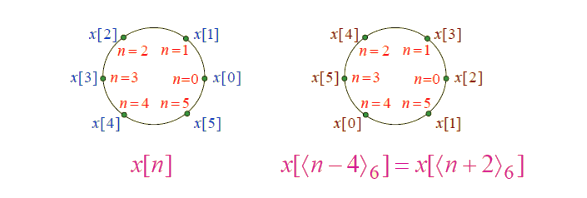
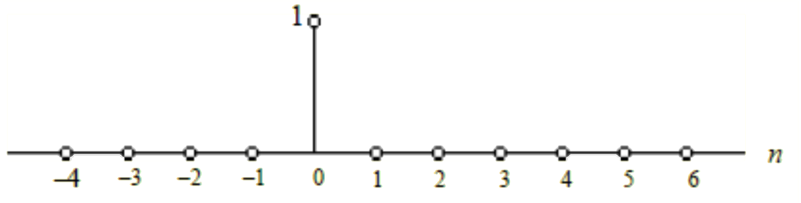
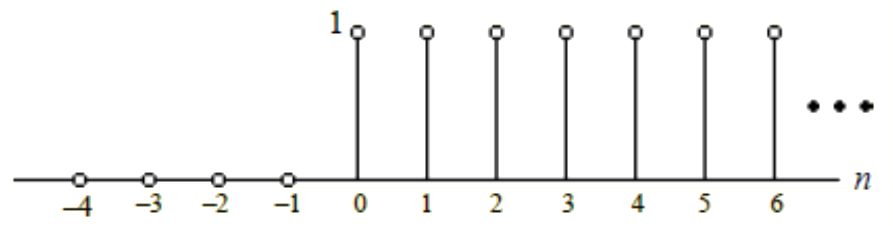
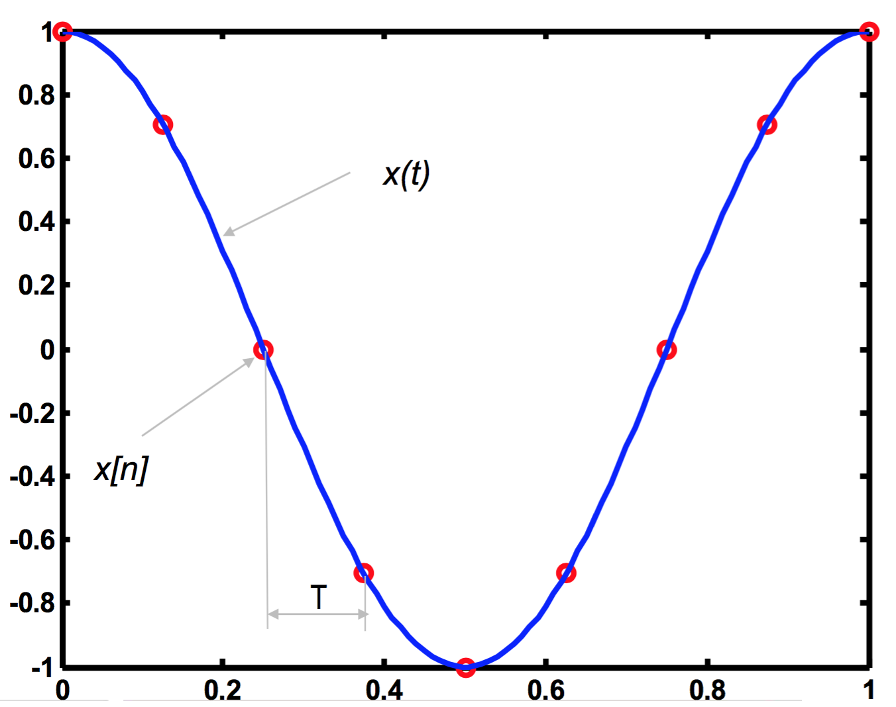

# lect03

## COURSE OVERVIEW: PART 1
- ~~Discrete-Time Signals in the Time Domain~~
	- __Operations, Classifications, Sampling__
- Discrete-Time Systems
	- Impulse/Step Responses, LTI Classification, Stability, Response to sinusoidal input
- Discrete-Time Signals in the Frequency Domain
	- Transforms, Applications, Sampling and reconstruction
- Finite-Length Discrete Transforms
	- DFT, FFT, Zero-padding, Fourier Domain filtering, Linear and Circular convolution
- Z-transform
- Basic filter structures: All pass, LPF, band pass, HPF, comb filter, prototype LPF
-Digital filter structures and representations; 2nd order building blocks
- FIR Design, Windowing
- IIR Design, Bilinear transformation
- IIR filter design with MATLAB
- Review of signal acquisition and reconstruction from frequency domain perspective, interpolating filters, zero-padding, A/D and D/A converters, anti-aliasing filter, sample-and-hold, anti-imaging filter
- Multirate DSP, up-sampling and down-sampling
- Implementation considerations—quantization and dynamic range
- Specific Applications (if time)

## OVERVIEW
- Modulo operation and circular shift/time reversal 
- Classification of sequences
- Basic sequences

## OPERATIONS ON FINITE-LENGTH SEQUENCES
- Consider a $$\text{length}-N$$ sequence $$x[n]$$ defined for $$0\leq{n}\leq{N}-1$$ and otherwise undefined - What is the length of $$x[-n]$$ and over what range is it defined?
- What about a linear time-shift of $$x[n]$$ by $$M$$ (integer)?
- What about convolution of two $$\text{length}-N$$ sequences, each defined from $$0\leq{n}\leq{N}-1$$?
- Manipulations on sequences that change the range and/or length are not ideal for most implementations. Thus, these operations are tweaked as follows.

## MODULO OPERATION (A BUILDING BLOCK)
- Length should stay at $$N$$ and range should stay at $$0\leq{n}\leq{N}-1$$
- __Time-Reversal__: uses the modulo operation
- Modulo operation
	- residue,
	$$
	\begin{align*}
	r&=\left<m\right>_N&=m\:\text{modulo}\:N\\
    r&=m+lN
	\end{align*}
    $$
	, where $$l$$ is a positive or negative integer and $$r$$ is an anteger between $$0$$ and $$N-1$$

### EXAMPLE: $$N=18$$ and $$m=31$$
$$
\begin{align*}
r&=\left<31\right>_{18}\\
&=(31)+(-1)(18)=13
\end{align*}
$$
where $$l=-1$$

### EXAMPLE: $$N=8$$ and $$m=25$$
$$
\begin{align*}
r&=\left<25\right>_{8}\\
&=(25)+(-1)(8)=1
\end{align*}
$$
where $$l=-3$$

mentally think "add or subtract $$N$$ from $$m$$ until I get in the range $$0\leq{n}\leq{N}-1$$"

## CIRCULAR TIME-REVERSAL
- circular time-rerversal, $$\{y[n]\}$$ of a $$\text{length}-N$$ sequence $$\{x[n]\}$$ defined for $$0\leq{n}\leq{N}-1$$ is given by $$\{y[n]\}=\{x[\left<-n\right>_{N}]\}$$

### EXAMPLE:
$$x[n]=\{1,\:2,\:3,\:4,\:5\}$$
and we are interested in the __circular time__-__reversal__, $$\{y[n]\}=\{x[\left<-n\right>_{N}]\}$$ what does the new sequence look like?
- start one-by-one... $$y[0]=?$$
- next, $$y[1]=?$$

## CIRCULAR SHIFT OF A FINITE-LENGTH SEQUENCE
- Similar to time-reversal, this uses the modulo operation
- Circular shift $$\{x_c[n]\}$$ of a $$\text{length}-n$$ sequence $$\{x[n]\}$$ defined for $$0\leq{n}\leq{N}-1$$ shifted by $$n_0$$ is given by $$\{x_C[n]\}=\{x[\left<n-n_0\right>_N]\}$$
- So, what is the length and range of $$\{x_C[n]\}$$.

### EXAMPLE:

- viewd as a an actual circle

## CLASSIFICATION OF SEQUENCES
- Number of samples (finite-length vs. inifinite-length – already discussed)
- Symmetry with respect to $$n=0$$ (conjugate-symmetric, even, odd)
- Periodicity
- Summability
- Energy and Power

## SYMMETRY CLASSIFICATION
### Conjugate-symmetric sequence:
$$
x[n]=x^*[-n]
$$
- If $$x[n]$$ is real and symmetric about $$n=0$$, then it is an even sequence

### Conjugate-antisymmetric sequence:
$$
x[n]=-x^*[-n]
$$
- If $$x[n]$$ is real and antisymmetric about $$n=0$$, then it is an odd sequence
- __Q__: what does $$x[0]$$ have to be in a conjugate-symmetric sequence?
- And in a conjugate-anti-symmetric sequence?
- Any complex sequence, $$\{x[n]\}$$, can be expressed as a sum of its conjugate-symmetric part, $$\{x_\text{cs}[n]\}$$, and its conjugate-antisymmetric part, $$\{x_\text{ca}[n]\}$$
where
$$
\begin{align*}
x_\text{cs}[n]&=\frac{1}{2}\left(x[n]+x^*[-n]\right)\\
x_\text{ca}[n]&=\frac{1}{2}\left(x[n]-x^*[-n]\right)
\end{align*}
$$
- This uses conjugation, time-reversal, addition and multiplication
> __NOTE__: this is possible for finite-length sequences that are defined for a symmetric interval. 64

## PERIODICITY
- A sequence $$x[n]$$ satisfying $$x[n]=x[n+kN]$$ is called a periodic sequence with period $$N$$, where $$N$$ is a positive integer and $$k$$ is any integer.
- Smallest value of $$N$$ satisfying periodicity equation above is called the fundamental period.
- Fundamental frequency is the inverse of the fundamental period.
- Sequence that is not periodic... is aperiodic.
- Combining two periodic signals with periods $$N_a$$ and $$N_b$$, respectively, yields a new periodic signal with period $$N=\tfrac{N_aN_b}{\gcd{(N_a,\:N_b)}}$$ (This is the same as the least common multiple of the two periods).
> __NOTE__: shortuct does not necessarily work for three periods, but least common multiple is still the goal.

## ENERGY AND POWER
- Energy of a sequence is defined by:
$$
E_x=\sum_{n=-\infty}^{\infty}{|x[n]|^2}
$$
- Finite length sequence with finite sample values has finite energy
- Infinite length sequence depends on convergence of summation
- Average Power of an aperiodic sequence is defined by:
$$
P_x=\lim_{K\to\infty}\frac{1}{2K+1}{\sum_{n=-K}^{K}{|x[n]|^2}}
$$
- Energy of a sequence over a finite interval $$-K\leq{n}\leq{K}$$ as:
$$
E_{x,K}=\sum_{n=-K}^{K}{|x[n]|^2}
$$
- Thus
$$
P_x=\lim_{K\to\infty}\frac{1}{2K+1}E_{x,K}
$$
- Average Power of a periodic sequence is:
$$
P_x=\frac{1}{N}\sum_{n=-0}^{N-1}{|x[n]|^2}
$$

## ENERGY AND POWER SIGNALS
- An infinite energy signal with finite average power is called a power signal
- A finite energy signal with zero average power is called an energy signal

## OTHER CLASSIFICATIONS
- BOUNDED if:
$$
|x[n]|\leq{B}_x<\infty
$$
- ABSOLUTELY SUMMABLE if:
$$
\sum_{n=-\infty}^{\infty}{|x[n]|}<\infty
$$
- SQUARE SUMMABLE if:
$$
\sum_{n=-\infty}^{\infty}{|x[n]|^2}<\infty
$$

## BASIC SEQUENCES
- Unit sample
- Unit step
- Real sinusoidal
- Exponential

## UNIT SAMPLE SEQUENCE
- Like a “delta sequence” – a single sample at $$n=0$$
$$
\delta[n]=
\begin{cases}
1,&n=0\\
0&n\neq{0}
\end{cases}
$$

- Any arbitrary sequence can be written as the weighted sum of unit samples (with some being delayed or advanced)

## UNIT STEP SEQUENCE
- Unit samples from $$n=0$$ to $$\infty$$
$$
\mu[n]=
\begin{cases}
1,&n\geq0\\
0&n<0
\end{cases}
$$

## REAL SINUSOIDAL SEQUENCE
$$
x[n]=A\cos{(\omega_0n+\varphi)}&
\begin{cases}
A,&\text{amplitude}\\
\omega_0,&\text{angular frequency}\\
\varphi,&\text{phase}
\end{cases}
$$

## EXPONENTIAL SEQUENCE
$$
\begin{matrix}
x[n]=A\propto^{n},&-\infty<n<\infty
\end{matrix}
$$
, where $$A$$ and $$\propto$$ are real or complex numbers
- If we write
$$
\begin{align*}
\propto&=e^{(\sigma_0+j\omega_0)}\\
A&=|A|e^{j\varphi}
\end{align*}
$$
,then we can express
$$
x[n]&=|A|e^{j\varphi}e^{(\sigma_0+j\omega_0)n}\\
&=x_{\Re}[n]+jx_{\Im}[n]
$$
where
$$
\begin{align*}
x_{\Re}[n]&=|A|^{j\varphi{n}}\cos{(\omega_0n+\varphi)}\\
x_{\Im}[n]&=|A|^{j\varphi{n}}\sin{(\omega_0n+\varphi)}
\end{align*}
$$
- complex exponential sequence are real sinusoids
- controls whether the amplitude is constant, growing or decaying for $$n>0$$

## PERIODICITY OF SINUSOIDALS AND EXPONENTIALS
$$A\cos{\left(\omega_0n+\varphi\right)}$$ and $$Be^{(j\omega_0n)}$$ are periodic sequences of period $$N$$ if $$\omega_0N=2\pi{r}$$, where $$N$$ and $$r$$ are positive integers.
- Smallest value of $$N$$ satisfying $$\oemga_0N=2\pi{r}$$ is the fundamental period.

### EXAMPLE:
Is $$x[n]=\sin{(\sqrt{3}n+\varphi)}$$ a periodic sequence?

## INTERESTING PROPERTIES
- Consider $$x[n]=e^{j\omega_1n}$$ and $$y[n]=e^{j\omega_2n}$$ where $$0\leq\omega_1<2\pi$$ and $$2\pi{k}\leq\omega_2<2\pi(k+1)$$ where $$k$$ is any positive integer. If $$\omega_2=\omega_1+2\pi{k}$$, then $$x[n]=y[n]$$ and are completely indistinguishable.
- Frequency of oscillation of $$A\cos{(\omega_0n)}$$ increases as $$\omega_0$$ increases from $$0$$ to $$\pi$$ and decreases from $$\pi$$$ to $$2\pi$$
	- Frequencies near $$0$$ or $$2\pi{k}$$ are called low frequencies.
	- Frequencies near $$\pi$$ or $$\pi(2k+1)$$ are called high frequencies.

## SAMPLING: CONTINUOUS TO DISCRETE TIME
- Discrete-time (DT) sequence $$\{x[n]\}$$ may be generated by sampling a continuous-time (CT) signal $$x_a(t)$$ at uniform intervals of time.

- $$n$$-th sample is given by:
$$
x[n]=x_a(t)|_{t=nT}=x_a(nT),\:\:\:\:n\text{ is an integer}
$$
- Sampling interval or sampling period: $$T$$ (unit time)
- Sampling frequency: $$F_T=\tfrac{1}{T}$$ (unit: $$\text{Hertz}$$, $$\text{Hz}$$ if $$T$$ is in seconds)

## BIG PICTURE
$$
\begin{matrix}
x(t)&\to&\text{SAMPLER}&\to&x[n]
\end{matrix}
$$

$$
\begin{matrix}
x[n]&\to&\text{RECONSTRUCTOR}&\to&x(t)
\end{matrix}
$$
- Goal is for SAMPLER to sample effectively enough to allow for perfect reconstruciton of $$x(t)$$
- Don't know __how__ yet, but we assume this is possible if sampled appropriately.

## HOW DO WE SAMPLE?
- Discrete-time (DT) sequence $$\{x[n]\}$$ may be generated by sampling a continuous-time (CT) signal $$x_a(t)$$ at uniform intervals of time.
- $$n$$-th sample is given by:
$$
x[n]=x_a(t)|_{t=nT}=x_a(nT),\:\:\:\:n\text{ is an integer}
$$
- Sampling interval or sampling period: $$T$$ (unit time)
- Sampling frequency: $$F_T=\tfrac{1}{T}$$ (unit: $$\text{Hertz}$$, $$\text{Hz}$$ if $$T$$ is in seconds)

### What CT function created these samples?

## ALIASING
- There are an infinite number of continuous-time signals which can lead to the same sequence when sampled periodically
- Additional conditions need to be imposed so the sequence $$x[n]$$ can uniquely represent $$x(t)$$.