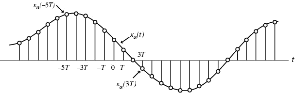
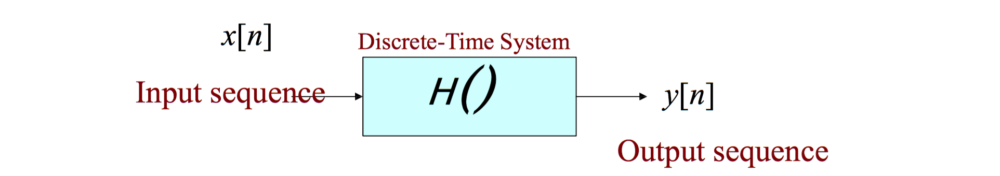
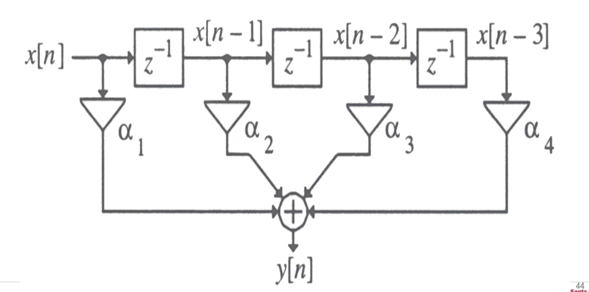
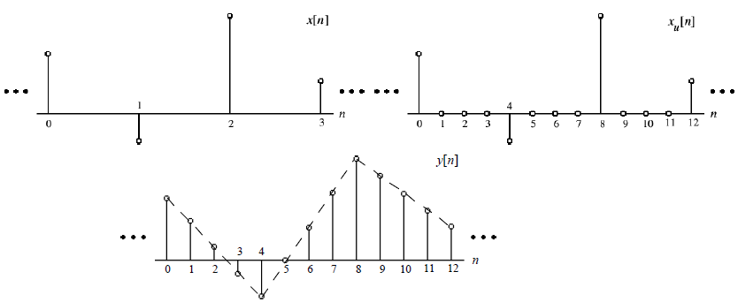
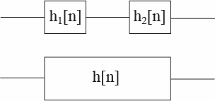
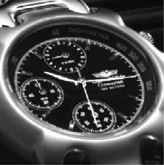

# lect04

## COURSE OVERVIEW: 
- ~~Discrete-Time Signals in the Time Domain~~
	- __Operations, Classifications, Sampling__
- Discrete-Time Systems
	- Impulse/Step Responses, LTI Classification, Stability, Response to sinusoidal input
- Discrete-Time Signals in the Frequency Domain
	- Transforms, Applications, Sampling and reconstruction
- Finite-Length Discrete Transforms
	- DFT, FFT, Zero-padding, Fourier Domain filtering, Linear and Circular convolution
- Z-transform
- Basic filter structures: All pass, LPF, band pass, HPF, comb filter, prototype LPF
- Digital filter structures and representations; 2nd order building blocks
- FIR Design, Windowing
- IIR Design, Bilinear transformation
- IIR filter design with MATLAB
- Review of signal acquisition and reconstruction from frequency domain perspective, interpolating filters, zero-padding, A/D and D/A converters, anti-aliasing filter, sample-and-hold, anti-imaging filter
- Multirate DSP, up-sampling and down-sampling
- Implementation considerations—quantization and dynamic range
- Specific Applications (if time)

## OVERVIEW
- Sampling / Alisainsg
- Discrete-Time Systems
- Linearity, Shift-Invariance / Time-Invariance
- Cascaded Systems

## SAMPLING: CONTINUOUS TO DISCRETE TIME
- Discrete-time (DT) sequence $$\{x[n]\}$$ may be generated by sampling a continuous-time (CT) signal $$x_a(t)$$ at uniform intervals of time.

- .$$n$$-th sample is given by:
$$
x[n]=x_a(t)|_{t=nT}=x_a(nT),\:\:\:\:n\text{ is an integer}
$$
- Sampling interval or sampling period: $$T$$ (unit time)
- Sampling frequency: $$F_T=\tfrac{1}{T}$$ (unit: $$\text{Hertz}$$, $$\text{Hz}$$ if $$T$$ is in seconds)

## BIG PICTURE
$$
\begin{matrix}
x(t)&\to&\text{SAMPLER}&\to&x[n]
\end{matrix}
$$

$$
\begin{matrix}
x[n]&\to&\text{RECONSTRUCTOR}&\to&x(t)
\end{matrix}
$$
- Goal is for SAMPLER to sample effectively enough to allow for perfect reconstruciton of $$x(t)$$
- Don't know __how__ yet, but we assume this is possible if sampled appropriately.

## HOW DO WE SAMPLE?
- Discrete-time (DT) sequence $$\{x[n]\}$$ may be generated by sampling a continuous-time (CT) signal $$x_a(t)$$ at uniform intervals of time.
- .$$n$$-th sample is given by:
$$
x[n]=x_a(t)|_{t=nT}=x_a(nT),\:\:\:\:n\text{ is an integer}
$$
- Sampling interval or sampling period: $$T$$ (unit time)
- Sampling frequency: $$F_T=\tfrac{1}{T}$$ (unit: $$\text{Hertz}$$, $$\text{Hz}$$ if $$T$$ is in seconds)

### [EXAMPLE: SAMPLING-ALIASING][1]

## ALIASING
- There are an infinite number of continuous-time signals which can lead to the same sequence when sampled periodically
- Additional conditions need to be imposed so the sequence $$x[n]$$ can uniquely represent $$x(t)$$.

## SAMPLING VOCABULARY
For continuous time frequency
$$
\begin{align*}
x(t)&=A\cos{(2\pi{f}_0t)}\\
&=A\cos{(\Omega_0t)}
\end{align*}
$$
where
$$
\left\{\begin{matrix}
\underset{\text{frequency (CT)}}{f_0\:\left[\tfrac{\text{cycles}}{\text{sec}}\right]}\\\\
\underset{\text{angular frequency (CT)}}{\Omega_0\:\left[\tfrac{\text{radians}}{\text{sec}}\right]}
\end{matrix}\right\}
$$
- Time variable $$t$$, of $$x_a(t)$$ is related to the discrete time variable $$n$$ of $$x[n]$$, only at discrete-time instants $$t_n$$ where $$t_n=nT$$
- After sampling at rate $$f_T$$ or at rate $$\Omega_T$$, where
$$
\left\{\begin{matrix}
\underset{\text{sampling frequency/rate}}{f_T=\tfrac{1}{T}\:\left[\tfrac{\text{samples}}{\text{sec}}\right]}\\\\
\underset{\text{angular sampling frequency (CT)}}{\Omega_T\:\left[\tfrac{\text{radians}\cdot\text{samples}}{\text{sec}}\right]}&
\end{matrix}\right\}
$$

$$
\begin{align*}
x[n]&=A\cos{(2\pi{f}_0nT)}=A\cos{\left(\frac{2\pi{f}_0}{f_T}n\right)}\\
&=A\cos{(\Omega_0nT)}=A\cos{\left(\frac{\Omega_0}{f_T}n\right)}\\
&=A\cos{\left(\frac{2\pi\Omega_0}{\Omega_T}n\right)}\\
&=A\cos{(\omega_0n)}\\
&=A\cos{(2\pi\nu_0n)}\\
\end{align*}
$$
where
$$
\left\{\begin{matrix}
\underset{\text{normalized digital frequency}}{\nu_0=\frac{f_0}{f_T}\:\left[\tfrac{\text{cycles}}{\text{sec}}\right]}\\
\underset{\text{normalized digital angular frequency}}{\omega_0=\frac{2\pi\Omega_0}{\Omega_T}\:\left[\tfrac{\text{radians}}{\text{sec}}\right]}&
\end{matrix}\right\}
$$

## MORE ON ALIASING
- Assertion:
$$
\cos{(\omega_0n)}=\cos{\left((\omega+2\pi{k})n\right)}
$$
- Consider a continuous time signal:  $$x(t)=\cos{(2\pi{f}_0t)}$$ that is sampled with a sampling frequency $$f_T$$.
- This yields:
$$
\begin{align*}
x[n]&=\cos{(2\pi{f}_0nT)}&\begin{cases}\omega_0=\frac{2\pi\Omega_0}{\Omega_T}=\frac{2\pi{f}_0}{f_T}\\f_T=\frac{1}{T}\end{cases}\\
&=\cos{\omega_0n}\\
&=\cos{\left((\omega_0+2\pi{k})n\right)}\\
&=\cos{\left((2\pi{f}_0T+2\pi{k})n\right)}\\
&=\cos{\left(2\pi{f}_0nT+2\pi{k}n\right)}\\
&=\cos{\left(2\pi{f}_0nT+2\pi{k}nTf_T\right)}\\
&=\cos{2\pi{n}T\left(f_0+kf_T\right)}
\end{align*}
$$
- Since $$x[n]=\cos{(2\pi{f}_0nT)}=\cos{\left(2\pi{n}T(f_0+kf_T)\right)}$$, this implies that an original continuous time domain signal with frequency $$f_0+kf_T$$  is indistinguishable from one with a frequency of $$f_0$$ after it has been sampled at sampling frequency: $$f_T$$
- This is the essense of aliasing!

## MORE ON ALIASING (CONT'D)
$$\omega_0=\frac{2\pi\Omega_0}{\Omega_T}$$
- No ALIASING, If $$\Omega_T>2\Omega_0$$, then $$\omega_0$$ will be in the range $$-\pi<\omega_0<\pi$$
- ALIASING, If $$\Omega_T<2\Omega_0$$, then $$\omega_0=\left<\tfrac{2\pi\Omega_0}{\Omega_T}\right>_{2\pi}$$ will be in the range $$-\pi<\omega_0<\pi$$
> __NOTE__: This is inconsistent with the previous definition of modulo in the sense that we are looking for a final angular frequency in a different range than the definition of modulo would suggest.

- To prevent aliasing, $$\Omega_T$$ should be greater than twice the frequency $$\Omega_0$$
- Generally speaking, an arbitrary signal composed of a weighted sum of sinusoids can be uniquely represented by its sampled version, $$x[n]$$, IF the sampling frequency is twice the highest frequency contained in the original signal.

### [EXAMPLE: SAMPLE VOCABULARY][2]

## RECONSTRUCTION
- We haven’t talked about __how__ reconstruction is done
- We’ve assumed reconstruction is perfect (in the sense that if the original signal is sampled properly, we can get back the original signal from its samples)
- IF the original signal was not sampled properly—we are out of luck. The samples will *look* like a different signal than the original—it will *alias* to a new frequency!

### [EXAMPLE: RECONSTRUCTION][3]

## RECONSTRUCTED FREQUENCIES
- We learned that a continuous time signal with frequency $$f_0+kf_T$$ will result in the same samples as a continuous time signal with frequency $$f_0$$ when sampled at $$f_T$$.
- We can think of this another way and use it to determine what frequency the reconstructor will end up with after reconstruction.
- If we said
$$
f_{0_{\text{new}}}=f_{0_{\text{unaliased}}}+kf_T
$$
Then,
$$
\begin{matrix}
f_{0_{\text{unaliased}}}=f_{0_{new}}+kf_T\\
k:\text{ integer})
\end{matrix}
$$
- SO—we can replace $$-$$ with $$+$$ and have the same expression:
$$
f_{0_{\text{unaliased}}}=f_{0_{new}}+kf_T
$$
- The reconstructor solves this expression to find the frequency that is between
$$-\tfrac{f_T}{2}$$ and $$\tfrac{f_T}{2}$$

### [EXAMPLE: RECONSTRUCTED FREQUENCIES][4]

### [EXAMPLE: SAMPLING AT RECONSTRUCTED FREQUENCIES][5]

## COURSE OVERVIEW: 
- ~~Discrete-Time Signals in the Time Domain~~
	- ~~Operations, Classifications, Sampling~~
- __Discrete-Time Systems__
	- __Impulse/Step Responses, LTI Classification, Stability, Response to sinusoidal input__
- Discrete-Time Signals in the Frequency Domain
	- Transforms, Applications, Sampling and reconstruction
- Finite-Length Discrete Transforms
	- DFT, FFT, Zero-padding, Fourier Domain filtering, Linear and Circular convolution
- Z-transform
- Basic filter structures: All pass, LPF, band pass, HPF, comb filter, prototype LPF
-Digital filter structures and representations; 2nd order building blocks
- FIR Design, Windowing
- IIR Design, Bilinear transformation
- IIR filter design with MATLAB
- Review of signal acquisition and reconstruction from frequency domain perspective, interpolating filters, zero-padding, A/D and D/A converters, anti-aliasing filter, sample-and-hold, anti-imaging filter
- Multirate DSP, up-sampling and down-sampling
- Implementation considerations—quantization and dynamic range
- Specific Applications (if time)

## DISCRETE TIME SYSTEM: DEFINITION
- A discrete-time system processes a given input sequence $$x[n]$$ to generates an output sequence $$y[n]$$ with more desirable properties.
- In most applications, the discrete-time system is a single-input, single-output system

## ONE-INPUT, ONE-OUTPUT DISCRETE-TIME SYSTEM

## MULTIPLE-INPUT, SINGLE-OUTPUT SYSTEM?
- Multiplication
- Addition

## EXAMPLES OF DISCRETE-TIME SYSTEMS
### ACCUMULATOR
$$
y[n]=x[n]+y[n-1]
$$

### M-POINT MOVING-AVERAGE SYSTEM
$$
y[n]=\frac{1}{M}\sum_{k=0}^{M-1}{x[n-k]}
$$
- Used in smoothing random data
- If input is a bounded sequence, then the $$M$$-point average is a bounded sequence
- Direct implementation requires $$M-1$$ additions, $$1$$ division and storage of $$M-1$$ past data samples

## ANOTHER IMPLEMENTATION OF M-POINT AVERAGE
$$
\begin{align*}
y[n]&=\frac{1}{M}\left(\sum_{k=0}^{M-1}{x[n-k]+x[n-M]-x[n-M]}\right)\\
&=\frac{1}{M}\left(\sum_{k=0}^{M}{x[n-k]+x[n]-x[n-M]}\right)\\
&=\frac{1}{M}\left(\sum_{k=0}^{M}{x[n-1-k]}\right)+\frac{1}{M}\left(x[n]\right)-\frac{1}{M}\left(x[n-M]\right)\\
&=y[n-1]+\frac{1}{M}\left(x[n]-x[n-M]\right)
\end{align*}
$$

- 2 additions and 1 division

## EXPONENTIALLY WEIGHTED RUNNING AVERAGE FILTER
$$
\begin{matrix}
y[n]=\alpha{y}[n-1]+x[n],&0<\alpha<1
\end{matrix}
$$
- 1 addition, 1 multiplication
- No storage of previous inputs
- Places more emphasis on most recent samples—less emphasis on the past
$$
\begin{align*}
y[n]&=\alpha\left(\alpha{y}[n-2]+x[n-1]\right)+x[n]\\
&=\alpha^2\left(y[n-2]\right)+\alpha\left(x[n-1]\right)+x[n]\\
y[n]&=\alpha^2\left(\alpha{y}[n-3]+x[n-2]\right)+\alpha\left(x[n-1]\right)+x[n]\\
&=\alpha^3\left(y[n-3]\right)+\alpha^2\left(x[n-2]\right)+\alpha\left(x[n-1]\right)+x[n]\\
&\cdots
\end{align*}
$$

## FACTOR-OF-$$n$$ INTERPOLATOR (LINEAR)
### FACTOR OF $$2$$ INTERPOLATOR
$$
\begin{align*}
y[n]&=x_u[n]\\
&+\frac{1}{2}\left(x_u[n-1]+x_u[n+1]\right)
\end{align*}
$$

### FACTOR OF $$3$$ INTERPOLATOR
$$
\begin{align*}
y[n]&=x_u[n]\\
&+\frac{1}{3}\left(x_u[n-2]+x_u[n+2]\right)\\
&+\frac{2}{3}\left(x_u[n-1]+x_u[n+1]\right)
\end{align*}
$$

## LINEAR INTERPOLATION
### FACTOR OF $$4$$ INTERPOLATOR

### FACTOR OF $$2$$ INTERPOLATOR FOR IMAGES

| original (512x512) | down-sampled (256x256) | interpolated (512x512) |
| :----------------: | :--------------------: | :--------------------: |
|  |  |  |

## MEDIAN FILTER
- Takes the median over a window of an odd number of samples
- __Application__: removes bursty noise spikes

## CLASSIFICATION OF SYSTEMS
- Linear
- Shift-Invariant
- Causal
- Stable
- Passive and Lossless

## LINEARITY
-  Assume $$y_1[n]$$ is the output due to an input $$x_1[n]$$
- And $$y_2[n]$$ is the output due to an input $$x_2[n]$$
- Linearity is preserved if for $$x[n]=\alpha{x}_1[n]+\beta{x}_2[n]$$,                  the output is $$y[n]=\alpha{y}_1[n]+\beta{y}_2[n]\:\:\:\:\forall{\alpha,\:\beta}$$ for all possible inputs $$x_1[n]$$ and  $$x_2[n]$$

### [EXAMPLE: LINEARITY TEST][6]

## MORE ON INITIAL CONDITIONS
$$
\begin{align*}
y_1[n]&=y_1[-1]+\sum_{l=0}^{n}{x_1[l]}\\
y_2[n]&=y_2[-1]+\sum_{l=0}^{n}{x_2[l]}\\
y[n]&=y[-1]+\sum_{l=0}^{n}{\left(\alpha{x}_1[l]+\beta{x}_2[l]\right)}\\
\alpha{y}_1[l]+\beta{y}_2[l]&=\alpha\left(y_1[-1]+\sum_{l=0}^{n}{x_1[l]}\right)+\beta\left(y_2[-1]+\sum_{l=0}^{n}{x_2[l]}\right)
\end{align*}
$$
- So, linearity only holds if $$y[-1]=\alpha{y}_1[-1]=\alpha{y}_1[-1]+\beta{y}_2[-1]$$
- For the accumulator with a causal input to be linear – this must hold for all conditions $$y[-1]$$.
- Thus, the accumulator must initially be at rest with zero initial condition.
- __example of a NON-LINEAR SYSTEM__: Median Filter

## SHIFT-INVARIANT SYSTEM
- Assume $$y_1[n]$$ is the output due to an input $$x_1[n]$$
- To be shift invariant, the response to $$x[n]=x_1[n-n_0]$$ must be $$y[n]=y_1[n-n_0]$$ where $$n_0$$ is any positive or negative integer—for any arbitrary input and corresponding output.
- When $$n$$ is related to discrete instants of time, this property is called time-invariance.
- Time-invariance ensures that for a specified input, the output is independent of the time the input is being applied.

### [EXAMPLE: SHIFT-INVARIANCE TEST][7]

[1]: http://chanhi2000.gitbooks.io/elen133/content/lect/ex04.html#1
[2]: http://chanhi2000.gitbooks.io/elen133/content/lect/ex04.html#2
[3]: http://chanhi2000.gitbooks.io/elen133/content/lect/ex04.html#3
[4]: http://chanhi2000.gitbooks.io/elen133/content/lect/ex04.html#4
[5]: http://chanhi2000.gitbooks.io/elen133/content/lect/ex04.html#5
[6]: http://chanhi2000.gitbooks.io/elen133/content/lect/ex04.html#6
[7]: http://chanhi2000.gitbooks.io/elen133/content/lect/ex04.html#7
