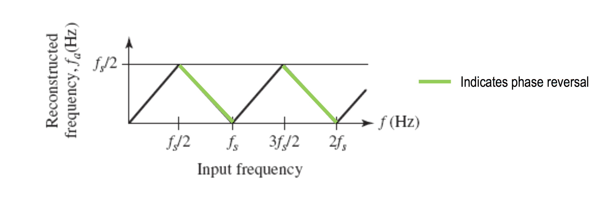
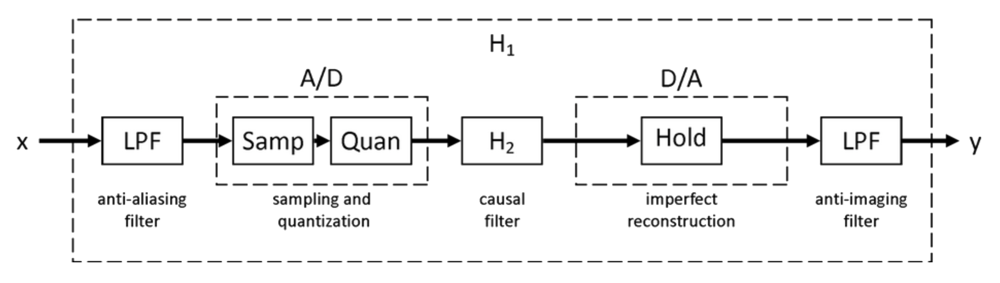

# lect06

## COURSE OVERVIEW: PART 1
- ~~Discrete-Time Signals in the Time Domain~~
	- ~~Operations, Classifications, Sampling~~
- ~~Discrete-Time Systems~~
	- ~~Impulse/Step Responses, LTI Classification, Stability, Response to sinusoidal input~~
- __Discrete-Time Signals in the Frequency Domain__
	- __Transforms, Applications, Sampling and reconstruction__
- Finite-Length Discrete Transforms
	- DFT, FFT, Zero-padding, Fourier Domain filtering, Linear and Circular convolution
- Z-transform
- Basic filter structures: All pass, LPF, band pass, HPF, comb filter, prototype LPF
-Digital filter structures and representations; 2nd order building blocks
- FIR Design, Windowing
- IIR Design, Bilinear transformation
- IIR filter design with MATLAB
- Review of signal acquisition and reconstruction from frequency domain perspective, interpolating filters, zero-padding, A/D and D/A converters, anti-aliasing filter, sample-and-hold, anti-imaging filter
- Multirate DSP, up-sampling and down-sampling
- Implementation considerations—quantization and dynamic range
- Specific Applications (if time)

## OVERVIEW
- Correlation / utocorrelation (inadvertently missed in a previous lecture)
- CTFT Review
- DTFT
- Sampling: Frequency Domain Perspective
- Bandpass Signal Sampling

## CORRELATION
- __Goal__: Compare one reference signal to one or more signals to determine similarity.
- Application
	- __digital communications__ (different symbols need different things)
	- __radar/sonar__ - reflected signal is a delayed version of transmitted signal - can be used to determine the location of the target (divide by speed of signal traversing through the medium)
	- this problm is harder in reality due to random noise
- Cross-correlation compares two energy signals and is given by:
$$
\begin{matrix}
r_{xy}[l]=\sum_{n=-\infty}^{\infty}{x[n]y[n-l]}&\text{for }\underset{\text{lag}}{l}=0,\:\pm1,\:\pm2,\:\cdots
\end{matrix}
$$
- The ordering of the subscripts indicates $$x[n]$$ is the reference signal and remains "fixed".
- You can convince yourself that $$r_{yx}[l]=r_{xy}[-l]$$

## AUTOCORRELATION
- Specail case where you correlate a signal with itself
$$
\begin{matrix}
r_{xx}[l]=_{n=-\infty}^{\infty}{x[n]x[n-l]}&\text{for }\underset{\text{lag}}{l}=0,\:\pm1,\:\pm2,\:\cdots
\end{matrix}
$$
- What is $$r_{xx}[0]$$ equal to?
$$
\text{ENERGY}
$$
- What can you say is true about evenness and oddness of $$r_{xx}[l]$$?
$$
\text{EVEN}
$$

## CORRELATION WRITTEN AS A CONVOLUTION
$$
\begin{align*}
r_{xy}[l]&=\sum_{n=-\infty}^{\infty}{x[n]y[n-l]}\\
&=r_{xy}[l]=\sum_{n=-\infty}^{\infty}{x[n]y[-(l-n)]}
\end{align*}
$$
Convolution expression:
$$
\begin{align*}
y[n]&=x[n]\otimes{h}[n]\\
&=\sum_{k=-\infty}^{\infty}{x[n]h[n-k]}
\end{align*}
$$
- Convince yourself that
$$
r_{xy}[l]=x[l]\otimes{y}[-l]
$$
therefore
$$
\begin{align*}
r_{xy}[l]&=x[n]\otimes{y}[-l]\\
&=\sum_{n=-\infty}^{\infty}{x[n]h[-(l-n)]}
\end{align*}
$$

## PROPERTIES OF AUTOCORRELATION / CROSS-CORRELATION

### 1.
$$
\begin{matrix}
r_{xx}[0]\geq{r}_{xx}[l]&\forall{l}\in\mathbb{I}
\end{matrix}
$$

### 2.
$$
\underset{\text{evenness for autocorelation}}{r_{xx}[l]=r_{xx}[-l]}
$$

### 3.
$$
r_{xx}[l]\text{ is periodic for a periodic function }x[n]
$$

### 4.
$$
E_{x}=r_{xx}[0]
$$

### 5.
$$
r_{xy}[l]=x[l]\otimes{y}[-l]
$$

### 6.
$$
r_{xy}[l]=r_{yx}[-l]
$$

## ENERGY
- Total energy of a finite energy CT complex signal $$x_a(t)$$ is given by:
$$
\begin{align*}
E_x&=\int_{-\infty}^{\infty}{|x(t)|^2dt}\\
&=\int_{-\infty}^{\infty}{x(t)x^*(t)dt}
\end{align*}
$$
- This can be rewritten as:
$$
E_x=\int_{-\infty}^{\infty}{x(t)\left[\int_{-\infty}^{\infty}{X^*(f)e^{-j2\pi{f}t}df}\right]dt}
$$
- Interchanging the order of integration and rearranging, we get:
$$
\begin{align*}
E_x&=\int_{-\infty}^{\infty}{X^*(f)\left[\int_{-\infty}^{\infty}{x(t)e^{-j2\pi{f}t}dt}\right]df}\\
&=\int_{-\infty}^{\infty}{X^*(f)X(f)df}\\
&=\int_{-\infty}^{\infty}{|X(f)|^2df}\\
\end{align*}
$$

## ENERGY / ENERGY DENSITY SPECTRUM
- __Parseval's theorem for finite-energy CT signals:
$$
\begin{align*}
E_x&=\int_{-\infty}^{\infty}{|x(t)|^2dt}\\
&=\int_{-\infty}^{\infty}{|X(f)|^2df}\\
\end{align*}
$$
- Energy density spectrum is denoted as:
$$
S_x(f)=|X(f)|^2
$$
- Energy over a particular range of frequencies can be found by integrating over those frequencies

## BAND-LIMITED CT SIGNALS
- A full-band, finite-energy, CT signal has a spectrum occupying the whole frequency range:
$$
-\infty<f<\infty
$$
- A band-limited CT signal has a spectrum that is limited to a portion of the frequency range.

## IDEAL VS. PRACTICAL
- An ideal band-limited signal has a spectrum that is ZERO outside of a finite frequency range
- A practical signal takes into account the fact that in the real world, all signals are time-limited and thus, not zero outside of a finite frequency range.

## SIGNAL CLASSIFICATION BY FREQUENCY CONTENT
- __low-pass__: a CT signal has spectrum
	- occupying $$|f|<f_p<\infty$$
	- and has a bandwidth, $$f_p$$.
- __high-pass__: a CT signal  has spectrum
	- occupying $$0<f_p\leq|f|<\infty$$
	- and has a bandwidth from $$f_p$$ to $$\infty$$
- __band-pass__: a CT signal  has spectrum
	- occupying $$0<f_L\leq|f|\leq{f}_H<\infty$$
	- and has a bandwidth $$f_H-f_L$$.

## DISCRETE-TIME FOURIER TRANSFORM (DTFT)
- As stated earlier
$$
\begin{matrix}
\underset{\text{DT time-doamain}}{n}&\to&\underset{\text{CF frequency-doamain}}{\omega}
\end{matrix}
$$
- The DTFT, $$X(e^{j\omega})$$ of a seequence $$x[n]$$ is given by:
$$
X(e^{j\omega})=\sum_{n=-\infty}^{\infty}{x[n]e^{-j\omega{n}}}
$$
where
$$
X(e^{j\omega})=X_{\Re}(e^{j\omega})+jX_{\Im}(e^{j\omega})
$$
- Like the CTFT, this can be written in terms of a magnitude and phase:
$$
X(e^{j\omega})=|X(e^{j\omega})|e^{j\theta(\omega)}
$$
where
$$
\left\{\begin{align*}
|X(e^{j\omega})|\:\:\:\:&\text{magnitude,}\\
&\text{magnitude function,}\\&\text{magnitude spectrum}\\
\theta(\omega)\:\:\:\:&\text{phase,}\\
&\text{phase function,}\\&\text{phase spectrum}\\
\end{align*}\right\}
$$

## DTFT OF REAL SEQUENCES
- For a real sequence, $$x[n]$$,
$$
\begin{matrix}
|X(e^{j\omega})|&\text{and}&X_\Re(e^{j\omega})
\end{matrix}
$$
are EVEN functions of $$\omega$$
- whereas, (again, for a real sequence),
$$
\begin{matrix}
\theta(\omega)&\text{and}&X_\Im(e^{j\omega})
\end{matrix}
$$
are ODD functions of $$\omega$$

## AMBIGUITY OF PHASE
$$
\begin{align*}
X(e^{j\omega})&=|X(e^{j\omega})e^{j\theta(\omega)}\\
&=|X(e^{j\omega})e^{j\theta(\omega)+2\pi{k}}\\
\end{align*}
$$
- The phase function, $$\theta(\omega)$$, cannot be uniquely specified for any DTFT
- unless otherwise stated, assume that $$\theta(\omega)$$ is restricted to the range:
$$
-\pi\leq\underset{\text{principal value}}{\theta(\omega)}\leq\pi
$$
- Because of this, discontinuities of $$2\pi$$ can appear in the phase response and are often removed to produce an alternate type of phase function: this is called __unwrapping__.

### [EXAMPLE: DTFT][1]

## PERIODICITY OF DTFT
$$
\begin{align*}
X(e^{j\left(\omega+2\pi{k}\right)})&=\sum_{n=-\infty}^{\infty}{x[n]e^{-j\left(\omega+2\pi{k}\right)n}}\\
&=\sum_{n=-\infty}^{\infty}{x[n]e^{-j\omega{n}}e^{-j2\pi{k}n}}\\
&=\sum_{n=-\infty}^{\infty}{x[n]e^{-j\omega{n}}}\\
&=X(e^{j\omega})
\end{align*}
$$
- Thus, this can be veiwwed as the __Fourier Series__ representation of the periodic function
- As a result, Fourier coefficient, $$x[n]$$ can be computed computed from $$X(e^{j\omega})$$ using the Fourier integral:
$$
\underset{\text{inverse DTFT}}{x[n]=\frac{1}{2\pi}\int_{-\pi}^{\pi}{X(e^{j\omega})e^{j\omega{n}}d\omega}}
$$

## ENERGY DENSITY SPECTRUM
- total energy of a finite-energy sequence $$g[n]$$ is given by:
$$
\begin{align*}
E_g&=\sum_{}^{}{|g[n]|^2}\\
&=\frac{1}{2\pi}\int_{-\pi}^{\pi}{|G(e^{j\omega})|^2d\omega}
\end{align*}
$$
- energy density spectrum:
$$
S_g(\omega)=|G(e^{j\omega})|^2
$$

## BAND-LIMITED DT SIGNALS
- Since the spectrum is periodic with a period of $$2\pi$$ , a __full-band__ signal has a spectrum occupying the frequency range:
$$
-\pi<\omega<\pi
$$
- A band-limited DT signal has a spectrum that is limited to a portion of the frequency range above

## IDEAL VS. PRACTICAL
- Ideal band-limited signal has a spectrum that is ZERO outside of a certain frequency range
- Ideal band-limited DT signals cannot be generated in practice.

## CLASSIFICATION OF BAND-LIMITED DT SIGNALS
- __low-pass__: DT signal has spectrum
	- occupying $$0<|\omega|\leq\omega_p<\pi$$
	- and has a bandwidth $$\omega_p$$
- __high-pass__: DT signal has spectrum
	- occupying $$0<\omega_p\leq|\omega|<\pi$$
	- and has a bandwidth $$\pi-\omega_p$$
- __band-pass__: DT signal has spectrum
	- occupying $$0<\omega_L\leq|\omega|\leq\omega_H<\pi$$
	- and has a bandwidth $$\omega_H-\omega_L$$

## DTFT PROPERTIES
- offered without proof
- easy to prove most of these
- CONVOLUTION is VERY USEFUL property
	- says take DTFT
	- Multiply in frequency domain
	- take inverse DTFT

| Theorems | Sequence | DTFT |
| :------- | :------: | :--: |
| | $$g[n]$$ | $$G(e^{j\omega})$$ |
| | $$h[n]$$ | $$H(e^{j\omega})$$ |
| Linearity | $$\alpha{g}[n]+\beta{h}[n]$$ | $$\alpha{G}(e^{j\omega})+\beta{H}(e^{j\omega})$$ |
| Time-shifting | $$g[n-n_0]$$ | $$\left(e^{-j\omega{n}_0}\right)G(e^{j\omega})$$ |
| Frequency-shifting | $$\left(e^{j\omega_0n}\right)g[n]$$ | $$G\left(e^{j\left(\omega-\omega_0\right)}\right)$$ |
| Differentiation | $$ng[n]$$ | $$j\frac{d\left(G(e^{j\omega})\right)}{d\omega}$$ |
| Convolution | $$g[n]\otimes{h}[n]$$ | $$G(e^{j\omega})H(e^{j\omega})$$ |
| Modulation | $$g[n]h[n]$$ | $$\tfrac{1}{2\pi}\int_{-\pi}^{\pi}{G(e^{j\theta})H(e^{j\omega-\theta})d\theta}$$ |
| Parseval's relation | $$\sum_{n=-\infty}^{\infty}{g[n]h^*[n]}$$ | $$\tfrac{1}{2\pi}\int_{-\pi}^{\pi}{G(e^{j\omega})H^*(e^{j\omega})d\omega}$$

## PHASE UNWRAPPING
- When phase is calculated outside of the range $$-\pi<\omega\leq\pi$$, it is computed modulo $$2\pi$$ to bring it back into this range.
- This can cause discontinuities of $$2\pi\:\text{rad}$$ in the plot
- Unwrapped phase with discontinuities removed will be denoted as
	- math: $$\theta_c(\omega)$$
	- matlab: `unwrap`

## SAMPLING: FREQUENCY DOMAIN PERSPECTIVE
- As indicated earlier – DT signals are often produced by sampling a CT signal
- Identical DT signals may result from the sampling of more than one distinct CT signal
- We have already discussed that if we sample at twice the maximum frequency, we can get back the intended signal.
- Let’s investigate what happens in the frequency domain when we sample...
- Assume $$g_a(t)$$ is a CT signal that is sampled at $$t=nT$$, generating the sequenc $$g[n]$$ where $$g[n]=g_a(nT)$$.
- Once again, $$T$$ is the sampling period and $$F_T$$ is the sampling frequency.
- Frequency domain representation of  $$g_a(t)$$ is given by CTFT:
$$
G_a(f)=\int_{-\infty}^{\infty}{g_a(t)e^{-j2\pi{f}t}dt}
$$
- And, the frequency domain representation of $$g[n]$$ is given by DTFT:
$$
G(e^{j\omega})=\sum_{n=-\infty}^{\infty}{g[n]e^{-j\omega{n}}}
$$
- Next, define the periodic impulse train, $$p(t)$$ as:
$$
p(t)=\sum_{n=-\infty}^{\infty}{\delta{(t-nT)}}
$$
Such that, $$g_a(t)p(t)=g_p(t)$$ (this is still a time domain signal with deltas that have ‘sampled’ the original sequence.
- the impulse train $$p(t)$$ consists of a train of ideal impulses, with period $$T$$.
- The multiplication yields:
$$
\begin{align*}
g_p(t)&=g_a(t)p(t)\\
&=\sum_{n=-\infty}^{\infty}{g_a(nT)\delta(t-nT)}
\end{align*}
$$

## SHAH FUNCTION: TRAIN OF IMPULSES
- the shah function is defined as:
$$
Ш_T(t)=\sum_{n=-\infty}^{\infty}\delta(t-nT)
$$
Where $$T$$ is some interval spacing (conveniently labeled as the sampling period is a useful separation for these deltas).
- The CTFT of the shah function is .. the shah function ... well, close:
$$
Ш_{f_T}(t)=\frac{1}{T}\sum_{n=-\infty}^{\infty}\delta\left(f-\frac{n}{T}\right)
$$

## SAMPLING: FREQUENCY DOMAIN PERSPECTIVE
- So
$$
\begin{align*}
g_p(t)&=g_a(t)p(t)\\
&=\sum_{n=-\infty}^{\infty}{g_a(nT)\delta(t-nT)}\\
&=g_a(t)Ш_T(t)
\end{align*}
$$
- and
$$
G_p(j\Omega)=?
$$
- So, if $$f_T$$ is $$\times2$$ the highest frequency, there will be __no aliasing__ (*i.e.* no disturbance to the baseband spectrum) and the original signal can be recovered exactly by passing the sampled signal through an ideal lowpass filter with a gain of $$T$$ and a cutoff frequency greater than the maximum frequency of the original signal and less than $$f_T-\max{\left(f_\text{original}\right)}$$.

## RECONSTRUCTION
- Frequency domain perspective is to use an ideal low pass filter that contains the frequencies of interest.
- What is this in the time domain?

## ALIASING
- The relationship between input and reconstructed frequencies in the sampling process is displayed below.

## DIGITAL PROCESSING OF CT SIGNALS
1. ### CONVERSION OF CT to DT (sampling, quantization)
	- usually happens with an __a__nalog-to-__d__igital converter (A/D)
	- Sample and Hold circuit is usually used to minimize error
2. ### PROCESSING OF DT signal (filtering, convolving, etc.)
3. ### CONVERSION OF DT to CT (reconstruction)
	- usually occurs using a __d__igital-to-__a__nalog converter (D/A)

## RECONSTRUCTION
- Frequency domain perspective is to use an ideal low pass filter that contains the frequencies of interest.
- What is this in the time domain?

## ANTI-ALIASING FILTER
- Removes out-of-band frequency content BEFORE sampling takes place to avoid aliasing.
- In theory, this removes all of the things that we have been worried about in terms of aliasing. It doesn’t make aliasing a non-issue—you can still have unintended aliasing or things that come AFTER the anti-aliasing filter that cause problems.

## ANTI-IMAGING FILTER
- This is another word for the reconstruction filter as it blocks out anything that may introduce out-of-band frequency content on the reconstruction side.

[1]: http://chanhi2000.gitbooks.io/elen133/content/lect/ex06.html#1

