# lect17

## COURSE OVERVIEW:
- ~~Discrete-Time Signals in the Time Domain~~
	- ~~Operations, Classifications, Sampling~~
- ~~Discrete-Time Systems~~
	- ~~Impulse/Step Responses, LTI Classification, Stability, Response to sinusoidal input~~
- ~~Discrete-Time Signals in the Frequency Domain~~
	- ~~Transforms, Applications, Sampling and reconstruction~~
- ~~Finite-Length Discrete Transforms~~
	- ~~DFT, FFT, Zero-padding, Fourier Domain filtering, Linear and Circular convolution~~
- ~~Z-transform~~
- ~~Basic filter structures: All pass, LPF, band pass, HPF, comb filter, prototype LPF~~
- ~~Digital filter structures and representations; 2nd order building blocks~~
- ~~FIR Design, Windowing~~
- ~~IIR Design, Bilinear transformation~~
- ~~IIR filter design with MATLAB~~
- __Review of signal acquisition and reconstruction from frequency domain perspective, interpolating filters, zero-padding, A/D and D/A converters, anti-aliasing filter, sample-and-hold, anti-imaging filter__
- __Multirate DSP, up-sampling and down-sampling__
- __Implementation considerations—quantization and dynamic range__
- Specific Applications (if time)

## OVERVIEW
- Bilinear Transformation
- IIR Filters in MATLAB
- FIR Filter (Parks-McClellan)

## REVIEW THE A->D->filter->A CHAIN
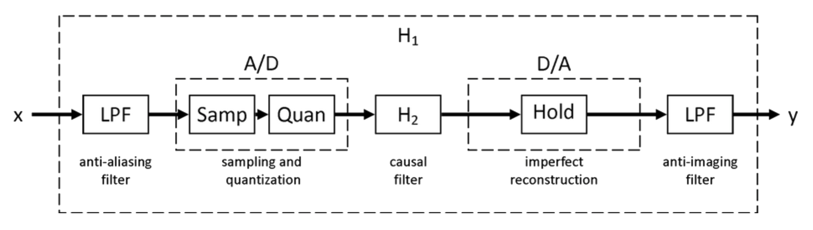

## SAMPLING: FREQUENCY DOMAIN PERSPECTIVE
- DT signals are often produced by sampling a CT signal
- Identical DT signals may result from the sampling of more than one distinct CT signal
- We discussed that if we sample at twice the maximum frequency, we can get back the intended signal.
- Let’s refresh our memories regarding what happens in the frequency domain when we sample...
- Assume $$g_a(t)$$ is a CT signal that is sampled at $$t=nT$$, generating the sequence $$g[n]$$, where
$$
g[n]=g_a(nT)
$$
- Once again, $$T$$ is the sampling period and $$F_T$$ is the sampling frequency.
- Frequency domain represenation of $$g_a(t)$$ is given by CTFT:
$$
G_a(j\Omega)=\int_{-\infty}^{\infty}{g_a(t)e^{-j\Omega{t}}dt}
$$
- And, the frequency domain representation of $$g[n]$$ is given by DTFT:
$$
G\left(e^{j\omega}\right)=\sum_{n=-\infty}^{\infty}{g[n]e^{-j\omega{n}}}
$$
- Next, define the periodic impulse train, $$p(t)$$ as:
$$
p(t)=\sum_{n=-\infty}^{\infty}{\delta(t-nT)}
$$
such that, $$g_a(t)p(t)=g_p(t)$$ (this is still a time domain signal with deltas that have 'sampled' the original sequence.)
- .$$p(t)$$ consists of a train of ideal impulses, with period $$T$$.
- The multiplication yields:
$$
\begin{align*}
g_p(t)&=g_a(t)p(t)\\
&=\sum_{n=-\infty}^{\infty}{g_a(nT)\delta(t-nT)}
\end{align*}
$$

## SHAH FUNCTION: TRAIN OF IMPULSES
- The shah function is defined as:
$$
Ш_T(t)=\sum_{n=-\infty}^{\infty}{\delta(t-nT)}
$$
where $$T$$ is some interval spacing (conveniently labeled as the sampling period is a useful separation for these deltas).
- The CTFT of the shah function is... the shah function... well, close:
$$
\begin{align*}
Ш_{\Omega_T}(j\Omega)&=\frac{1}{T}\sum_{n=-\infty}^{\infty}{\delta\left(\Omega-\frac{2\pi{n}}{T}\right)}\\
&=\frac{1}{T} \sum_{n=-\infty}^{\infty}{\delta(\Omega-n\Omega_T)}
\end{align*}
$$

## SAMPLING: FREQUENCY DOMAIN PERSPECTIVE
- So,
$$
\begin{align*}
g_p(t)&=g_a(t)p(t)\\
&=\sum_{n=-\infty}^{\infty}{g_a(nT)\delta(t-nT)}
\end{align*}
$$
- Can be rewritten as:
$$
g_p(t)=g_a(t)Ш_T(t)
$$
- And
$$
G_p(j\Omega)=G_a(j\Omega)\otimesШ_{\Omega_T}(j\Omega)
$$
- This means that sampling in the time domain at interval $$T$$ results in (scaled) REPLICATION in the frequency domain at interval $$\tfrac{1}{T}$$!!!
- Thus, $$G_p(j\Omega)$$ is a periodic function of $$\Omega$$ consisting of a sum of shifted and scaled replicas of $$G_a(j\Omega)$$, shifted by integer multiples of $$\Omega_T$$ and scaled by $$\tfrac{1}{T}$$.
- The frequency range:
$$
-\frac{1}{2}\Omega_t\leq\Omega\leq\frac{1}{2}\Omega_T
$$
is called the __baseband__ or __Nyquist band__.
- So, if $$\Omega$$ is twice the highest frequency, there will be no aliasing (*i.e.* no disturbance to the baseband spectrum) and the original signal can be recovered exactly by passing the sampled signal through an ideal lowpass filter with a gain of $$T$$ and a cutoff frequency greater than the maximum frequency of the original signal and less than $$\Omega_T$$ __minus the maximum original frequency__.

## SAMPLING RATE ALTERATION
- Used to generate a new sequence, $$y[n]$$, with a sampling rate $${F_T}^\prime$$ higher or lower than that of the original sampling rate $$F_T$$ of a given sequence $$x[n]$$.
$$
R=\frac{F_T^\prime}{F_T}
$$
	- If $$R>1$$, the process is called __interpolation__ — meaning, we are interpolating between samples to determine the new samples
	- If $$R<1$$, the process is called __decimation__ — meaning, we are decimating samples that previously existed

## UPSAMPLING
- An integer $$L>1$$ describes upsampling as $$L-1$$ equidistant zero-valued samples are inserted by an up-sampler between each set of two consecutive samples of the input sequence.
- Thus,
$$
x_u[n]=\begin{cases}
x\left[\frac{n}{L}\right],&n=0,\:\pm{L},\:\pm2L,\cdots\\
0,&\text{otherwise}
\end{cases}
$$
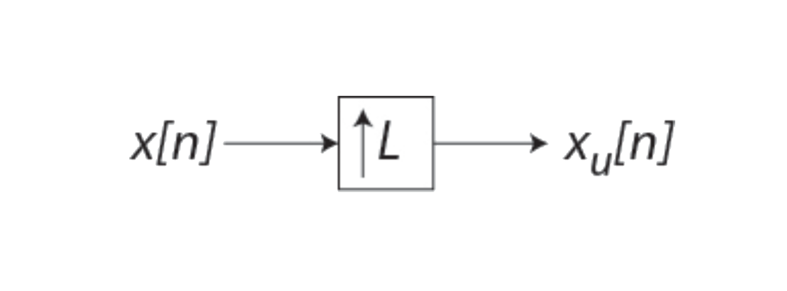

## DOWNSAMPLING
- An integer $$M>1$$ describes downsampling as every $$M$$-th sample of the input sequence being kept and $$M-1$$ samples between them being removed.
- Thus,
$$
x_d[n]=x[nM]
$$
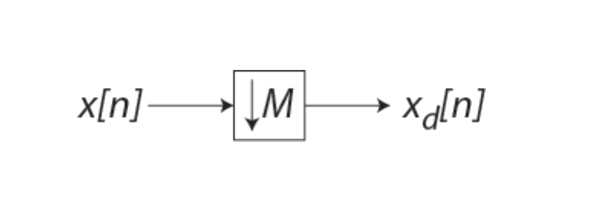

## FACTOR-OF-n INTERPOLATOR (LINEAR)
### FACTOR OF 2 INTERPOLATOR
$$
y[n]=x_u[n]+\frac{1}{2}\left(x_u[n-1]+x_u[n+1]\right)
$$
### FACTOR OF 3 INTERPOLATOR
$$
y[n]=x_u[n]+\frac{1}{3}\left(x_u[n-2]+x_u[n+2]\right)+\frac{2}{3}\left(x_u[n-1]+x_u[n+1]\right)
$$

## LINEAR INTERPOLATION
### FACTOR OF 4 INTERPOLATOR
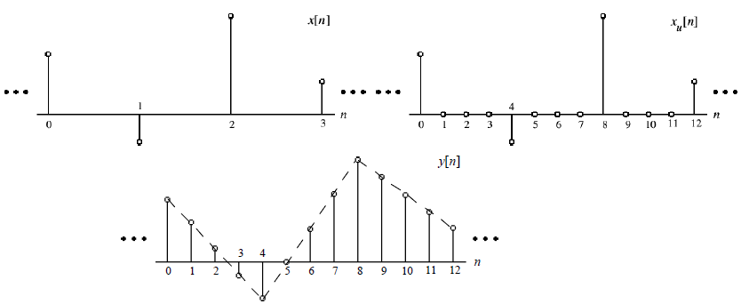

### FACTOR OF 2 INTERPOLATOR FOR IMAGES

| original (512x512) | down-sampled (256x256) | interpolated (512x512) |
| :----------------: | :--------------------: | :--------------------: |
| 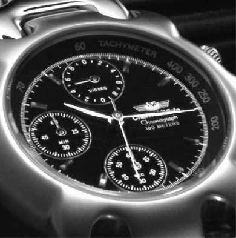 | 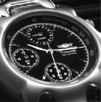 | 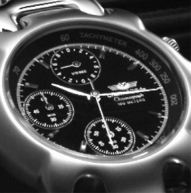 |

## A-to-D CONVERSION
- Conversion of an analog signal into digital format involves the following steps:
	- __Sampling__: Obtain samples of $$x(t)$$ at uniformly spaced time intervals.
	- __Quantization__: Map continuous-amplitude (infinite precision) samples into a finite number of amplitude levels.
	- __Coding__: Encode quantized (finite precision) samples into digital codewords.
- An __a__nalog-to-__d__igital __c__onverter (__ADC__) incorporates all these functions to carry out digital conversion
	- The ADC is preceded by an anti-aliasing filter to prevent the detrimental effect of aliasing produced in the sampling process

## QUANTIZATION
- A __quantizer__ maps analog input samples into one of a finite set of prescribed amplitudes (“levels”). It is a non-linear operation and non-invertible process
$$
y[n]=Q(x[n])
$$
where $$y[n]$$ is quantized sample corresponding to input sample $$x[n]$$
- If the ADC utilizes m bits to represent a sample, the number of distinct approximation levels is $$M=2^m$$
- The peak-to-peak (__full-scale__) amplitude range of the quantizer input is partitioned by the quantizer into $$M$$ __partition intervals__
- The $$k$$-th interval $$I_k$$ is determined by the __partition levels__ $$x_k$$ and $$x_{k+1}$$.*i.e.*,
$$
\begin{matrix}
I_k=\left\{x_k<x[n]\leq{x}_{k+1}\right\},&k=1,\:2,\:\cdots,\:M
\end{matrix}
$$
- The quantizer maps all input samples in the partition interval $$I_k$$ into some amplitude $$y_k$$, called the __quantization level__.
- The spacing between adjacent partition levels is called the __step size__
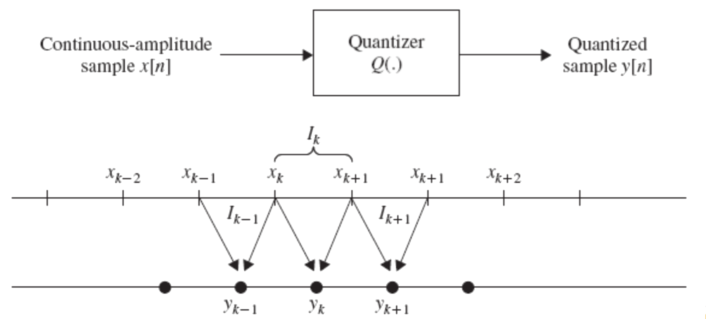
- If the full-scale range of the quantizer is divided into equal-length partition intervals, the quantizer is called a __uniform__ quantizer
- The quantization step size $$\Delta$$ for a uniform quantizer with $$2V$$ full-scale (FS) range is given by
$$
\Delta=\frac{2V}{M}=\frac{2V}{2^{m}}
$$
- Quantizers can be defined with either uniformly or nonuniformly spaced partition levels.
Uniform quantization is normally used in DSP applications
- However, in digital transmission and storage applications of signals such as speech, nonlinear and time-variant quantizers are frequently used

## TWO TYPES OF 8-LEVEL UNIFORM QUNATIZER
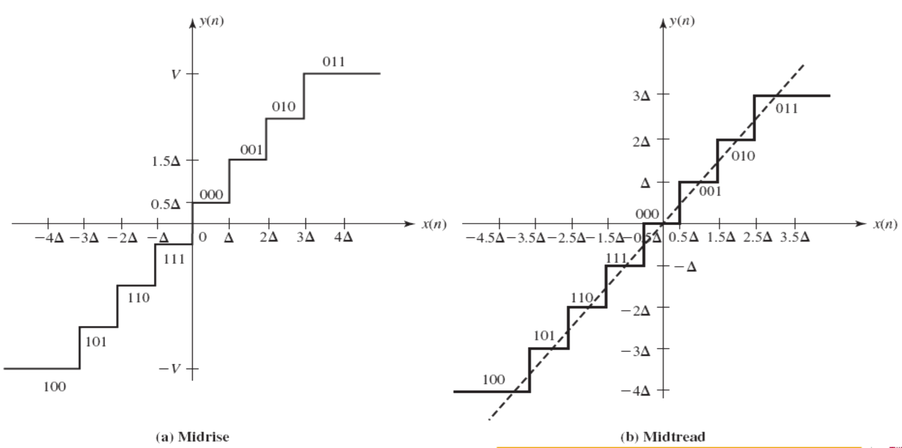

## QUANTIZATION NOISE
- The quantization process introduces __quantization error__
$$
e[n]=y[n]-x[n]
$$
- For a uniform quantizer with step size $$\Delta$$, the quantization error is always in the range
$$
\left(-\tfrac{\Delta}{2},\:\tfrac{\Delta}{2}\right]
$$
assuming, $$-V\leq{x}[n]\leq{V}$$
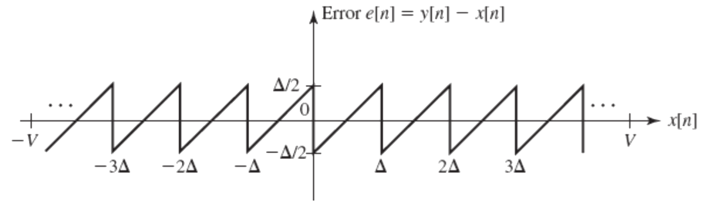
- We model quantization error as an additive noise

## NON-UNIFORM QUNATIZATION
- *Real audio signals* — *i.e.*, speech and music — contain both small and large amplitudes, but small amplitudes more likely
- Since the quantization noise for a uniform quantizer is independent of the signal amplitude, the SQNR is degraded for low signal levels
- In non-uniform quantization, we employ a relatively small step size $$\Delta$$ for low level signals and large $$\Delta$$ for larger signal levels
	- Provides relatively constant SQNR over a wide dynamic input signal range using the same number of bits
- Accomplished by the combination of a __compressor__ and an __expander__ — called a __compander__
	- __Compressor__ compresses input samples prior to uniformly quantizing at the transmit end.
	- __Expander__ restores samples to correct relative values.

## $$\mu$$-LAW QUANTIZER
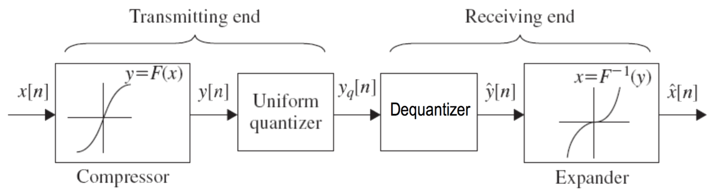
- Compression characteristics ($$\mu$$-law)
$$
\begin{align*}
y&=F(x)\\
&=x_\text{max}\frac{\log_{e}{\left(1+\mu\tfrac{|x|}{x_\text{max}}\right)}}{\log_{e}{\left(1+\mu\right)}}\operatorname{sgn}(x)
\end{align*}
$$
- In the United States, Canada, and Japan, $$\mu=255$$ is standard

## D-to-A CONVERSION
- Sample and hold

## ANTI-ALIASING FILTER
- Removes out-of-band frequency content BEFORE sampling takes place to avoid aliasing.
- In theory, this removes all of the things that we have been worried about in terms of aliasing. It doesn’t make aliasing a non-issue — you can still have unintended aliasing or things that come AFTER the anti-aliasing filter that cause problems.

## ANTI-IMAGING FILTER
- This is another word for the reconstruction filter as it blocks out anything that may introduce out-of-band frequency content on the reconstruction side.

## MULTIRATE DIGITAL SIGNAL PROCESSING
- It is often necessary to change the sampling rate of a signal:
	– Match a different rate signal
	– Lower sampling rate to match lower bandwidth
	– Increase sampling rate before time division multiplexing
- One possibility is to put the signal through a D/A and then resample
	- __Advantage__: allows any new sampling rate
	- __Disadvantages__: distortion caused by D/A and quantization effects in A/D
- Sampling rate conversion in digital domain avoids these disadvantages
- Math of the second method can be considered as: “resampling after reconstruction”
- Let $$x(t)$$ be a CT signal that is sampled at a rate $$F_x=\tfrac{1}{T_x}$$ to generate discrete samples $$x(nT_x)$$. From the samples, a CT signal can be re-generated using the interpolation formula:
$$
y(t)=\sum_{n=-\infty}^{\infty}{x(nT_x)g(t-nT_x)}
$$
- In theory, if the bandwidth of $$x(t)$$ is less than $$\tfrac{F_x}{2}$$ and the interpolation function is given by:
$$
\begin{align*}
g(t)&=\frac{\sin{\left(\tfrac{\pi{t}}{T_x}\right)}}{\left(\tfrac{\pi{t}}{T_x}\right)};\\
G(f)&=\begin{cases}
T_x,&|f|\leq\tfrac{F_x}{2}\\
0,&\text{otherwise}
\end{cases}
\end{align*}
$$
- Then, $$y(t)=x(t)$$. If the above is not true, then $$y(t)\neq{x}(t)$$.
- In practice, perfect recovery of $$x(t)$$ is not possible.
- For our purposes, this is a tool to understand the alteration of the sampling rate.
- To perform sampling rate conversion, evaluate $$y(t)$$ (from the previous slide) at time instants $$t=mT_y,$$ where $$F_y=\tfrac{1}{T_y}$$ is the desired sampling frequency...
- Therefore — general formula for sampling rate conversion is:
$$
y(mT_y)=\sum_{n=-\infty}^{\infty}{x(nT_x)g(mT_y-nT_x)}
$$
- This is accurate only if $$F_y>F_x$$.
	- If $$F_y<F_x$$, frequency components above  $$\tfrac{F_y}{2}$$ need to be filtered out before resampling — *i.e.*, the new sampling rate cannot violate the Nyquist limit.
- Let’s look at the sampling chain to understand this better.

- The anti-aliasing filter filters that analog signal to below $$\tfrac{F_s}{2}$$.
- The sampler then grabs a sample every $$T_s$$ seconds.
- Separating this from the quantization and the filter that are present, the reconstruction filter creates an analog reconstruction of the signal from the samples under the assumption that, because the samples are every $$T_s$$ seconds, that the signal must contain frequencies LESS THAN $$\tfrac{F_s}{2}$$.
- Now, assume a system were to adjust the sampling rate to a __lower__ sampling rate, I'll call it $$F_\text{smaller}$$ to make it clear. This means that the new samples are going to be $$T_\text{bigger}=\tfrac{1}{F_\text{samller}}$$ apart.  And, because the samples are nwo further apart (again, representing a smaller sampling frequency), any reconstruction or assumption about the analog signal that it represents must be that it contains frequencies LESS THAN $$\tfrac{F_\text{smaller}}{2}$$.
- Returning to the general sampling conversion formula:
$$
y(mT_y)=\sum_{n=-\infty}^{\infty}{x(nT_x)g(mT_y-nT_x)}
$$
	- If $$T_y=T_x$$, then we have the convolution summation which corresponds to an LTI system.
	- Now, if $$T_y\neq{T}_x$$, we can gain insight by rearranging the argument of $$g(t)$$ as follows:
	$$
	y(mT_y)=\sum_{n=-\infty}^{\infty}{x(nT_x)g\left(T_x\left(\frac{mT_y}{T_x}-n\right)\right)}
	$$
	- The term $$\tfrac{mT_y}{T_x}$$ may or may not be an integer, but it can be separated into an integer part (we will call it $$k_m$$) and a fractional part (we will call $$\Delta_m$$) such that
	$$
	\frac{mT_y}{T_x}=k_m+\Delta_m
	$$
	where
	$$
	\begin{align*}
	k_m&=\left\lfloor\frac{mT_y}{T_x}\right\rfloor;\\
	\Delta_m&=\frac{mT_y}{T_x}-\left\lfloor\frac{mT_y}{T_x}\right\rfloor;\\
	\end{align*}
	$$
	- Let's interpret the value $$\Delta_m$$
		- it represents the position of the current sample within the original sample period $$T_x$$.
		- Using the definition above, we get:
		$$
		y(mT_y)=\sum_{n=-\infty}^{\infty}{x(nT_x)g\left(T_x\left(k_m+\Delta_m-n\right)\right)}
		$$
		- Finally, if we replace the index of summation from $$n$$ to $$k=k_m-n$$, we get:
		$$
		\begin{align*}
		y(mT_y)&=y\left((k_m+\Delta_m)T_x\right)\\
		&=\sum_{k=-\infty}^{\infty}{x((k_m-k))T_x)g\left(\left(kT_x+\Delta_mT_x\right)\right)}
		\end{align*}
		$$
		- The above represents the fundamental equation for the discrete-time implementation of sampling rate conversion.
		- Note that given $$T_x$$ and $$T_y$$, the inpute and output sampling times are fixed, the function $$g(t)$$ is shifted for each $$m$$ such that the value $$g(\Delta_mT_x)$$ is position at $$t=mT_y$$ and the required values of $$g(t)$$ are determined at the input sampling times.
- So, for each value of $$m$$,
	- $$Delta_m$$ determines the impulse response coefficients
	- whereares the index $$k_m$$ specifies the corresponding input samples needed to compute the sample $$y(mT_y)$$.
	- Since for any $$m$$, $$k_m$$ is an integer, $$y(mT_y)$$ is the convolution between the input sequence $$x(nT_y)$$ and the impulse response $$g((n+\Delta_m)T_x)$$.
	- The above yields a linear and *continuously time-varying* system in the sense that a different impulse response is required for every sample.
	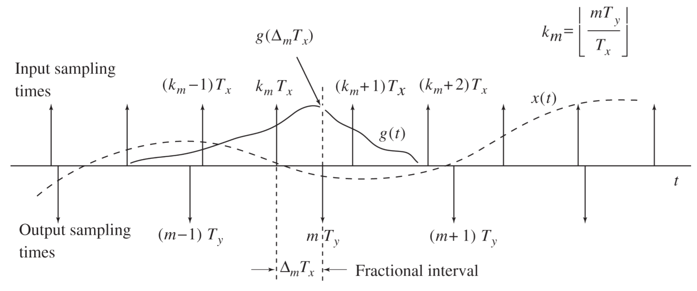
- If the ratio of $$T_y$$ and $$T_x$$ is a rational number, *i.e.*, if:
$$
\frac{T_y}{T_x}=\frac{F_x}{F_y}=\frac{D}{I}
$$
where $$D$$ and $$I$$ are relatively prime integers — now, $$\Delta_m$$ can only take on $$I$$ values
$$
\left(0,\:\tfrac{1}{I},\:\tfrac{2}{I},\:\cdots,\:\tfrac{(I-1)}{I}\right)
$$
- Therefore, in this scenarios, there are only $$I$$ possible impulse responses.
- Thus, the system $$g((n+\Delta_m)T_x)$$ is linear and *periodically time-varying* — which is much more mathematically manageable.
- These letters were used for a reason.
	- Consider $$I$$ is the upsampling or (__interpolation__) factor,
	- and $$D$$ is the downsampling or (__decimation__) factor.
- So, one upsamples by a factor of $$I$$, then downsamples by a factor of $$D$$ and the result is a new frequency that is the ratio of these two integers times the original frequency.
- __example__: if we wanted to go from a sampling frequency of $$10\:\text{Hz}$$ to $$15\:\text{Hz}$$, we would realize that $$15$$ is $$\tfrac{3}{2}$$ of $$10$$. How would you upsample/downsample to achieve this conversion?
$$
T_y=\frac{D}{I}T_x
$$
- In this case, $$T_x=0.1\:\text{sec}$$. If we upsample by 3, we insert two samples between every existing pair of samples — essentially converting the time separation to $$0.0333333\:\text{sec}$$ — and, the frequency to $$30\:\text{Hz}$$. Now, if we take every other sample of the new sequence, the separation is $$0.0666666\:\text{sec}$$, or $$15\:\text{Hz}$$ and we have achieved our conversion.

## BASIC APPROACH TO DO THIS IN DIGITAL
- upsample — insert zeros
- interpolate to replace zeros
- downsample — remove every $$m$$-th sample
- Let's look at these mathematically in the frequency domain

## UPSAMPLING
- Imagine, first, that you sample a signal by the sampling rate, $$F_T$$, and in a separate sample, by the sampling rate $$LF_T$$.
- In the first scenario, you will get spectral replicas every $$kF_T$$, and in the same scenario, you will get spectral replicas every $$kLF_T$$.
- What does this look like vs. $$\omega$$? How does $$\omega$$ map to $$f$$ in each case?
- .$$F_T$$ maps to $$\omega=2\pi$$, so the $$-pi$$ to $$pi$$ range maps to a different set of frequencies in each scenario.
	- In scenario 1, $$-pi$$ to $$pi$$ maps to $$-\tfrac{F_t}{2}$$ to $$\tfrac{F_t}{2}$$.
	- In scenario 2, $$-pi$$ to $$pi$$ maps to $$-\tfrac{LF_t}{2}$$ to $$\tfrac{LF_t}{2}$$.
- Thus, the scaling changes.
	- The max frequency of our original CT spectra, $$f_\text{max}$$, originally mapped to $$\omega_\text{max}=f_\text{max}\tfrac{2\pi}{F_T}$$.
	- In the scenario 2, it maps to $$\omega_\text{max}=f_\text{max}\tfrac{2\pi}{LF_T}$$.
$$
x_u[n]=\begin{cases}
x\left[\frac{n}{L}\right],&n=0,\:\pm{L},\:\pm2L,\cdots\\
0,&\text{otherwise}
\end{cases}
$$
- And, thus
$$
\begin{align*}
X_U(z)&=\sum_{n=-\infty}^{\infty}{x_u[n]z^{-n}}\\
&=\sum_{n=-\infty}^{\infty}{x\left[\frac{n}{L}\right]z^{-n}},&&\left<n=kL\right>\\
&=\sum_{k=-\infty}^{\infty}{x\left[\frac{kL}{L}\right]z^{-kL}}\\
&=\sum_{k=-\infty}^{\infty}{x[k](z^L)^{-k}}\\
&=X(z^{L})
\end{align*}
$$
- If $$X_U(z)=X(z^{L})$$, then,
$$
X_U\left(e^{j\omega}\right)=X\left(e^{j\omega{L}}\right)
$$
- At $$\omega=\pi$$,
$$
X_U\left(e^{j\pi}\right)=X\left(e^{j\pi{L}}\right)
$$
see $$L$$ replicas of spectrum before upsampling

## IMPLEMENTATION OF LENGTH-$$N$$ INTERPOLATION
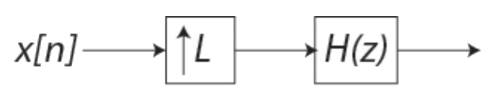
- .$$H(z)$$ has length, $$N$$.
- Need $$N$$ multiplies for each output.
- Have $$L$$ outputs for each input.
- This $$=NL$$ multiplies for each input...
- But, most of the multiplies are by __zero__! Let's make this more efficient.

## EFFICIENT IMPLEMENTATION OF INTERPOLATION
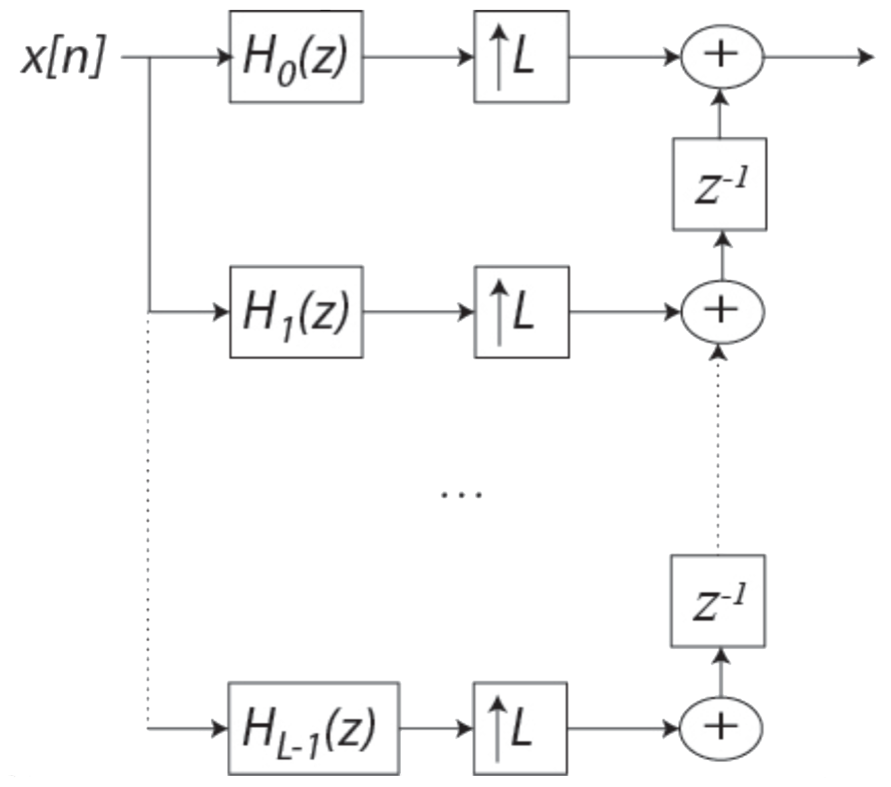
- Use $$L$$ downsampled version of $$H(z)$$ instead: (called a *polyphase filter decomposition*)
- Reduce total number of multiplies by a factor of $$L$$ — delays are cheap (computationally).

## DOWNAMPLING
$$
\begin{align*}
y[n]&=x[nM]\\
Y(z)&=\sum_{n=-\infty}^{\infty}{x[nM]z^{-n}}
\end{align*}
$$
- Can't get $$Y(z)$$ from this, no way to relate with a percentation of the data missing.
- Create a new function where we can compute $$z$$-transform.
- Without loss of generality, assume $$M=2$$.
$$
w[n]=\frac{1}{2}\left(x[n]+(-1)^nx[n]\right)
$$
- This takes every other sample and replaces the other with zero.
- Thus,
$$
\begin{align*}
W(z)&=\frac{1}{2}X(z)+\frac{1}{2}X(-z)\\
W\left(e^{j\omega}\right)&=\frac{1}{2}X\left(e^{j\omega}\right)+\frac{1}{2}X\left(e^{j(\omega-\pi)}\right)\\
\end{align*}
$$
- Then,
$$
\begin{align*}
y[n]&=w[2n]\\
Y(z)&=\sum_{n=-\infty}^{\infty}{w[2n]z^{-n}}\\
&=\sum_{m=-\infty}^{\infty}{w[m]z^{-\tfrac{m}{2}}},&&\left<m=2n\right>\\
&=W\left(z^{\tfrac{1}{2}}\right)\\
&=\frac{1}{2}\left(X\left(z^{\tfrac{1}{2}}\right)+\left(-z^{\tfrac{1}{2}}\right)\right)
\end{align*}
$$
- In general,
$$
\begin{align*}
Y(z)&=\frac{1}{M}\sum_{k=0}^{M-1}{X\left(z^{\tfrac{1}{M}}W_M^{-k}\right)}\\\\
&\left<W_M^{-k}=\left(e^{-j\tfrac{2\pi}{M}}\right)^{-k}\right>
\end{align*}
$$
- Aliasing will occur if the maximum frequency is greater than $$\tfrac{\pi}{M}$$ — should use an anti-aliasing filter before downsampling!
- So, should filter with LPF with cutoff at $$\tfrac{\pi}{M}$$ before downsampling.

## ASIDE ON NON-INTEGER DELAYS
- We know that integer delays can be implemented by multiplying by a linear phase term in the frequency domain.
- We’ve also alluded to the fact that non-integer delays can occur (when we have even symmetry with an even number of coefficients)
- __MATH__: say $$H\left(e^{j\omega}\right)=e^{-j\omega{D}}$$
$$
\begin{align*}
h[n]&=\frac{1}{2\pi}\int_{-\pi}^{\pi}{H\left(e^{j\omega}\right)e^{j\omega{n}}d\omega}\\
&=\frac{1}{2\pi}\int_{-\pi}^{\pi}{e^{j\omega(n-D)}d\omega}\\
&=\frac{1}{2\pi}\left(\frac{1}{j(n-D)}\right)\left.e^{j\omega(n-D)}\right|_{-\pi}^{\pi}\\
&=\frac{1}{2\pi}\left(\frac{1}{j(n-D)}\right)\left(2j\:\sin{\left(\pi(n-D)\right)}\right)\\
&=\frac{\sin{\left(\pi(n-D)\right)}}{\pi(n-D)}
\end{align*}
$$
- If $$D$$ is an integer, 
$$
h[n]=\begin{cases}
1&,n=D\\0,&\text{otherwise}\end{cases}
$$
- If $$D$$ is not an integer, $$h[n]$$ equals samples of the $$\operatorname{sinc}$$ function.
- $$\operatorname{sinc}$$ is interpolating filter that would restore original function of continuous time.
- From that, we can effectively resample with an offset
- We can do the same thing and also change the sampling rate

## BACK TO RATE CONVERSION
- We said that we would:
	- upsample
	- interpolate (filter $$H_U(z)$$) — we now know that this filter is an LPF with cutoff at $$\tfrac{\pi}{L}$$
	- downsample
- Now, we know that downsample should include a pre-filter — specifically, a LPF with a cutoff at $$\tfrac{\pi}{L}$$
- We can combine the 2 filters as an LPF with a cutoff with $$\min{\left(\tfrac{\pi}{L},\:\tfrac{\pi}{M}\right)}$$

## SUMMARY
- Changing sampling rate chages frequency mapping inherent with new sampling rate. 
- Upsampling by $$L$$ causes the $$-\pi$$ to $$\pi$$ range of the original to be mapped to $$-L\pi$$ to $$L\pi$$. So, need LPF with cutoff of $$\tfrac{\pi}{L}$$ to keep only original $$-\pi$$ to $$\pi$$ of original signal. This is __interpolation__.
- Downsampling by $$M$$ causes replicas of the spectrum shifted by $$\tfrac{2\pi}{M}$$ to be added in. The $$-\pi$$ to $$\pi$$ range of $$\omega$$ after downsampling corresponds to $$-\tfrac{\pi}{M}$$ to $$\tfrac{\pi}{M}$$ range of the original $$\omega$$. LPF with cutoff of $$\tfrac{\pi}{M}$$ prevents aliasing.