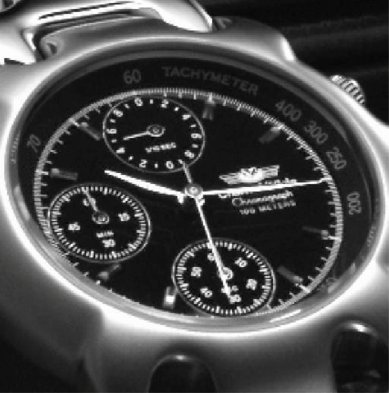
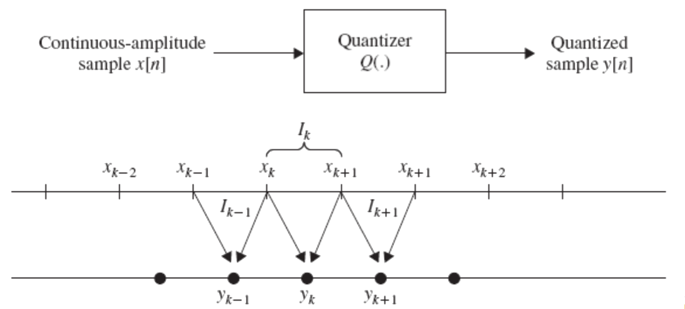
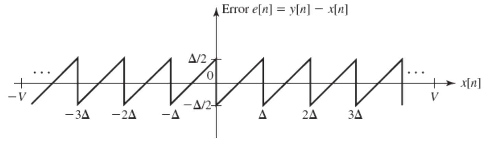

# lect17a

## COURSE OVERVIEW:
- ~~Discrete-Time Signals in the Time Domain~~
	- ~~Operations, Classifications, Sampling~~
- ~~Discrete-Time Systems~~
	- ~~Impulse/Step Responses, LTI Classification, Stability, Response to sinusoidal input~~
- ~~Discrete-Time Signals in the Frequency Domain~~
	- ~~Transforms, Applications, Sampling and reconstruction~~
- ~~Finite-Length Discrete Transforms~~
	- ~~DFT, FFT, Zero-padding, Fourier Domain filtering, Linear and Circular convolution~~
- ~~Z-transform~~
- ~~Basic filter structures: All pass, LPF, band pass, HPF, comb filter, prototype LPF~~
- ~~Digital filter structures and representations; 2nd order building blocks~~
- ~~FIR Design, Windowing~~
- ~~IIR Design, Bilinear transformation~~
- ~~IIR filter design with MATLAB~~
- __Review of signal acquisition and reconstruction from frequency domain perspective, interpolating filters, zero-padding, A/D and D/A converters, anti-aliasing filter, sample-and-hold, anti-imaging filter__
- __Multirate DSP, up-sampling and down-sampling__
- __Implementation considerations—quantization and dynamic range__
- Specific Applications (if time)

## OVERVIEW
- Bilinear Transformation
- IIR Filters in MATLAB
- FIR Filter (Parks-McClellan)

## REVIEW THE A->D->filter->A CHAIN

## SAMPLING: FREQUENCY DOMAIN PERSPECTIVE
- DT signals are often produced by sampling a CT signal
- Identical DT signals may result from the sampling of more than one distinct CT signal
- We discussed that if we sample at twice the maximum frequency, we can get back the intended signal.
- Let’s refresh our memories regarding what happens in the frequency domain when we sample...
- Assume $$g_a(t)$$ is a CT signal that is sampled at $$t=nT$$, generating the sequence $$g[n]$$, where
$$
g[n]=g_a(nT)
$$
- Once again, $$T$$ is the sampling period and $$F_T$$ is the sampling frequency.
- Frequency domain represenation of $$g_a(t)$$ is given by CTFT:
$$
G_a(j\Omega)=\int_{-\infty}^{\infty}{g_a(t)e^{-j\Omega{t}}dt}
$$
- And, the frequency domain representation of $$g[n]$$ is given by DTFT:
$$
G\left(e^{j\omega}\right)=\sum_{n=-\infty}^{\infty}{g[n]e^{-j\omega{n}}}
$$
- Next, define the periodic impulse train, $$p(t)$$ as:
$$
p(t)=\sum_{n=-\infty}^{\infty}{\delta(t-nT)}
$$
such that, $$g_a(t)p(t)=g_p(t)$$ (this is still a time domain signal with deltas that have 'sampled' the original sequence.)
- .$$p(t)$$ consists of a train of ideal impulses, with period $$T$$.
- The multiplication yields:
$$
\begin{align*}
g_p(t)&=g_a(t)p(t)\\
&=\sum_{n=-\infty}^{\infty}{g_a(nT)\delta(t-nT)}
\end{align*}
$$

## SHAH FUNCTION: TRAIN OF IMPULSES
- The shah function is defined as:
$$
Ш_T(t)=\sum_{n=-\infty}^{\infty}{\delta(t-nT)}
$$
where $$T$$ is some interval spacing (conveniently labeled as the sampling period is a useful separation for these deltas).
- The CTFT of the shah function is... the shah function... well, close:
$$
\begin{align*}
Ш_{\Omega_T}(j\Omega)&=\frac{1}{T}\sum_{n=-\infty}^{\infty}{\delta\left(\Omega-\frac{2\pi{n}}{T}\right)}\\
&=\frac{1}{T} \sum_{n=-\infty}^{\infty}{\delta(\Omega-n\Omega_T)}
\end{align*}
$$

## SAMPLING: FREQUENCY DOMAIN PERSPECTIVE
- So,
$$
\begin{align*}
g_p(t)&=g_a(t)p(t)\\
&=\sum_{n=-\infty}^{\infty}{g_a(nT)\delta(t-nT)}
\end{align*}
$$
- Can be rewritten as:
$$
g_p(t)=g_a(t)Ш_T(t)
$$
- And
$$
G_p(j\Omega)=G_a(j\Omega)\otimesШ_{\Omega_T}(j\Omega)
$$
- This means that sampling in the time domain at interval $$T$$ results in (scaled) REPLICATION in the frequency domain at interval $$\tfrac{1}{T}$$!!!
- Thus, $$G_p(j\Omega)$$ is a periodic function of $$\Omega$$ consisting of a sum of shifted and scaled replicas of $$G_a(j\Omega)$$, shifted by integer multiples of $$\Omega_T$$ and scaled by $$\tfrac{1}{T}$$.
- The frequency range:
$$
-\frac{1}{2}\Omega_t\leq\Omega\leq\frac{1}{2}\Omega_T
$$
is called the __baseband__ or __Nyquist band__.
- So, if $$\Omega$$ is twice the highest frequency, there will be no aliasing (*i.e.* no disturbance to the baseband spectrum) and the original signal can be recovered exactly by passing the sampled signal through an ideal lowpass filter with a gain of $$T$$ and a cutoff frequency greater than the maximum frequency of the original signal and less than $$\Omega_T$$ __minus the maximum original frequency__.

## SAMPLING RATE ALTERATION
- Used to generate a new sequence, $$y[n]$$, with a sampling rate $${F_T}^\prime$$ higher or lower than that of the original sampling rate $$F_T$$ of a given sequence $$x[n]$$.
$$
R=\frac{F_T^\prime}{F_T}
$$
	- If $$R>1$$, the process is called __interpolation__ — meaning, we are interpolating between samples to determine the new samples
	- If $$R<1$$, the process is called __decimation__ — meaning, we are decimating samples that previously existed

## UPSAMPLING
- An integer $$L>1$$ describes upsampling as $$L-1$$ equidistant zero-valued samples are inserted by an up-sampler between each set of two consecutive samples of the input sequence.
- Thus,
$$
x_u[n]=\begin{cases}
x\left[\frac{n}{L}\right],&n=0,\:\pm{L},\:\pm2L,\cdots\\
0,&\text{otherwise}
\end{cases}
$$

## DOWNSAMPLING
- An integer $$M>1$$ describes downsampling as every $$M$$-th sample of the input sequence being kept and $$M-1$$ samples between them being removed.
- Thus,
$$
x_d[n]=x[nM]
$$

## FACTOR-OF-n INTERPOLATOR (LINEAR)
### FACTOR OF 2 INTERPOLATOR
$$
y[n]=x_u[n]+\frac{1}{2}\left(x_u[n-1]+x_u[n+1]\right)
$$
### FACTOR OF 3 INTERPOLATOR
$$
y[n]=x_u[n]+\frac{1}{3}\left(x_u[n-2]+x_u[n+2]\right)+\frac{2}{3}\left(x_u[n-1]+x_u[n+1]\right)
$$

## LINEAR INTERPOLATION
### FACTOR OF 4 INTERPOLATOR

### FACTOR OF 2 INTERPOLATOR FOR IMAGES

| original (512x512) | down-sampled (256x256) | interpolated (512x512) |
| :----------------: | :--------------------: | :--------------------: |
|  |  |  |

## A-to-D CONVERSION
- Conversion of an analog signal into digital format involves the following steps:
	- __Sampling__: Obtain samples of $$x(t)$$ at uniformly spaced time intervals.
	- __Quantization__: Map continuous-amplitude (infinite precision) samples into a finite number of amplitude levels.
	- __Coding__: Encode quantized (finite precision) samples into digital codewords.
- An __a__nalog-to-__d__igital __c__onverter (__ADC__) incorporates all these functions to carry out digital conversion
	- The ADC is preceded by an anti-aliasing filter to prevent the detrimental effect of aliasing produced in the sampling process

## QUANTIZATION
- A __quantizer__ maps analog input samples into one of a finite set of prescribed amplitudes (“levels”). It is a non-linear operation and non-invertible process
$$
y[n]=Q(x[n])
$$
where $$y[n]$$ is quantized sample corresponding to input sample $$x[n]$$
- If the ADC utilizes m bits to represent a sample, the number of distinct approximation levels is $$M=2^m$$
- The peak-to-peak (__full-scale__) amplitude range of the quantizer input is partitioned by the quantizer into $$M$$ __partition intervals__
- The $$k$$-th interval $$I_k$$ is determined by the __partition levels__ $$x_k$$ and $$x_{k+1}$$.*i.e.*,
$$
\begin{matrix}
I_k=\left\{x_k<x[n]\leq{x}_{k+1}\right\},&k=1,\:2,\:\cdots,\:M
\end{matrix}
$$
- The quantizer maps all input samples in the partition interval $$I_k$$ into some amplitude $$y_k$$, called the __quantization level__.
- The spacing between adjacent partition levels is called the __step size__

- If the full-scale range of the quantizer is divided into equal-length partition intervals, the quantizer is called a __uniform__ quantizer
- The quantization step size $$\Delta$$ for a uniform quantizer with $$2V$$ full-scale (FS) range is given by
$$
\Delta=\frac{2V}{M}=\frac{2V}{2^{m}}
$$
- Quantizers can be defined with either uniformly or nonuniformly spaced partition levels.
Uniform quantization is normally used in DSP applications
- However, in digital transmission and storage applications of signals such as speech, nonlinear and time-variant quantizers are frequently used

## TWO TYPES OF 8-LEVEL UNIFORM QUNATIZER

## QUANTIZATION NOISE
- The quantization process introduces __quantization error__
$$
e[n]=y[n]-x[n]
$$
- For a uniform quantizer with step size $$\Delta$$, the quantization error is always in the range
$$
\left(-\tfrac{\Delta}{2},\:\tfrac{\Delta}{2}\right]
$$
assuming, $$-V\leq{x}[n]\leq{V}$$

- We model quantization error as an additive noise

## NON-UNIFORM QUNATIZATION
- *Real audio signals* — *i.e.*, speech and music — contain both small and large amplitudes, but small amplitudes more likely
- Since the quantization noise for a uniform quantizer is independent of the signal amplitude, the SQNR is degraded for low signal levels
- In non-uniform quantization, we employ a relatively small step size $$\Delta$$ for low level signals and large $$\Delta$$ for larger signal levels
	- Provides relatively constant SQNR over a wide dynamic input signal range using the same number of bits
- Accomplished by the combination of a __compressor__ and an __expander__ — called a __compander__
	- __Compressor__ compresses input samples prior to uniformly quantizing at the transmit end.
	- __Expander__ restores samples to correct relative values.

## $$\mu$$-LAW QUANTIZER

- Compression characteristics ($$\mu$$-law)
$$
\begin{align*}
y&=F(x)\\
&=x_\text{max}\frac{\log_{e}{\left(1+\mu\tfrac{|x|}{x_\text{max}}\right)}}{\log_{e}{\left(1+\mu\right)}}\operatorname{sgn}(x)
\end{align*}
$$
- In the United States, Canada, and Japan, $$\mu=255$$ is standard
