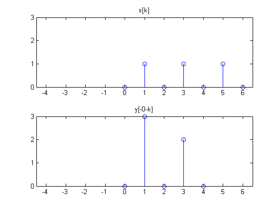
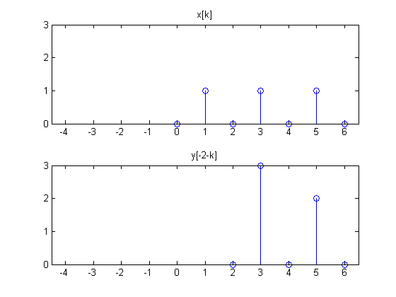
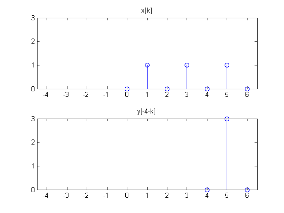

# mt01a

## 1.
__Signal manipulation and operations__

Use these plots for all of Setion 1 $$y[n]$$ is on the left and $$x[n]$$ is on the right.

### 1(a)
__Signal manipulation__: Plot the non-zero values of $$y_1[n]=-y[-4-2n]$$ where $$y[n]$$ is plotted on the left below.
$$
\begin{align*}
y_1[n]&=-y[-2(n+2)];\\
&\vdots\\
y_1[-3]&=-y[-2(-3+2)]=-y[2]=0\\
y_1[-2]&=-y[-2(-2+2)]=-y[0]=0\\
y_1[-1]&=-y[-2(-1+2)]=-y[-2]=0\\
y_1[0]&=-y[-2(0+2)]=-y[-4]=0\\
&\vdots\\
\end{align*}
$$
There are no non-zero of $$y_1[n]$$ since the sample jumps by the factor of 2.

### 1(b)
__Correlation__: again, use $$x[n]$$ and $$y[n]$$ as plotted above.

#### 1b(i)
List the indices, $$l$$, for which is $$r_{xy}[l]$$ non-zero (I'm not asking for a range and I don't care what the correlation values are.)
$$
l=2,\:4,\:6,\:8;
$$
Let's check by tabular method.
$$
\begin{align*}
r_{xy}[l]&=x[l]\otimes{y}[-l]\\
&=\sum_{n=-\infty}^{\infty}{x[n]y[n-l]}
\end{align*}
$$

| $$l$$ | $$r_{xy}[l]$$ |
| :---: | :------------ |
| $$0$$ | $$0$$ |
| $$1$$ | $$0$$ |
| $$2$$ | $$(1)(3)=3$$ |
| $$3$$ | $$0$$ |
| $$4$$ | $$(1)(3)+(1)(2)=5$$ |
| $$5$$ | $$0$$ |
| $$6$$ | $$(1)(3)+(1)(2)=5$$ |
| $$7$$ | $$0$$ |
| $$8$$ | $$(1)(2)$$ |

#### 1b(ii)
What is $$r_{yx}[-4]$$?
$$
\begin{align*}
r_{yx}[-4]&=r_{xy}[4]\\
&=\sum_{n=-\infty}^{\infty}{x[n]y[n-4]}\\
&=(1)(3)+(1)(2)\\
&=5;
\end{align*}
$$

### 1(c)
__Convolution__: $$z[n]$$ represents the convolution $$x[n]\otimes{y}[n]$$ with each plotted as shown.

#### 1c(i)
For which values of $$n$$ is $$z[n]$$ non-zero?
$$
n=-2,\:0,\:2,\:4
$$
Let's check by tabular method.
$$
\begin{align*}
z[n]&=x[n]\otimes{y}[n]\\
&=\sum_{k=-\infty}^{\infty}{x[k]y[n-k]}
\end{align*}
$$

| $$n$$ | $$z[n]$$ |
| :---: | :------------ |
| $$-2$$ | $$(1)(3)=3$$ |
| $$-1$$ | $$0$$ |
| $$0$$ | $$(1)(3)+(1)(2)=5$$ |
| $$1$$ | $$0$$ |
| $$2$$ | $$(1)(3)+(1)(2)=5$$ |
| $$3$$ | $$0$$ |
| $$4$$ | $$(1)(2)=2$$ |
| $$5$$ | $$0$$ |

#### 1c(ii)
What is $$z[4]$$?
$$
\begin{align*}
z[4]&=x[4]\otimes{y}[4]\\
&=\sum_{k=-\infty}^{\infty}{x[k]y[4-k]}\\
&=x[6]y[-2]=(1)(2)\\
&=2
\end{align*}
$$

### 1(d)
__Operations__: Find $$w[n]=x[n+1]-y[n-5]$$. Be sure to label the value and range for $$w[n]$$.

Tabular Method:

| $$n$$ | $$x[n]$$ | $$y[n]$$ | $$x[n+1]$$ | $$-y[n-5]$$ | $$w[n]$$ |
| :---: | :------: | :------: | :--------: | :---------: | :------: |
| $$-4$$ | - | $$0$$ | - | - | - |
| $$-3$$ | - | $$2$$ | - | - | - |
| $$-2$$ | - | $$0$$ | - | - | - |
| $$-1$$ | - | $$3$$ | $$0$$ | - | $$0$$ |
| $$0$$ | $$0$$ | $$0$$ | $$1$$ | - | $$1$$ |
| $$1$$ | $$1$$ | - | $$0$$ | $$0$$ | $$0$$ |
| $$2$$ | $$0$$ | - | $$1$$ | $$-2$$ | $$-1$$ |
| $$3$$ | $$1$$ | - | $$0$$ | $$0$$ | $$0$$ |
| $$4$$ | $$0$$ | - | $$1$$ | $$-3$$ | $$-2$$ |
| $$5$$ | $$1$$ | - | $$0$$ | $$0$$ | $$0$$ |
| $$6$$ | $$0$$ | - | - | - | - |

$$
\therefore\:\begin{matrix}
\{w[n]\}=\{0,\:1,\:0,\:-1,\:0,\:-2\}&\text{for }-1\leq{n}\leq4
\end{matrix}
$$
