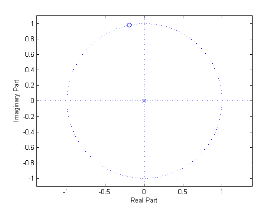

# mt02

## 1
__Frequency Response, Filter Manipulation__

Use this information for problems 1(a)-(c)
A system has impulse response
$$
h[n]=\delta[n]-\delta[n-2]
$$

### 1(a)
Plot the magnitude and phase of $$H\left(e^{j\omega}\right)$$


### 1(b)
An input signal
$$
x[n]=\cos{\left(\frac{\pi}{6}n\right)}+\cos{\left(\frac{\pi}{2}n\right)}
$$
is filtered with the system described above by $$h[n]$$ to produce $$y[n]$$. What is the output $$y[n]$$? Be sure to account for the magnitude and phase.


### 1(c)
A new filter, $$h_2[n]$$, is created by adding a zeros at $$z=\pm{j}$$. Add an appropriate pole (or poles) to keep the system causal. (IF YOU ARE STUCK ON THIS PROBLEM, PLEASE MAKE AN ASSUMPTION AT SOME POINT SO YOU CAN GET CREDIT FOR THE REST OF THE PROBLEM)

#### 1(c)i
What would you multiply $$H(z)$$ by in the $$z$$-domain to achieve this task?

#### 1(c)ii
What is the time-domain operation that you could perform on $$h[n]$$ to achieve this task?

#### 1(c)iii
What are the new coefficients of the filter, $$h_2[n]$$?

#### 1(c)iv
What type filter (Type 1, 2, 3, 4, or none) is the new filter, $$h_2[n]$$? Justify your answer.


#### 1(c)v
Draw a pole-zero plot for th e new filter, $$h_2[n]$$. (The zeros for $$h[n]$$ should be easily captured from a correct magnitude plot)


## 2.
__Misc. Short Answer Questions and MATLAB__

### 2(a)
Assume you are given a signal with frequencies from $$23\:\text{Hz}$$ to $$27\:\text{Hz}$$. What is the lowest sampling rate that you can use to sample while still ensuring perfect reconstruction on the other side?

### 2(b)
A system with an impulse response for $$h[n]=\delta[n]-\delta[n-3]$$ sees an input of $$x[n]=\delta[n-2]$$. What is the output $$y[n]$$?

### 2(c)
The $$X[k]$$ is the 1000 sample `fft()` of some $$x[n]$$ as returend by MATLAB, where $$x[n]$$ was constructed by sampling $$x(t)$$ at an appropriate sampling rate of $$3000\:\text{Hz}$$. Observing $$X[k]$$ reveals that all of the samples are $$0$$ except for $$X[301]$$ and $$X[701]$$ which all have a large non-zero value.  Note that these are the MATLAB indices.  Determine the frequency of the sinusoid(s), in Hertz, that appear in $$x(t)$$.

### 2(d)
True or False: Taking a practical high-pass filter, in the frequency domain and multiplying it with itself will produce a better high-pass filter, in the sense that low frequencies will be more suppressed and the filter will more sharply drop from the passband to the stopband.

------
Use this for 2(e)-(f)
```matlab
[H, w] = freqz(b, a, 512)
```
is typed into MATLAB to determine the frequency response.

### 2(e)
Under what conditions is this analyzign an FIR?


### 2(f)
What is the value for the __last__ normalized frequency, $$\omega$$, that `freqz` returns in the variable `w`. __Reminder__: the first is $$0$$, and note that `'whole'` is NOT used.


## 3.
__DFT and DFT Properties__

### 3(a)
For the point, $$x$$, shown below, calculate the approximate location for $$x^4$$. This will go faster if you use what you know about manipulating points on the unit circle.



### 3(b)
.$${W_{32}}^p$$ represents the point closest to the product that you determined abvoe in Problem 3(a). What is $$p$$?


### 3(c)
Reduce $${W_{16}}^{54}$$ to a complex number.


------
For the problem 3(d)-(e), you are given
$$
x[n]=[1,\:2,\:3,\:4]
$$
and are told that:
$$
\operatorname{DFT}\left(x[n]\right)=\{10,\:-2+2j,\:-2,\:-2-2j\}
$$

### 3(d)
Find
$$
\operatorname{DFT}\left(\operatorname{DFT}\left(\operatorname{DFT}\left(\operatorname{DFT}\left(x[n]\right)\right)\right)\right)
$$


### 3(e)
What is the $$\operatorname{DFT}\left(\{3,\:4,\:1,\:2\right)$$? While you will be given credit for brute forcing this, it is not the point of the problem and you will spend less time on this by applying  the appropriate property.


## 4.
__Overlap-add, Overlap-save, and Linear/Circular Convolution__

You are tolde that an input sequence $$x[n]=[0,\:1,\:2,\:3,\:4,\:5,\:6,\:7,\:8,\:9,\:10,\:11,\:12,\:13,\:\cdots]$$ (note, this starts at $$n=0$$) will be going into a system that has an impulse response of $$h[n]=[1,\:0,\:-1]$$.

For question 4(a)-(b), we will use the __overlap-add__ method with $$N=6$$.

### 4(a)
Using the definition provided in lecture, what is the sub-sequence $$x_1[n]$$?


### 4(b)
Assuming that the DFT method of determining convolution is used, what length DFTs and invers DFTs are used to determine $$y_1[n]$$?


For questions 4(c)-(e), we will use the __overlap-save__ method with $$N=6$$.

### 4(c)
Using the definition provided in lecture, what is the sub-sequence $$x_1[n]$$?

### 4(d)
How many terms of $$y_1[n]$$ will be kept in the final output $$y[n]$$?

### 4(e)
Even though it may be rejected, find the first term of $$y_1[n]$$, *i.e.* $$y_1[0]$$.


## 5.
__Z-transform, Pole-zero plots, and FIR filter types__

For 5(a)-(c), asssume you have a system with a difference equation:
$$
y[n]=x[n]+\frac{1}{2}x[n-1]-\frac{1}{2}x[n-2]+\frac{1}{4}y[n-1]+\frac{3}{8}y[n-2]
$$

### 5(a)
Find the transfer function, $$H(z)$$, of the system.


### 5(b)
Manipulate the transfer function in 5(a) as needed and draw the pole/zero plot.  __NOTE__: Think for a second or two... this factors with relatively polite fractions.


### 5(c)
Using any method you'd like, provide the first three samples of the impulse response: $$h[0]$$, $$h[1]$$, and $$h[2]$$.


-----
__REMINDER__: 5(d)-(e) are not related to 5(a)-(c)

### 5(d)
You are given a high pass filter (cutoff of $$\omega_c=\tfrac{2\pi}{5}$$) of order $$4$$ with coefficients: $$[a,\:b,\:c,\:b,\:a]$$. In terms of the coefficients  ($$a$$, $$b$$, and $$c$$), what are the coefficients of a lowpass filter with a cutoff of $$\omega_c=\tfrac{3\pi}{5}$$. (__NOTE__: this is unrelated to 5(a)-(d))


### 5(e)
Provide a reasonable sketch (labeled as best you can) of the magnitude of the frequency response for the pole/zero plot provided below. As a helper, you are told that 
$$
H(z)=\frac{\left(z^2-z+\tfrac{1}{2}\right)}{\left(z^2+z+\tfrac{1}{2}\right)}
$$
Indicate the approximate location of all minima, maxima, local minima, and local maxima and label the values at $$\omega=0$$< $$\pi$$, and $$-\pi$$.


