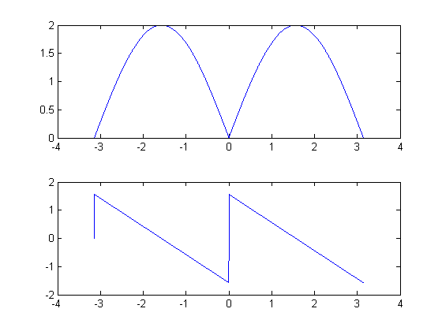
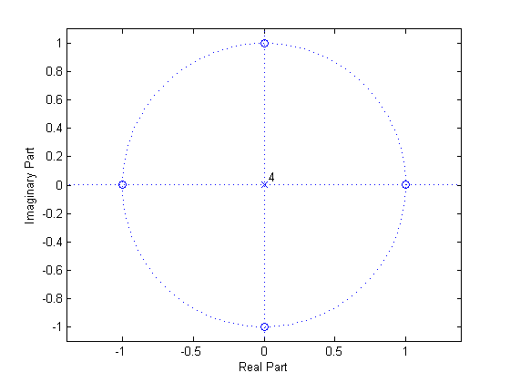

# mt02a

## 1
__Frequency Response, Filter Manipulation__

Use this information for problems 1(a)-(c)
A system has impulse response
$$
h[n]=\delta[n]-\delta[n-2]
$$

### 1(a)
Plot the magnitude and phase of $$H\left(e^{j\omega}\right)$$

$$
\begin{align*}
h[n]&=\delta[n]-\delta[n-2]\\
H\left(e^{j\omega}\right)&=1-e^{-j2\omega}\\
&=e^{-j\omega}\left(e^{j\omega}-e^{-j\omega}\right)\\
&=e^{-j\omega}\left(j2\sin{\left(\omega\right)}\right)\\
&=e^{-j\left(\omega-\tfrac{\pi}{2}\right)}\left(2\sin{\left(\omega\right)}\right)\\\\
\left|H\left(e^{j\omega}\right)\right|=2\sin{\left(\omega\right)};\\
\Theta(\omega)&=-\omega+\frac{\pi}{2}
\end{align*}
$$




### 1(b)
An input signal
$$
x[n]=\cos{\left(\frac{\pi}{6}n\right)}+\cos{\left(\frac{\pi}{2}n\right)}
$$
is filtered with the system described above by $$h[n]$$ to produce $$y[n]$$. What is the output $$y[n]$$? Be sure to account for the magnitude and phase.

From freq. resp. plot,
- @$$\omega=\tfrac{\pi}{6}$$, 
$$
\begin{cases}
\left|H\left(e^{j\left(\tfrac{pi}{6}\right)}\right)\right|=1;\\
\Theta\left(\tfrac{\pi}{6}\right)&=\frac{\pi}{3};
\end{cases}
$$
- @$$\omega=\tfrac{\pi}{2}$$,
 $$
\begin{cases}
\left|H\left(e^{j\left(\tfrac{pi}{2}\right)}\right)\right|=2;\\
\Theta\left(\tfrac{\pi}{2}\right)&=0
\end{cases}
$$

So
$$
y[n]=\cos{\left(\frac{\pi}{6}n+\frac{\pi}{3}\right)}+2\cos{\left(\frac{\pi}{2}n\right)}
$$


### 1(c)
A new filter, $$h_2[n]$$, is created by adding a zeros at $$z=\pm{j}$$. Add an appropriate pole (or poles) to keep the system causal. (IF YOU ARE STUCK ON THIS PROBLEM, PLEASE MAKE AN ASSUMPTION AT SOME POINT SO YOU CAN GET CREDIT FOR THE REST OF THE PROBLEM)


#### 1(c)i
What would you multiply $$H(z)$$ by in the $$z$$-domain to achieve this task?
$$
\begin{align*}
H^\prime(z)&=\frac{(z-j)(z+j)}{z^2}\\
&=\frac{\left(z-e^{-j\tfrac{\pi}{2}}\right)\left(z-e^{j\tfrac{\pi}{2}}\right)}{z^2}
\end{align*}
$$


#### 1(c)ii
What is the time-domain operation that you could perform on $$h[n]$$ to achieve this task?
$$
\begin{align*}
H^\prime(z)&=\frac{\left(z-e^{-j\tfrac{\pi}{2}}\right)\left(z-e^{j\tfrac{\pi}{2}}\right)}{z^2}\\
&=\frac{z^2-z\left(e^{-j\tfrac{\pi}{2}}+e^{j\tfrac{\pi}{2}}\right)+1}{z^2}\\
&=1-2\cos{\left(\frac{\pi}{2}\right)}z^{-1}+z^{-2}\\
&=1-z^{-2};\\\\
h^\prime[n]&=\delta[n]+\delta[n-2];
\end{align*}
$$


#### 1(c)iii
What are the new coefficients of the filter, $$h_2[n]$$?
$$
\begin{align*}
h_2[n]&=h^\prime[n]\otimes{h}^\prime[n]\\
&=[1,\:0\:-1]\otimes[1\:0,\:1]\\
&=[1,\:0,\:0,\:0,\:-1]
\end{align*}
$$


#### 1(c)iv
What type filter (Type 1, 2, 3, 4, or none) is the new filter, $$h_2[n]$$? Justify your answer.
- __length__: odd ($$5$$)
- __symmetry__: odd

It is a TYPE III filter.

#### 1(c)v
Draw a pole-zero plot for th e new filter, $$h_2[n]$$. (The zeros for $$h[n]$$ should be easily captured from a correct magnitude plot)
$$
H_2(z)=\frac{(z-j)(z+j)(z-1)(z+1)}{z^4}
$$




## MATLAB
```matlab
%% 1(a)
%
h = [1 0 -1];
[H, w] = freqz(h, 1, 1024, 'whole');
%
figure(1);
subplot(2,1,1);
plot(  w-pi, fftshift(abs(H))  );
subplot(2,1,2);
plot(  w-pi, fftshift(angle(H))  );
%
%% 1(b).
%
w1 = pi/6;
w2 = pi/2;
%
mag = [  abs(H(min(find( w >= w1)-1))), abs(H(min(find( w > w2)))) ];
phs = [  angle(H(min(find( w >= w1)-1))), angle(H(min(find( w > w2)))) ];
%
nv = 0:1024-1;
y = mag(1)*cos(w1*nv + phs(1)) + ...
    mag(2)*cos(w2*nv + phs(2));
%
% figure(2);
% stem(nv, y);
%% 1(c).
%
hp = [1 0 1];
h2 = conv(h, hp);
%
figure(3);
zplane(h2, 1);
```
