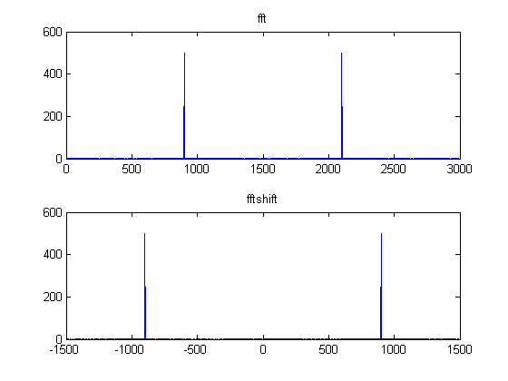

# mt02b

## 2.
__Misc. Short Answer Questions and MATLAB__

### 2(a)
Assume you are given a signal with frequencies from $$23\:\text{Hz}$$ to $$27\:\text{Hz}$$. What is the lowest sampling rate that you can use to sample while still ensuring perfect reconstruction on the other side?

Given
$$
\begin{align*}
f_H&=27;\\
f_L&=23;
\end{align*}
$$
We can find
$$
\begin{align*}
B_{IF}&=f_H-f_L\\
&=(27)-(23)\\
&=4;
\end{align*}
$$
To be able to sample safely, we must set the boundary for sampling frequency so that,
$$
\frac{2f_H}{n_\text{max}}\leq{F_T}\leq\frac{2f_L}{(n_\text{max}-1)}\\
$$
Here we can find $$n_\text{max}$$,
$$
\begin{align*}
n_\text{max}&=\left\lfloor\frac{f_H}{B_{IF}}\right\rfloor\\
&=\left\lfloor\frac{(27)}{(4)}\right\rfloor\\
&=6;
\end{align*}
$$
Therefore, the lowest sampling rate is
$$
\begin{align*}
f_T&=\frac{2f_H}{n_\text{max}}\\
&=\frac{2(27)}{(6)}\\
&=9\:\text{Hz}
\end{align*}
$$


### 2(b)
A system with an impulse response for $$h[n]=\delta[n]-\delta[n-3]$$ sees an input of $$x[n]=\delta[n-2]$$. What is the output $$y[n]$$?

Assuming its LTI,
$$
\begin{align*}
h[n]&=\delta[n]-\delta[n-3];\\
x[n]&=\delta[n-2];\\\\
y[n]&=\delta[n-2]-\delta[n-5];
\end{align*}
$$


### 2(c)
The $$X[k]$$ is the 1000 sample `fft()` of some $$x[n]$$ as returend by MATLAB, where $$x[n]$$ was constructed by sampling $$x(t)$$ at an appropriate sampling rate of $$3000\:\text{Hz}$$. Observing $$X[k]$$ reveals that all of the samples are $$0$$ except for $$X[301]$$ and $$X[701]$$ which all have a large non-zero value.  Note that these are the MATLAB indices.  Determine the frequency of the sinusoid(s), in Hertz, that appear in $$x(t)$$.

Given
$$
\begin{align*}
f_T&=3000\:\text{Hz}\\
N&=1000;
\end{align*}
$$
We can find
$$
\begin{align*}
\omega_k&=k\Delta\omega\\
&=k\frac{2\pi}{N}\\
&=k\frac{2\pi}{1000}\\
\end{align*}
$$
- For $$k=300$$
$$
\begin{align*}
\omega_{300}&=(300)\frac{2\pi}{(1000)}\\
&=\frac{6\pi}{10}\\
\end{align*}
$$
- For $$k=700$$
$$
\begin{align*}
\omega_{700}&=(300)\frac{2\pi}{(1000)}\\
&=\frac{14\pi}{10}\\
\end{align*}
$$

These are $$\omega$$'s when we use `fft`, we ought to align the $$\omega$$ for `fftshift`, so that it's visually aiding. by substracting $$-pi$$.
$$
\begin{align*}
\omega_{300}&=\frac{6\pi}{10}-pi\\
&=-\frac{4\pi}{10}\\\\
\omega_{700}&=\frac{14\pi}{10}-pi\\
&=\frac{4\pi}{10}
\end{align*}
$$
Then, the real frequnecies are
$$
\begin{align*}
f&=\omega_{300}\left(\frac{f_T}{2\pi}\right)\\
&=\left(\frac{6\pi}{10}\right)\left(\frac{3000}{2\pi}\right)\\
&=900;
\end{align*}
$$


See the plot to convince yourself.



### 2(d)
True or False: Taking a practical high-pass filter, in the frequency domain and multiplying it with itself will produce a better high-pass filter, in the sense that low frequencies will be more suppressed and the filter will more sharply drop from the passband to the stopband.


__TRUE__


------
Use this for 2(e)-(f)
```matlab
[H, w] = freqz(b, a, 512)
```
is typed into MATLAB to determine the frequency response.

### 2(e)
Under what conditions is this analyzign an FIR?

only FIR when `a=1`

### 2(f)
What is the value for the __last__ normalized frequency, $$\omega$$, that `freqz` returns in the variable `w`. __Reminder__: the first is $$0$$, and note that `'whole'` is NOT used.

It's at just a shy of $$\pi$$.
$$
w=\pi-\frac{\pi}{512};
$$


## MATLAB
```matlab
%% 2(c)
%
N = 1000;
fT = 3000;
f0 = 900;
nv = 0:N-1;
x = cos(2*pi*f0/fT*nv);
%
w = 0 : (2*pi/N) : (2*pi-2*pi/N);
X = abs(fft(x));
%
figure();
subplot(2,1,1);
plot(  (w)/(2*pi)*fT, abs(X)  );
title('fft');
subplot(2,1,2);
plot(  (w-pi)/(2*pi)*fT, fftshift(abs(X))  );
title('fftshift');
```
