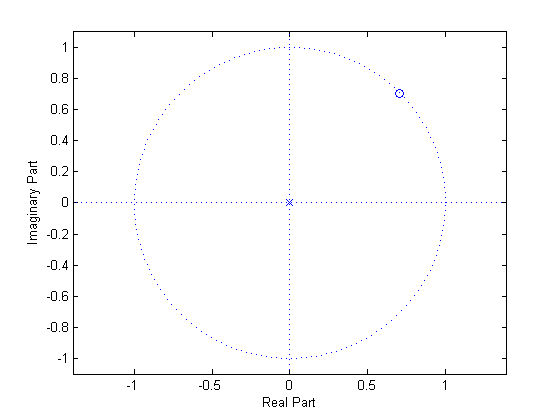

# mt02c

## 3.
__DFT and DFT Properties__

### 3(a)
For the point, $$x$$, shown below, calculate the approximate location for $$x^4$$. This will go faster if you use what you know about manipulating points on the unit circle.


If we say $$x=e^{-j2\pi\tfrac{23}{32}}$$ (just before 24th point),
$$
\begin{align*}
x^4&=\left(W_{32}^{23}\right)^4\\
&=W_{32}^{92}\\
&=W_{32}^{92}-\left(W_{32}^{32}\right)^2\\
&=W_{32}^{92-2(32)}\\
&=W_{32}^{28}
\end{align*}
$$

See the MATLAB result to convince yourself


### 3(b)
.$${W_{32}}^p$$ represents the point closest to the product that you determined abvoe in Problem 3(a). What is $$p$$?
$$
p=28;
$$


### 3(c)
Reduce $${W_{16}}^{54}$$ to a complex number.
$$
\begin{align*}
{W_{16}}^{54}&={W_{8}}^{27}\\
&={W_{8}}^{3(8)+3}\\
&=\underset{1}{\underline{\left({W_{8}}^8\right)^3}}+{W_{8}}^{3}\\
&=e^{-j2\pi\frac{3}{8}}\\
&=\cos{\left(-2\pi\frac{3}{8}\right)}+j\sin{\left(-2\pi\frac{3}{8}\right)}\\
&=\cos{\left(\frac{6}{8}\pi\right)}-j\sin{\left(\frac{6}{8}\pi\right)}\\
\end{align*}
$$


------
For the problem 3(d)-(e), you are given
$$
x[n]=[1,\:2,\:3,\:4]
$$
and are told that:
$$
\operatorname{DFT}\left(x[n]\right)=\{10,\:-2+2j,\:-2,\:-2-2j\}
$$

### 3(d)
Find
$$
\operatorname{DFT}\left(\operatorname{DFT}\left(\operatorname{DFT}\left(\operatorname{DFT}\left(x[n]\right)\right)\right)\right)
$$

Using the Duality property,
$$
\begin{matrix}
G[n]&\leftrightarrow&Ng\left[\left<-k\right>_N\right]
\end{matrix}
$$
we can model such that,
$$
\begin{align*}
x^\prime[k]&=\operatorname{DFT}\left(\operatorname{DFT}\left(x[n]\right)\right)\\
&=4[1,\:4,\:3,\:2]\\
&=[4,\:16,\:12,\:8]\\\\
x^{\prime\prime}[k]&=\operatorname{DFT}\left(\operatorname{DFT}\left(\operatorname{DFT}\left(\operatorname{DFT}\left(x[n]\right)\right)\right)\right)\\
&=\operatorname{DFT}\left(\operatorname{DFT}\left(x^\prime[k]\right)\right)\\
&=4[4,\:8,\:12,\:16]\\
&=[16,\:32,\:48,\:64]
\end{align*}
$$

### 3(e)
What is the $$\operatorname{DFT}\left(\{3,\:4,\:1,\:2\right)$$? While you will be given credit for brute forcing this, it is not the point of the problem and you will spend less time on this by applying  the appropriate property.

Using the Circular time-shifting property,
$$
\begin{matrix}
g[\left<n-n_0\right>_N]&\leftrightarrow&W_N^{k_{n_0}}G\left[k\right]
\end{matrix}
$$
We can determine
$$
\begin{align*}
x^\prime[n]&=x[\left<n-2\right>_4]\\
X^\prime[k]&=\operatorname{DFT}\left(x[\left<n-2\right>_4]\right)\\
&={W_{4}}^{2K}\left[10,\:-2+2j,\:-2,\:-2-2j\right]\\
&=\left[10(1),\:(-2+2j)(-1),\:(-2)(1),\:(-2-2j)(-1)\right]\\
&=\left[10(,\:2-2j,\:-2,\:2+2j\right]\\
\end{align*}
$$

## MATLAB
```matlab
%% 3(a)
%
figure();
W = exp(-j*2*pi*23/32);
zplane(W, 0);
figure();
W4 = (exp(-j*2*pi*23/32))^4;
zplane(W4, 0);
```
