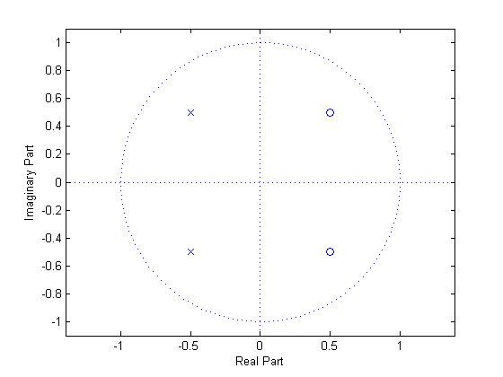
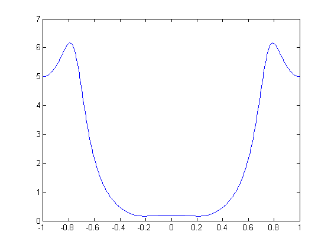

# mt02e

## 5.
__Z-transform, Pole-zero plots, and FIR filter types__

For 5(a)-(c), asssume you have a system with a difference equation:
$$
y[n]=x[n]+\frac{1}{2}x[n-1]-\frac{1}{2}x[n-2]+\frac{1}{4}y[n-1]+\frac{3}{8}y[n-2]
$$

### 5(a)
Find the transfer function, $$H(z)$$, of the system.
$$
\begin{align*}
y[n]&=x[n]+\frac{1}{2}x[n-1]-\frac{1}{2}x[n-2]+\frac{1}{4}y[n-1]+\frac{3}{8}y[n-2]\\
Y(z)&=X(z)+\frac{1}{2}X(z)z^{-1}-\frac{1}{2}X(z)z^{-2}+\frac{1}{4}Y(z)z^{-1}+\frac{3}{8}Y(z)z^{-2}\\
Y(z)\left(1-\frac{1}{4}z^{-1}-\frac{3}{8}z^{-2}\right)&=X(z) \left(z+\frac{1}{2}z^{-1}-\frac{1}{2}z^{-2}\right);\\
H(z)&=\frac{Y(z)}{X(z)}=\frac{z+\frac{1}{2}z^{-1}-\frac{1}{2}z^{-2}}{1-\frac{1}{4}z^{-1}-\frac{3}{8}z^{-2}}
\end{align*}
$$

### 5(b)
Manipulate the transfer function in 5(a) as needed and draw the pole/zero plot.  __NOTE__: Think for a second or two... this factors with relatively polite fractions.
$$
\begin{align*}
H(z)&=\frac{z+\frac{1}{2}z^{-1}-\frac{1}{2}z^{-2}}{1-\frac{1}{4}z^{-1}-\frac{3}{8}z^{-2}}\\
&=\frac{z^2+\frac{1}{2}z-\frac{1}{2}}{z^2-\frac{1}{4}z-\frac{3}{8}}\\
&=\frac{(z+1)\left(z-\tfrac{1}{2}\right)}{\left(z-\tfrac{3}{4}\right)\left(z+\tfrac{1}{2}\right)}
\end{align*}
$$


### 5(c)
Using any method you'd like, provide the first three samples of the impulse response: $$h[0]$$, $$h[1]$$, and $$h[2]$$.
$$
\begin{align*}
H(z)&=\frac{1+\frac{1}{2}z^{-1}-\frac{1}{2}z^{-2}}{1-\frac{1}{4}z^{-1}-\frac{3}{8}z^{-2}}\\
\end{align*}
$$
Do the long division to quickly compute the first 3 terms
$$
\require{enclose}
\begin{array}{rll}
1+\tfrac{3}{4}z^{-1}+\tfrac{1}{16}z^{-2}\cdots&\\[-3pt]
1-\tfrac{1}{4}z^{-1}-\tfrac{3}{8}z^{-2} \enclose{longdiv}{1+\frac{1}{2}z^{-1}-\frac{1}{2}z^{-2}\phantom{00000000000000}}\kern-.2ex \\[-3pt]
\underline{\phantom{0}1-\frac{1}{4}z^{-1}-\frac{3}{8}z^{-2}}\phantom{00000000000000}&& \\[-3pt]
\phantom{0}\frac{3}{4}z^{-1}-\frac{1}{8}z^{-2}\phantom{0000000000000}\\[-3pt]
\underline{\phantom{0}\frac{3}{4}z^{-1}-\frac{3}{16}z^{-2}-\frac{9}{32}z^{-3}\phantom{0000}}&&\\[-3pt]
\phantom{0}\frac{1}{16}z^{-2}+\frac{9}{32}z^{-3}\phantom{0000}&&\\[-3pt]
\underline{\phantom{0}\frac{1}{16}z^{-2}+\frac{9}{32}z^{-3}\cdots}\phantom{0}&&\\[-3pt]
\phantom{0}\vdots\phantom{00000}
\end{array}
$$
Then
$$
\begin{align*}
H(z)&=1+\tfrac{3}{4}z^{-1}+\tfrac{1}{16}z^{-2}\cdots\\
h[n]&=\delta[n]+\frac{3}{4}\delta[n-1]+\frac{1}{16}\delta[n-2]+\cdots
\end{align*}
$$
Therefore
$$
\therefore\begin{cases}
h[0]=1;\\
h[1]=\frac{3}{4};\\
h[2]=\frac{1}{16};\\
\end{cases}
$$

-----
__REMINDER__: 5(d)-(e) are not related to 5(a)-(c)

### 5(d)
You are given a high pass filter (cutoff of $$\omega_c=\tfrac{2\pi}{5}$$) of order $$4$$ with coefficients: $$[a,\:b,\:c,\:b,\:a]$$. In terms of the coefficients  ($$a$$, $$b$$, and $$c$$), what are the coefficients of a lowpass filter with a cutoff of $$\omega_c=\tfrac{3\pi}{5}$$. (__NOTE__: this is unrelated to 5(a)-(d))

Given
$$
\begin{align*}
N&=4;
\end{align*}
$$
We can say
$$
\begin{align*}
h_{HP}[n]&=[a,\:b,\:c,\:b,\:a];\\
h_{LP}[n]&=(-1)^{\tfrac{N}{2}}(-1)^nh_{HP}[n]\\
&=(-1)^nh_{HP}[n]\\
&=[a,\:-b,\:c,\:-b,\:a]
\end{align*}
$$

### 5(e)
Provide a reasonable sketch (labeled as best you can) of the magnitude of the frequency response for the pole/zero plot provided below. As a helper, you are told that
$$
H(z)=\frac{\left(z^2-z+\tfrac{1}{2}\right)}{\left(z^2+z+\tfrac{1}{2}\right)}
$$
Indicate the approximate location of all minima, maxima, local minima, and local maxima and label the values at $$\omega=0$$< $$\pi$$, and $$-\pi$$.




$$
\begin{align*}
H\left(e^{j\omega}\right)&=\frac{1-e^{-j\omega}+ \tfrac{1}{2}e^{-j2\omega}}{1+e^{-j\omega}+\tfrac{1}{2}e^{-j2\omega}}\\\\
H\left(e^{j(0)}\right)&=\frac{1-1+\tfrac{1}{2}}{1+1+\tfrac{1}{2}}\\
&=\frac{1}{5};\\
H\left(e^{j(\pi)}\right)&=\frac{1-(-1)+\tfrac{1}{2}}{1+(-1)+\tfrac{1}{2}}\\
&=5;
\end{align*}
$$


## MATLAB
```matlab
%% 5(b)
%
num = [1, 1/2, -1/2];
den = [1, -1/4, -3/8];
%
figure(1);
zplane(num, den);
%% 5(e)
%
num = [1, -1, 1/2];
den = [1, 1, 1/2];
%
figure(2);
zplane(num, den);
[H w] = freqz(num, den, 512, 'whole');
figure(3);
plot(  (w-pi)/pi, fftshift(abs(H))  );
``