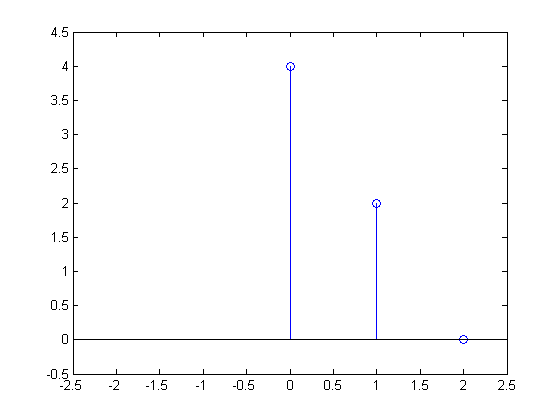

# q01b

## 2.
$$
\begin{matrix}
x[n]=\{0,\:0,\:2,\:0,\:4\},&n=0:4
\end{matrix}
$$
Plot the transfored signal: $$y[n]=x[4-2n]$$


Given
$$
\begin{align*}
y[n]&=x[4-2n]\\
&=x[-2(n-2)]
\end{align*}
$$
We can break up problems as follows
$$
\begin{align*}
x[n]&=\{0,\:0,\:2,\:0,\:4\},&&n=0:4\\
x[-2n]&=\{4,\:2,\:0\},&&n=-2:0\\
x[-2(n-2)]&=\{4,\:2\},&&n=0:1\\
\end{align*}
$$




## MATLAB
```matlab
x = [4, 2, 0];
figure();
stem(0:2, x);
axis([-2.5, 2.5, min(x)-0.5, max(x)+0.5 ]);
```