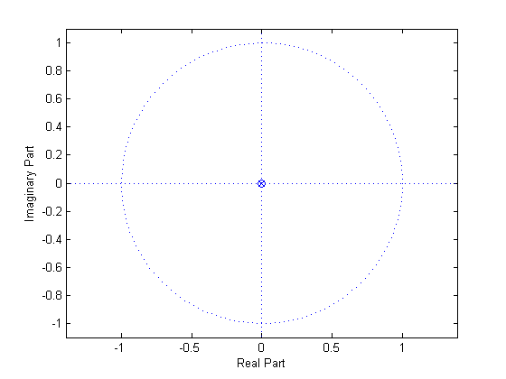
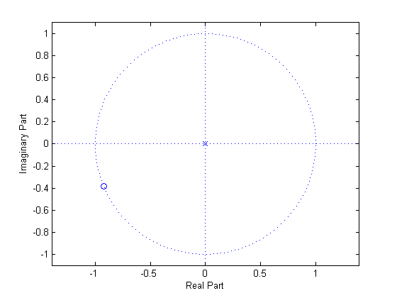

# q03b

## 2.
DTF kernel $$W_N$$
Draw the approximate location on the $$e^{j\theta}$$ unit circle of the dot representing $${W_{16}}^{23}$$.


Given
$$
W_N=e^{-\tfrac{j2\pi}{N}}\\
$$
We can find $${W_16}^{23}$$ on the unit circle such that
$$
\begin{align*}
{W_16}^{23}&={W_16}^{(23)-16}\\
&={W_16}^{7}
\end{align*}
$$




## MATLAB
```matlab
figure(1);
zplane(0,0);
figure(2);
zplane(exp(-j*2*pi*7/16), 0);
```