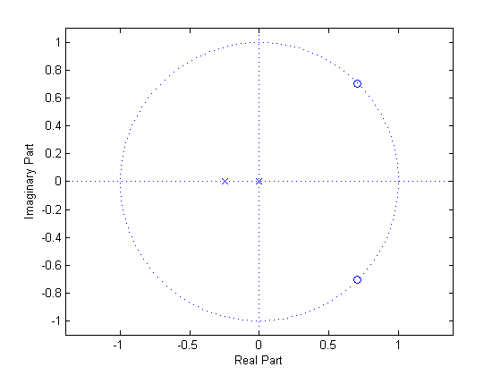
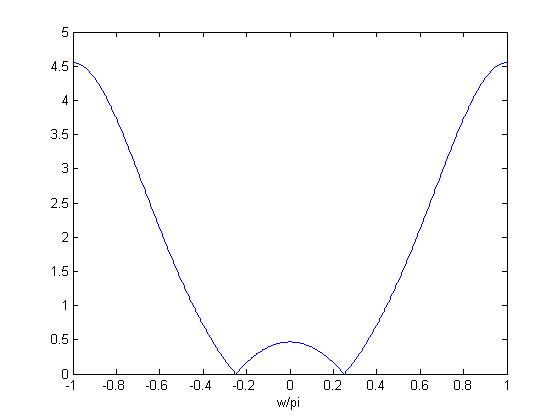

# q04b

## 2.
You are given the following pole/zero plot. Draw a reasonable sketch of the magnitude of the frequency response. Use a frequency axis that goes from $$-\pi$$ to $$\pi$$.



You should draw a plot similar to this



## MATLAB
```matlab
w = pi/4;
figure();
p = [1, 1/4, 0];
z = [1, -2*cos(w), 1];
zplane(z, p)
%
[H, w] = freqz(z, p, 512, 'whole');
figure();
plot(  (w-pi)/pi, fftshift(abs(H))  );
xlabel('w/pi')
```