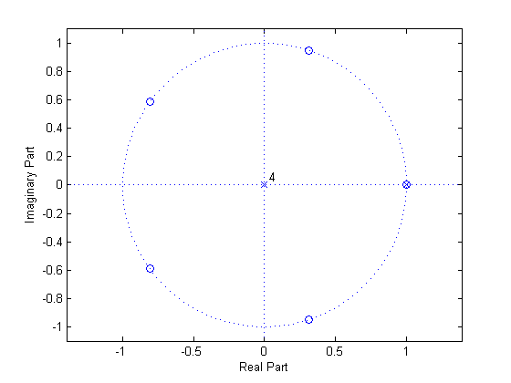
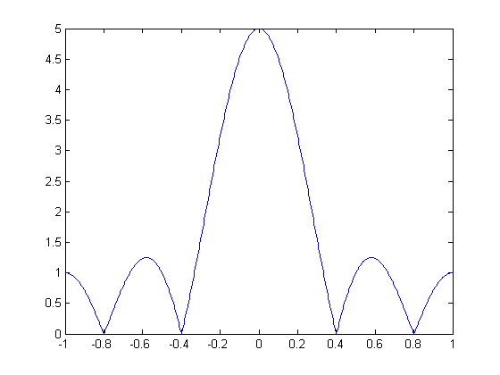

# q05c

## 3.
In HW6, you found that the transfer function for a rectangular window, $$\begin{matrix}w_1[n]=1,&0\leq{n}\leq{N}\end{matrix}$$, is as follows:
$$
W_1(z)=\frac{z^{(N+1)}-1}{z^{N}(z-1)}
$$
Plot the pole-zero plot for a rectangular window of length $$5$$. For 1 point of extra credit, determine the main lobe width of the filter.


For window length $$5$$, $$N=5-1=4$$. So,
$$
\begin{matrix}w_1[n]=1,&0\leq{n}\leq{4}\end{matrix}
$$
Then we know that
$$
W_1(z)=\frac{z^5-1}{z^4(z-1)}
$$
- Zeros:
$$
\require{cancel}
\begin{align*}
z^5&=1=e^{\pm{j}2\pi},\:e^{\pm{j}4\pi}\\
z&=\cancel{1},\:e^{\pm{j}\tfrac{2}{5}\pi},\:e^{\pm{j}\tfrac{4}{5}\pi}
\end{align*}
$$
- Poles:
$$
\require{cancel}
\begin{align*}
z&=0,\:0,\:0,\:0,\:\cancel{1}
\end{align*}
$$




To find the main lobe width,
$$
\begin{align*}
w_\text{mainlobe}&=\left(\frac{2}{5}\pi\right)-\left(-\frac{2}{5}\pi\right)\\
&=\frac{4}{5}\pi=0.8\pi
\end{align*}
$$

Check the freq. resp. plot to verify it's true.



## MATLAB
```matlab
p = [1 -1 0 0 0 0];
z = [1 0 0 0 0 -1];
figure();
zplane(z,p);
%
[H w] = freqz(z, p, 512, 'whole');
figure();
plot(  (w-pi)/pi, fftshift(abs(H))  );
```
